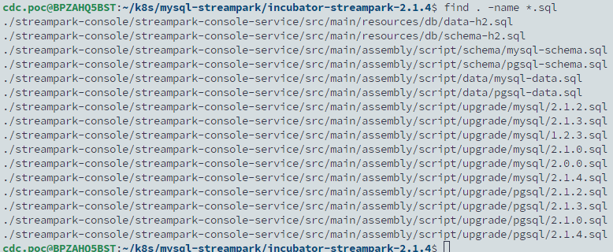
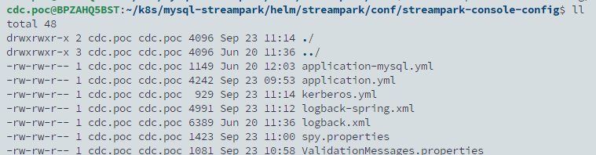
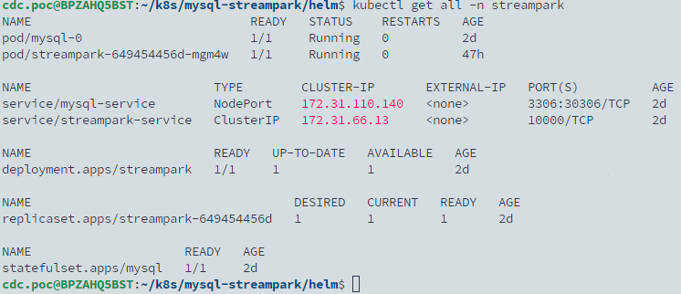

## TL; DR

本文記錄在 Kubernetes 集群上部署 Apache Streampark 的步驟，Streampark 是一個開源項目，簡化了在 Kubernetes 上部署和管理 Flink 應用程序。

<!--more-->

## 客製化 Streampark image

主要要達成以下目的

1. 因需要在 Streampark 中建立 flink 集群，建立集群需指定 `FLINK_HOME`，但預設的 image 沒有包含 flink，所以需要將會用到的 flink 版本一次包好。
2. 由於 Apache 專案與 mysql jdbc 驅動的 license 不相容，須額外下載 mysql jdbc 驅動，並將其放在 `$STREAMPARK_HOME/lib` 下。

前往官網下載最新版本 https://streampark.apache.org/download/ ，並準備以下 Dockerfile

```docker
FROM alpine:3.20 as deps-stage
COPY apache-streampark_*-*-bin.tar.gz /
WORKDIR /
RUN tar zxvf apache-streampark_*-*-bin.tar.gz \
&& mv apache-streampark_*-*-bin streampark

FROM apache/flink:1.17.2 as flink-1.17
FROM apache/flink:1.18.1 as flink-1.18
FROM apache/flink:1.19.1 as flink-1.19

FROM docker:dind
WORKDIR /streampark
COPY --from=deps-stage /streampark /streampark

ENV NODE_VERSION=16.1.0
ENV NPM_VERSION=7.11.2

RUN apk add openjdk8 \
    && apk add maven \
    && apk add wget \
    && apk add vim \
    && apk add bash \
    && apk add curl

ENV JAVA_HOME=/usr/lib/jvm/java-1.8-openjdk
ENV MAVEN_HOME=/usr/share/java/maven-3
ENV PATH $JAVA_HOME/bin:$PATH
ENV PATH $MAVEN_HOME/bin:$PATH

RUN wget "https://nodejs.org/dist/v$NODE_VERSION/node-v$NODE_VERSION-linux-x64.tar.gz" \
    && tar zxvf "node-v$NODE_VERSION-linux-x64.tar.gz" -C /usr/local --strip-components=1 \
    && rm "node-v$NODE_VERSION-linux-x64.tar.gz" \
    && ln -s /usr/local/bin/node /usr/local/bin/nodejs \
    && curl -LO https://dl.k8s.io/release/v1.29.0/bin/linux/amd64/kubectl \
    && install -o root -g root -m 0755 kubectl /usr/local/bin/kubectl

RUN mkdir -p ~/.kube

# Copy Flink installations from base images
COPY --from=flink-1.17 /opt/flink /streampark/flink-1.17
COPY --from=flink-1.18 /opt/flink /streampark/flink-1.18
COPY --from=flink-1.19 /opt/flink /streampark/flink-1.19

# Download and install JDBC connector
RUN wget -P /streampark/lib https://repo1.maven.org/maven2/com/mysql/mysql-connector-j/8.0.31/mysql-connector-j-8.0.31.jar

EXPOSE 10000
```

打包鏡像

```bash
docker buildx build -t streampark-flink:2.1.4 .
```

## 部署 MySQL

::: info
Streampark 使用 h2, pgsql, mysql 其中一個 Database 存放 metadata，本例使用 MySQL。
:::

1. 準備 `init.sql` 檔案

    在下載的 Streampark 目錄中找 mysql 的 DDL 檔

    

    主要需要建立的是 `mysql-schema.sql` 以及 `mysql-data.sql`，合併兩個 sql 檔合併，並以 `init.sql` 命名。

    ```bash
    cat ./incubator-streampark-2.1.4/streampark-console/streampark-console-service/src/main/assembly/script/schema/mysql-schema.sql ./incubator-streampark-2.1.4/streampark-console/streampark-console-service/src/main/assembly/script/data/mysql-data.sql > init.sql
    ```

2. 建立 mysql init.sql 的 configMaps

    ```bash
    kubectl create configmap mysql-initdb-config --from-file=init.sql -n streampark
    ```

3. 建立 mysql statefulset

    streampark-mysql-sts.yaml

    ```yaml
    ---
    apiVersion: v1
    kind: Service
    metadata:
        name: mysql-service
        namespace: streampark
    spec:
        type: NodePort
        selector:
            app: mysql
        ports:
            - protocol: TCP
              port: 3306
              targetPort: 3306
              nodePort: 30306
    ---
    apiVersion: apps/v1
    kind: StatefulSet
    metadata:
        name: mysql
        namespace: streampark
    spec:
        serviceName: 'mysql-service'
        replicas: 1
        selector:
            matchLabels:
                app: mysql
        template:
            metadata:
                labels:
                    app: mysql
            spec:
                securityContext:
                    fsGroup: 1000
                    runAsUser: 1000
                containers:
                    - name: mysql
                      image: mysql:8.3
                      ports:
                          - containerPort: 3306
                      env:
                          - name: MYSQL_ROOT_PASSWORD
                            value: 'streampark'
                          - name: MYSQL_USER
                            value: 'streampark'
                          - name: MYSQL_PASSWORD
                            value: 'streampark'
                      volumeMounts:
                          - mountPath: /var/lib/mysql
                            name: mysql-storage
                          - mountPath: /docker-entrypoint-initdb.d
                            name: initdb-scripts
                volumes:
                    - name: initdb-scripts
                      configMap:
                          name: mysql-initdb-config
        volumeClaimTemplates:
            - metadata:
                  name: mysql-storage
                  namespace: streampark
              spec:
                  accessModes: ['ReadWriteOnce']
                  storageClassName: 'ceph-block'
                  resources:
                      requests:
                          storage: 10Gi
    ```

    ```yaml
    kubectl apply -f streampark-mysql-sts.yaml
    ```

4. 建立 secret 以供後面 Streampark 部署使用

    ```yaml
    kubectl create secret generic streampark-mysql \
    --namespace=streampark \
    --from-literal=mysql-root-password=streampark
    ```

## Streampark 部署

### 透過 helm 產生部署檔

在上一步驟下載的 Streampark 中包含了 helm chart 可用於 Kubernetes 的部署，

1. 進入 `helm/streampark` 目錄修改 `values.yaml` ，以註解說明本文修改的地方

    ```yaml
    image:
        repository: 'harbor.sdsp-stg.com/base/streampark-flink'
        pullPolicy: 'IfNotPresent'
        tag: '2.1.4'
        pullSecret: ''

    rbac:
        create: true

    spec:
        container:
            env:
                [
                    { name: TZ, value: 'Asia/Taipei' },
                    { name: LANG, value: en_US.UTF-8 },
                    # 指定要使用的 DOCKER HOST，詳情請參考部署階段說明
                    { name: DOCKER_HOST, value: 'tcp://172.21.18.51:2375' },
                    { name: LANGUAGE, value: en_US:en },
                    { name: LC_ALL, value: en_US.UTF-8 },
                ]

        replicaCount: 1
        containerPort: 10000
        name: rest
        affinity: {}

        nodeSelector: {}

        tolerations: []

        # 加大 resource limit 的資源限制
        resources:
            {
                limits: { memory: '8Gi', cpu: '4' },
                requests: { memory: '1Gi', cpu: '1' },
            }

        livenessProbe:
            enabled: true
            initialDelaySeconds: '90'
            periodSeconds: '30'
            timeoutSeconds: '20'
            failureThreshold: '3'
            successThreshold: '1'

        readinessProbe:
            enabled: true
            initialDelaySeconds: '90'
            periodSeconds: '30'
            timeoutSeconds: '20'
            failureThreshold: '3'
            successThreshold: '1'

    # 定義 ingress，並使用 Prefix 的方式建立，另外移除不必要的 annotation (後續需要手動修改 yaml 加上 ingressClassName
    ingress:
        enabled: true
        host: 'streampark.sdsp-stg.com'
        path: '/'
        pathType: 'Prefix'

    # 因使用 ingress 對外開放，就將 service 改為 ClusterIP
    service:
        type: 'ClusterIP'
        name: 'streampark-service'

    streamParkDefaultConfiguration:
        create: true
        append: true

    streamParkServiceAccount:
        create: true
        annotations: {}
        name: 'streampark'
    ```

2. 設定 `./streampark/conf/streampark-console-config` 目錄下的配置檔

    主要移除了用不到的 `application-h2.yml` 、 `application-pgsql.yml` 、 `application-sso.yml` 檔案

    

    並且修改 `application.yml` 以及 `application-mysql.yml` 內容

    ```yaml
    # application.yml 修改 database 為 mysql，其於保持預設
    spring:
        profiles:
            active: mysql
    ```

    ```yaml
    # application-mysql.yml 更新連線資訊
    spring:
        datasource:
            username: root
            password: streampark
            driver-class-name: com.mysql.cj.jdbc.Driver
            url: jdbc:mysql://mysql-service.streampark.svc.cluster.local:3306/streampark?useSSL=false&useUnicode=true&characterEncoding=UTF-8&allowPublicKeyRetrieval=false&useJDBCCompliantTimezoneShift=true&useLegacyDatetimeCode=false&serverTimezone=GMT%2B8
    ```

3. 產生 YAML 檔

    ```bash
    helm template streampark/ -n streampark -f streampark/values.yaml --output-dir ./result
    ```

    產生的 YAML 檔會放在 `result` 目錄下。

### 客製化部署檔

1. 產生 kube config 的 configmaps 供 Streampark 使用 Kubernetes 部署 flink cluster

    ```bash
    kubectl create configmap my-kube-config --from-file=$HOME/.kube/config -n streampark
    ```

2. 編輯 `result/ingress.yaml` ，指定 ingressClassName

    ```yaml
    apiVersion: networking.k8s.io/v1
    kind: Ingress
    metadata:
        name: streampark
        namespace: streampark
        labels:
            app.kubernetes.io/name: streampark
            app.kubernetes.io/version: '2.1.4'
            app.kubernetes.io/managed-by: Helm
            helm.sh/chart: streampark-2.1.4
    spec:
        ingressClassName: nginx
        rules:
            - host: streampark.sdsp-stg.com
              http:
                  paths:
                      - backend:
                            service:
                                name: streampark-service
                                port:
                                    name: rest
                        path: /
                        pathType: Prefix
    ```

3. 編輯 `result/streampark.yaml` 新增 initContainers 測試 MySQL 資料庫連線、綁入 kube config、以及持久化專案目錄。

    ```yaml
    apiVersion: apps/v1
    kind: Deployment
    metadata:
        name: streampark
        namespace: streampark
        labels:
            app.kubernetes.io/name: streampark
            app.kubernetes.io/version: '2.1.4'
            app.kubernetes.io/managed-by: Helm
            helm.sh/chart: streampark-2.1.4
    spec:
        replicas: 1
        selector:
            matchLabels:
                app.kubernetes.io/name: streampark
        template:
            metadata:
                labels:
                    app.kubernetes.io/name: streampark
            spec:
                serviceAccountName: streampark
                initContainers:
                    - name: db-service-check
                      image: mysql:8.3
                      command:
                          - sh
                          - '-c'
                          - mysqladmin ping -h mysql-service.streampark.svc.cluster.local -uroot -p'${MYSQL_ROOT_PASSWORD}' --silent
                      env:
                          - name: MYSQL_ROOT_PASSWORD
                            valueFrom:
                                secretKeyRef:
                                    name: streampark-mysql
                                    key: mysql-root-password
                containers:
                    - image: harbor.sdsp-stg.com/base/streampark-flink:2.1.4
                      name: streampark
                      imagePullPolicy: Always
                      ports:
                          - name: rest
                            containerPort: 10000
                            protocol: TCP
                      env:
                          - name: TZ
                            value: Asia/Taipei
                          - name: LANG
                            value: en_US.UTF-8
                          - name: LANGUAGE
                            value: en_US:en
                          - name: LC_ALL
                            value: en_US.UTF-8
                          - name: DOCKER_HOST
                            value: tcp://172.21.18.51:2375
                      securityContext:
                          privileged: false
                      command:
                          [
                              'bash',
                              '-c',
                              'bash ./bin/streampark.sh start_docker',
                          ]
                      livenessProbe:
                          exec:
                              command:
                                  [
                                      'curl',
                                      '-s',
                                      'http://localhost:10000/actuator/health/liveness',
                                  ]
                          initialDelaySeconds: 90
                          periodSeconds: 30
                          timeoutSeconds: 20
                          successThreshold: 1
                          failureThreshold: 3
                      readinessProbe:
                          exec:
                              command:
                                  [
                                      'curl',
                                      '-s',
                                      'http://localhost:10000/actuator/health/readiness',
                                  ]
                          initialDelaySeconds: 90
                          periodSeconds: 30
                          timeoutSeconds: 20
                          successThreshold: 1
                          failureThreshold: 3
                      volumeMounts:
                          - name: streampark-default-config-volume
                            mountPath: /streampark/conf
                          - name: kube-config-volume
                            mountPath: /root/.kube
                          - name: streampark-storage-volume
                            mountPath: /opt
                      resources:
                          limits:
                              cpu: '4'
                              memory: 8Gi
                          requests:
                              cpu: '1'
                              memory: 1Gi
                volumes:
                    - name: streampark-default-config-volume
                      configMap:
                          name: streampark-console-config
                          items:
                              - key: application.yml
                                path: application.yml
                              - key: application-mysql.yml
                                path: application-mysql.yml
                              - key: logback-spring.xml
                                path: logback-spring.xml
                              - key: kerberos.yml
                                path: kerberos.yml
                              - key: spy.properties
                                path: spy.properties
                              - key: ValidationMessages.properties
                                path: ValidationMessages.properties
                    - name: kube-config-volume
                      configMap:
                          name: my-kube-config
                          items:
                              - key: config
                                path: config
                    - name: streampark-storage-volume
                      persistentVolumeClaim:
                          claimName: streampark-pvc
    ```

### 部署
在部署前需要先找一台有 docker 的機器將 docker daemon 公開出來，原因是因為當使用 streampark application mode 部署 flink 的時候，需要設定 DOCKE_HOST，並且還需要透過 docker 去執行打包以及推送鏡像。  
進入到欲公開使用的 docker host，編輯 `/etc/docker/daemon.json`
```json
{
  "hosts": ["tcp://0.0.0.0:2375","unix:///var/run/docker.sock"]
}
```
接著重啟 docker `sudo systemctl restart docker`，就可以發現到 docker post 被公開了。

回到 Kubernetes 開始正式部署
```yaml
kubectl apply -f ./result
```


