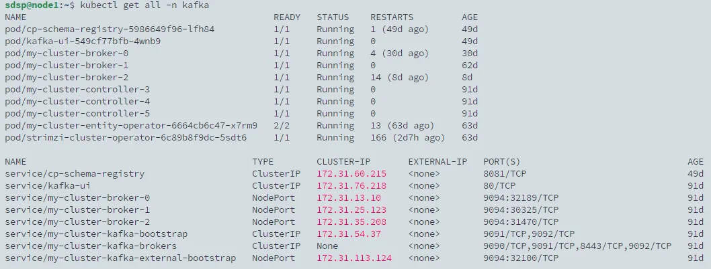
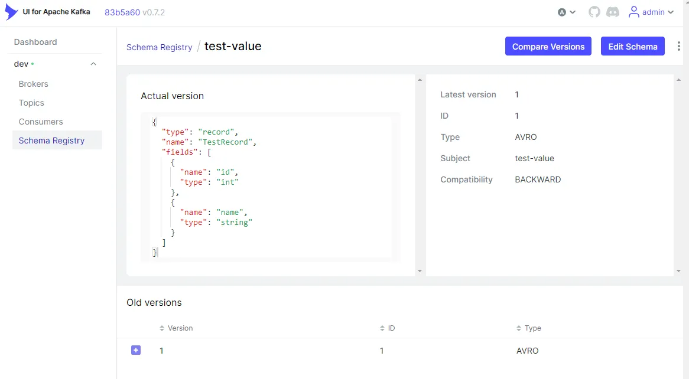
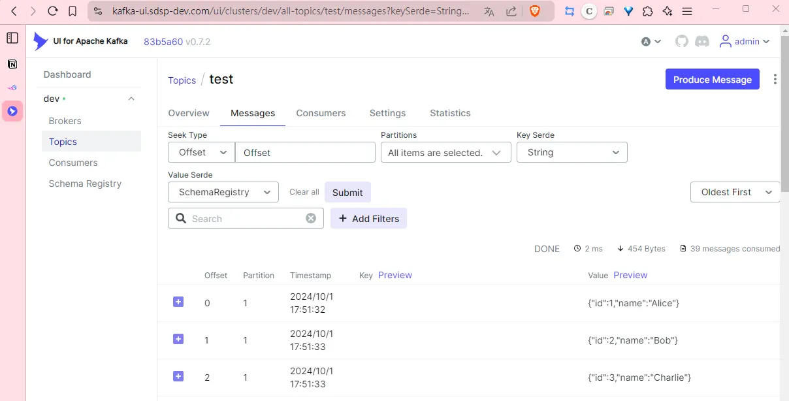

## TL;DR

Kubernetes 環境中已經有一座使用 strimzi 部屬的 kafka cluster，本篇記錄如何部署並使用 Kafka Schema Registry。

## 部署

```yaml
apiVersion: apps/v1
kind: Deployment
metadata:
  name: cp-schema-registry
  namespace: kafka
  labels:
    app: cp-schema-registry
spec:
  replicas: 1
  selector:
    matchLabels:
      app: cp-schema-registry
  template:
    metadata:
      labels:
        app: cp-schema-registry
    spec:
      containers:
        - name: cp-schema-registry-server
          image: "confluentinc/cp-schema-registry:7.7.1"
          imagePullPolicy: "IfNotPresent"
          ports:
            - name: schema-registry
              containerPort: 8081
              protocol: TCP
          env:
            - name: SCHEMA_REGISTRY_HOST_NAME
              valueFrom:
                fieldRef:
                  fieldPath: status.podIP
            - name: SCHEMA_REGISTRY_LISTENERS
              value: http://0.0.0.0:8081
            - name: SCHEMA_REGISTRY_KAFKASTORE_BOOTSTRAP_SERVERS
              value: PLAINTEXT://my-cluster-kafka-bootstrap.kafka.svc.cluster.local:9092

---
apiVersion: v1
kind: Service
metadata:
  name: cp-schema-registry
  namespace: kafka
  labels:
    app: cp-schema-registry
spec:
  ports:
    - name: schema-registry
      port: 8081
  selector:
    app: cp-schema-registry

---
apiVersion: networking.k8s.io/v1
kind: Ingress
metadata:
  name: cp-schema-registry
  namespace: kafka
  labels:
    app: cp-schema-registry
spec:
  ingressClassName: nginx
  rules:
    - host: kafka-schema-registry.sdsp-dev.com
      http:
        paths:
          - backend:
              service:
                name: cp-schema-registry
                port:
                  name: schema-registry
            path: /
            pathType: Prefix
  tls:
    - hosts:
        - kafka-schema-registry.sdsp-dev.com
```



## 更新 kafka-ui 設定

```yaml
yamlApplicationConfig:
  kafka:
    clusters:
      - name: dev
        bootstrapServers: my-cluster-kafka-bootstrap:9092
        schemaRegistry: http://cp-schema-registry:8081
  auth:
    type: LOGIN_FORM
  spring:
    security:
      user:
        name: admin
        password: "!QAZxsw2"
  management:
    health:
      ldap:
        enabled: false

ingress:
  enabled: true
  ingressClassName: nginx
  path: "/"
  pathType: Prefix
  host: kafka-ui.sdsp-dev.com
  tls:
    enabled: true
```

更新 chart

```yaml
helm upgrade kafka-ui kafka-ui/kafka-ui --namespace kafka -f values.yaml
```

## 測試

從 kafka-ui 進入 Schema Registry，建立一個 schema test-value，擁有以下結構

```yaml
{
  "type": "record",
  "name": "TestRecord",
  "fields":
    [{ "name": "id", "type": "int" }, { "name": "name", "type": "string" }],
}
```



透過 python client produce 使用指定 schema produce 資料

```python
# main.py
import requests
import json
from confluent_kafka import SerializingProducer
from confluent_kafka.schema_registry import SchemaRegistryClient
from confluent_kafka.schema_registry.avro import AvroSerializer
from confluent_kafka.schema_registry import Schema

kafka_url = 'kafka.sdsp-dev.com:8094'
schema_registry_url = 'https://kafka-schema-registry.sdsp-dev.com/'
kafka_topic = 'test'
schema_registry_subject = 'test-value'

def delivery_report(errmsg, msg):
    """Delivery report callback."""
    if errmsg is not None:
        print("Delivery failed for Message: {} : {}".format(msg.key(), errmsg))
        return
    print('Message: {} successfully produced to Topic: {} Partition: [{}] at offset {}'.format(msg.key(), msg.topic(), msg.partition(), msg.offset()))

def avro_producer(kafka_url, schema_registry_url, schema_registry_subject):
    # 從 Schema Registry 中獲取 schema
    sr, latest_version = get_schema_from_schema_registry(schema_registry_url, schema_registry_subject)
    print(latest_version.schema.schema_str)

    value_avro_serializer = AvroSerializer(
        schema_registry_client=sr,
        schema_str=latest_version.schema.schema_str,
        conf={
            'auto.register.schemas': False
        }
    )

    # Kafka Producer
    producer = SerializingProducer({
        'bootstrap.servers': kafka_url,
        'security.protocol': 'plaintext',
        'value.serializer': value_avro_serializer,
        'delivery.timeout.ms': 120000,
        'enable.idempotence': 'true'
    })

    # 測試數據
    test_data = [
        {"id": 1, "name": "Alice"},
        {"id": 2, "name": "Bob"},
        {"id": 3, "name": "Charlie"}
    ]

    # produce
    for record in test_data:
        try:
            producer.produce(topic=kafka_topic, value=record, on_delivery=delivery_report)
            producer.poll(1)

        except Exception as e:
            print(f"Failed to produce record: {record}, Error: {e}")

    producer.flush()

def get_schema_from_schema_registry(schema_registry_url, schema_registry_subject):
    """從 Schema Registry 獲取 schema"""
    sr = SchemaRegistryClient({'url': schema_registry_url})
    latest_version = sr.get_latest_version(schema_registry_subject)
    return sr, latest_version

avro_producer(kafka_url, schema_registry_url, schema_registry_subject)
```

```python
python main.py
```

查看結果


