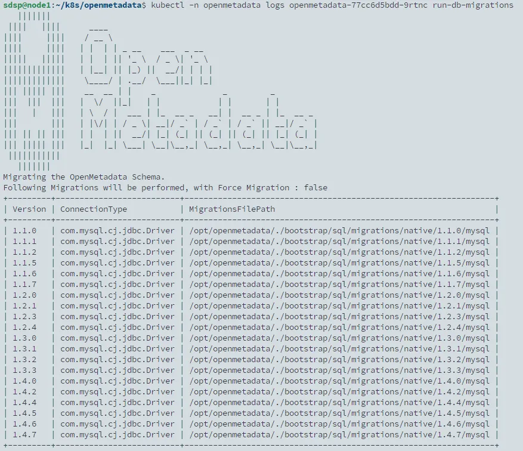

## Prerequisite

提前建立 helm chart 安裝時用到的資源

1. 建立 namespace

   ```bash
   kubectl create ns openmetadata
   ```

2. 建立 open-metadata 連線 secrets

   ```bash
   kubectl create secret generic mysql-secrets --from-literal=openmetadata-mysql-password=openmetadata_password -n openmetadata
   kubectl create secret generic airflow-secrets --from-literal=openmetadata-airflow-password=admin -n openmetadata
   kubectl create secret generic airflow-mysql-secrets --from-literal=airflow-mysql-password=airflow_pass -n openmetadata
   ```

3. 建立 mysql init 腳本 configmap

   新增 `init.sql` 檔案，內容如下

   ```sql
   CREATE DATABASE openmetadata_db;
   CREATE USER 'openmetadata_user'@'%' IDENTIFIED BY 'openmetadata_password';
   GRANT ALL PRIVILEGES ON openmetadata_db.* TO 'openmetadata_user'@'%' WITH GRANT OPTION;

   CREATE DATABASE airflow_db CHARACTER SET utf8mb4 COLLATE utf8mb4_unicode_ci;
   CREATE USER 'airflow_user'@'%' IDENTIFIED BY 'airflow_pass';
   GRANT ALL PRIVILEGES ON airflow_db.* TO 'airflow_user'@'%' WITH GRANT OPTION;
   commit;
   ```

   建立 configmap

   ```bash
   kubectl create configmap initdb --from-file=init.sql -n openmetadata
   ```

4. 新增 repo

   ```bash
   helm repo add open-metadata https://helm.open-metadata.org
   helm repo update open-metadata
   ```

## Install Open-metadata Dependencies Resource

共有三個 dependencies resource 要部署，當前 `1.4.8` open-metadata helm chart 使用到的依賴 chart 如下：

- [**Bitnami MySQL**](https://artifacthub.io/packages/helm/bitnami/mysql/9.7.2) (helm chart version 9.7.2)
- [**OpenSearch**](https://artifacthub.io/packages/helm/opensearch-project-helm-charts/opensearch/2.12.2) (helm chart version 2.12.2)
- [**Airflow**](https://artifacthub.io/packages/helm/airflow-helm/airflow/8.8.0) (helm chart version 8.8.0)

### 準備自訂義 values.yaml

與官方預設的 values 有以下差異：

- MySQL
  - 關閉所有探針 (參考[這篇](https://github.com/bitnami/charts/issues/7433) issue，因為等了超過十分鐘都無法 ready，但發現 database 已經可以正常連線並且 init sql 也有成功執行)
  - `initdbScripts` 改成 `initdbScriptsConfigMap`
  - `volumePermissions.enabled: true`，啟用 init container 先進行 data volume `/bitnami/mysql` 的權限設定。參考[文檔說明](https://docs.bitnami.com/general/how-to/troubleshoot-helm-chart-issues/#permission-errors-when-enabling-persistence)，因 bitnami helm chart 皆是以 non root 身分執行 container，所以如果要啟用 persistent 的話，需要先設定權限。
- Airflow
  - 指定 `dags.persistence.storageClass` 以及 `logs.persistence.storageClass` 為 `ceph-filesystem` ，原因是因為 rook 的 block storage 不支援 `ReadWriteMany` 模式。
  - 啟用 ingress

```yaml
# you can find more details about this here https://artifacthub.io/packages/helm/bitnami/mysql
mysql:
  enabled: true
  fullnameOverride: "mysql"
  architecture: standalone
  image:
    pullPolicy: "Always"
    debug: true
  auth:
    rootPassword: "!QAZxsw2"
    createDatabase: false
  initdbScriptsConfigMap: initdb
  primary:
    extraFlags: "--sort_buffer_size=10M"
    persistence:
      storageClass: "ceph-block"
      size: 50Gi
    service:
      type: NodePort
    livenessProbe:
      enabled: false
    readinessProbe:
      enabled: false
    startupProbe:
      enabled: false
  secondary:
    replicaCount: 0
  volumePermissions:
    enabled: true

# OpenSearch Helm Dependency
# you can find more details about this here https://artifacthub.io/packages/helm/opensearch-project-helm-charts/opensearch/2.12.2
opensearch:
  enabled: true
  clusterName: opensearch
  fullnameOverride: opensearch
  nodeGroup: ""
  imagePullPolicy: Always
  opensearchJavaOpts: "-Xmx1g -Xms1g"
  persistence:
    storageClass: "ceph-block"
    size: 30Gi
  protocol: http
  config:
    opensearch.yml: |
      plugins.security.disabled: true
  singleNode: true
  resources:
    requests:
      cpu: "100m"
      memory: "256M"
    limits:
      cpu: "2000m"
      memory: "2048M"

# Airflow configurations for helm dependency
# you can find more details about this here https://github.com/airflow-helm/charts
airflow:
  enabled: true
  airflow:
    image:
      repository: docker.getcollate.io/openmetadata/ingestion
      tag: 1.4.8
      pullPolicy: "IfNotPresent"
    executor: "KubernetesExecutor"
    config:
      # This is required for OpenMetadata UI to fetch status of DAGs
      AIRFLOW__API__AUTH_BACKENDS: "airflow.api.auth.backend.session,airflow.api.auth.backend.basic_auth"
      # OpenMetadata Airflow Apis Plugin DAGs Configuration
      AIRFLOW__OPENMETADATA_AIRFLOW_APIS__DAG_GENERATED_CONFIGS: "/opt/airflow/dags"
      # OpenMetadata Airflow Secrets Manager Configuration
      AIRFLOW__OPENMETADATA_SECRETS_MANAGER__AWS_REGION: ""
      AIRFLOW__OPENMETADATA_SECRETS_MANAGER__AWS_ACCESS_KEY_ID: ""
      AIRFLOW__OPENMETADATA_SECRETS_MANAGER__AWS_ACCESS_KEY: ""
    users:
      - username: admin
        password: "!QAZxsw2"
        role: Admin
        email: asus.sdsp@gmail.com
        firstName: admin
        lastName: admin
  web:
    extraVolumes:
      - name: pod-template
        configMap:
          name: openmetadata-pod-template
          defaultMode: 420
    extraVolumeMounts:
      - name: pod-template
        readOnly: true
        subPath: pod_template.yaml
        mountPath: /opt/airflow/pod_templates/pod_template.yaml
    readinessProbe:
      enabled: true
      initialDelaySeconds: 60
      periodSeconds: 30
      timeoutSeconds: 10
      failureThreshold: 10
    livenessProbe:
      enabled: true
      initialDelaySeconds: 60
      periodSeconds: 30
      timeoutSeconds: 10
      failureThreshold: 10
  postgresql:
    enabled: false
  workers:
    enabled: false
  flower:
    enabled: false
  redis:
    enabled: false
  externalDatabase:
    type: mysql
    host: mysql
    port: 3306
    database: airflow_db
    user: airflow_user
    passwordSecret: airflow-mysql-secrets
    passwordSecretKey: airflow-mysql-password
  serviceAccount:
    create: true
    name: "airflow"
  scheduler:
    logCleanup:
      enabled: false
  dags:
    persistence:
      enabled: true
      storageClass: "ceph-filesystem"
      size: 1Gi
      accessMode: ReadWriteMany
  logs:
    persistence:
      enabled: true
      storageClass: "ceph-filesystem"
      accessMode: ReadWriteMany
      size: 1Gi
  ingress:
    enabled: true
    apiVersion: networking.k8s.io/v1
    web:
      path: ""
      host: "airflow.sdsp-dev.com"
      ingressClassName: "nginx"
      tls:
        enabled: true
```



不要修改 Airflow 預設的密碼 admin，否則在後面 open-metada 的部署後會出現 `Authentication failed for user [admin] trying to access the Airflow APIs.` ，可以參考[這個 issue](https://github.com/open-metadata/openmetadata-helm-charts/issues/169)。




### 開始安裝

```bash
helm install openmetadata-dependencies open-metadata/openmetadata-dependencies --namespace openmetadata -f values.yaml
```

查看 pod 可以看到 mysql、opensearch 以及 opemmetadata 已經開始部署


因為 airflow 會依附於 mysql 做資料儲存，故需要先等 mysql 完成安裝，請等待 logs 出現 `mysql 07:56:22.19 INFO  ==> ** MySQL setup finished! **` 代表完成，安裝的過程大概需要 6~ 7 分鐘。

接著再重啟啟動 airflow 的 pod，

```bash
kubectl -n openmetadata delete pod -l release=openmetadata-dependencies
```




此步驟為必須執行的步驟，且需要確保 mysql 已經完成才執行重啟，否則在後續 openmetadata 可能會出現`Broken plugin: [openmetadata_managed_apis.plugin] (MySQLdb.OperationalError) (1213, 'Deadlock found when trying to get lock; try restarting transaction'` 的錯誤。



## Install Open-metadata

### 準備自訂義 values.yaml

僅設定 ingress 資源，其餘全部保持預設。

```yaml
ingress:
  enabled: true
  className: nginx
  annotations: {}
  hosts:
    - host: openmetadata.sdsp-dev.com
      paths:
        - path: /
          pathType: ImplementationSpecific
  tls:
    - hosts:
        - openmetadata.sdsp-dev.com
```

### 開始安裝

```bash
helm install openmetadata open-metadata/openmetadata --namespace openmetadata -f values.yaml
```

過程需要等待 init container `run-db-migrations` 完成 Database 的設定，過程大概需要十分鐘。可以透過 logs 查看執行狀態

```bash
kubectl -n openmetadata logs openmetadata-77cc6d5bdd-9rtnc run-db-migrations
```



等待 pod 全部 ready 後，就完成部署了。


