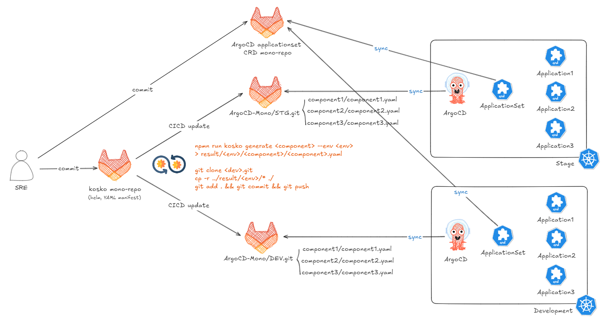
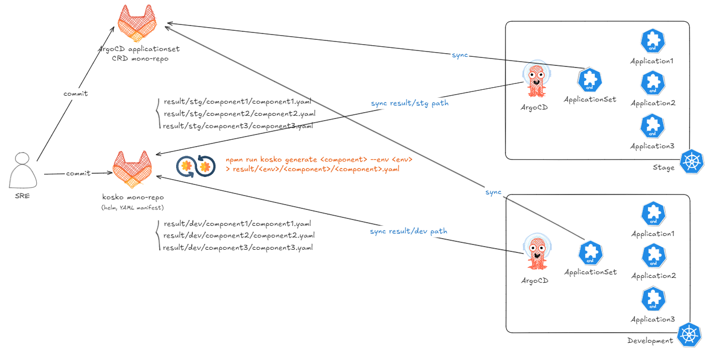
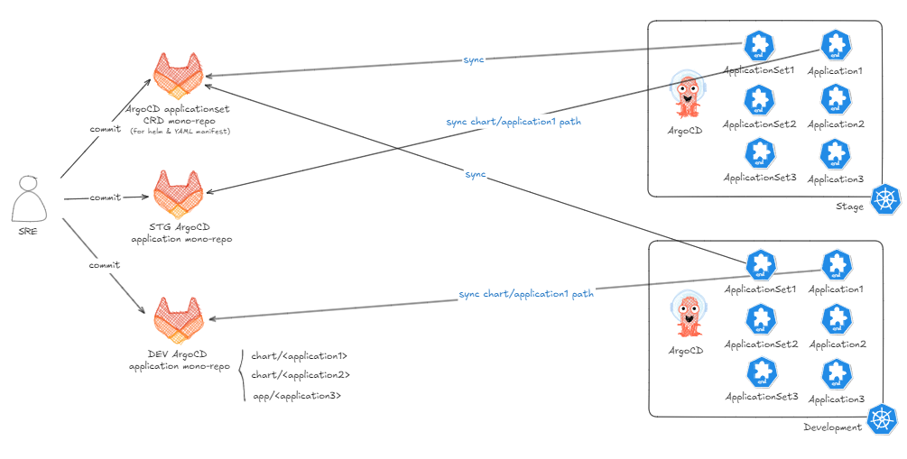

以目前維運經驗，在 Kubernetes 部署 PaaS 應用時，元件以透過 Helm 部署為大宗，故目標是要能同時定義 yaml manifest 與 helm chart 的 tool 為首要選擇。

目前 survey 了三種工具可以用來渲染 YAML 與 helm chart。

- Kosko https://kosko.dev/
  - 基於 JavaScript/TypeScript，用於動態生成 Kubernetes 的 YAML manifest，適合需要大量動態靈活配置的應用場景。
  - 需要另外搭配撰寫邏輯配置 YAML 生成後的儲存路徑。
- CDK8S https://cdk8s.io/
  - AWS 開源的工具，支援多語言開發（TypeScript, Python, Java），強調物件導向方式定義 Kubernetes 資源。
  - 一個 application 需要一個獨立的 CDK8S 專案，對於多應用管理較不靈活。
- Kustomization [kustomize/plugin/builtin/helmchartinflationgenerator at master · kubernetes-sigs/kustomize](https://github.com/kubernetes-sigs/kustomize/tree/master/plugin/builtin/helmchartinflationgenerator)
  - Kubernetes 原生工具，允許用戶將 YAML manifest 進行基礎層與覆蓋層的結構化管理，支援 `HelmChartInflationGenerator`，可以直接渲染 Helm chart 並進行覆蓋操作。
  - 直接以 YAML 的方式覆蓋，在動態配置生成方面不如 Kosko 靈活。

首先最先可以捨棄的工具為 CDK8S，因為一個應用需要一個獨立的 CDK8S 專案，這對於多應用場景來說管理成本過高，不適合目標場景。

## **四種設計流程**

## **方案一（Kosko git project + 多環境 ArgoCD git project）**

### **流程**

- 透過在 argocd-applicationset-repo git project 先定義各環境的 ArgoCD 的 ApplicationSet。
- 在 Kosko git project 的 CI Pipeline 中生成不同環境的 YAML 檔案，並儲存在 `result/<env>/<component>/<component-name>.yaml` 中。再透過定義不同環境的 git update 步驟，將這些 YAML 推送至各環境的獨立 ArgoCD application git project。
- 各個環境的 ArgoCD 將透過 ApplicationSet 監聽對應的指定環境的 ArgoCD application git projects，並自動同步到 Kubernetes 中。

**優點**

- 環境隔離性好，每個環境有獨立的 git 倉庫，方便獨立查看異動紀錄

**缺點**

- CI pipeline 較複雜
- 維運人員並不一定具備 JS 程式基礎

## **方案二（ArgoCD 直接同步 Kosko git Project 中的部署目錄）**

### **流程**

- 透過在 argocd-applicationset-repo git project 先定義各環境的 ArgoCD 的 ApplicationSet。
- 在 Kosko git project 的 CI Pipeline 中生成不同環境的 YAML 檔案，並儲存在 `result/<env>/<component>/<component>.yaml` 中。
- 各個環境的 ArgoCD 將透過 ApplicationSet 直接監聽 kosko git project 的 `result/<env>` 來進行同步和部署。

**優點**

- 單一倉庫管理所有環境,更易於維護

**缺點**

- 環境隔離性較差，在還沒有導入機敏資料管理的前提下，部署所有環境的 yaml 都可以在 Kosko project 中看到)
- 維運人員並不一定具備 JS 程式基礎

## **方案三 （使用 Kustomization Overlays 管理多環境）**

### **流程**

- 透過在 argocd-applicationset-repo git project 先定義各環境的 ArgoCD 的各個 Application 的 ApplicationSet。
- 使用 Kustomization 定義基礎的 Application 設定，並透過 overlays 來覆蓋不同環境的特殊配置。
- 各個環境的 ArgoCD 將透過 ApplicationSet 監聽不同環境（如 dev 和 stg）的 `overlays/<env>` 目錄來進行同步。

**優點**

- 利用了 Kubernetes 原生工具,無需額外的生成步驟

**缺點**

- 對於複雜的客製化可能不如 JavaScript 靈活

## **方案四 （使用多環境 ArgoCD git project）**

**流程**

- 透過在 argocd-applicationset-repo git project 先定義各環境的 ArgoCD 的 helm chart 以及 yaml manifest 的 ApplicationSet 。
- 各個環境的 ArgoCD 將透過 ApplicationSet 個別監聽不同環境（如 dev 和 stg）的指定目錄來進行 helm 及 manifest 的同步。

**優點**

- 環境隔離性好，每個環境有獨立的 git 倉庫，方便獨立查看異動紀錄
- 利用了 Kubernetes 原生工具，無需額外的生成步驟
- 適合 argocd 分開部署的環境使用 (如當前的環境，一個 argocd 管一個 k8s cluster)
- 門檻最低

**缺點**

- 即使有重複使用的配置，也需維護不同環境的 git project
