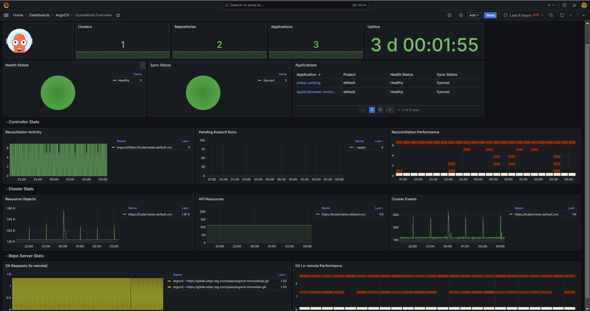

## 準備

新增 helm repo

```bash
helm repo add argo https://argoproj.github.io/argo-helm
```

values.yaml

```yaml
redis-ha:
  enabled: true
  haproxy:
   IPv6:
     enabled: false

controller:
  replicas: 1

server:
  replicas: 2

repoServer:
  replicas: 2

applicationSet:
  replicas: 2

global:
  domain: argocd.sdsp-stg.com

configs:
  params:
    server.insecure: true

controller:
  metrics:
    enabled: true
    service:
      type: ClusterIP
      servicePort: 8082
      portName: http-metrics
    serviceMonitor:
      enabled: true
      interval: 30s
      namespace: monitoring
      additionalLabels:
        release: kube-prometheus-stack

server:
  metrics:
    enabled: true
    service:
      type: ClusterIP
      servicePort: 8083
      portName: http-metrics
    serviceMonitor:
      enabled: true
      interval: 30s
      namespace: monitoring
      additionalLabels:
        release: kube-prometheus-stack
  ingress:
    enabled: true
    ingressClassName: nginx
    annotations:
      nginx.ingress.kubernetes.io/force-ssl-redirect: "true"
      nginx.ingress.kubernetes.io/backend-protocol: "HTTP"
    extraTls:
      - hosts:
        - argocd.sdsp-stg.com

repoServer:
  metrics:
    enabled: true
    service:
      type: ClusterIP
      servicePort: 8084
      portName: http-metrics
    serviceMonitor:
      enabled: true
      interval: 30s
      namespace: monitoring
      additionalLabels:
        release: kube-prometheus-stack

applicationSet:
  metrics:
    enabled: true
    service:
      type: ClusterIP
      servicePort: 8080
      portName: http-metrics
    serviceMonitor:
      enabled: true
      interval: 30s
      namespace: monitoring
      additionalLabels:
        release: kube-prometheus-stack
```

其中，

1. redis-ha 需要將 haproxy 的 IPv6 關閉，否則在啟動後 redis ha proxy 會報以下錯誤

   ```bash
   [ALERT]    (1) : Binding [/usr/local/etc/haproxy/haproxy.cfg:9] for proxy health_check_http_url: cannot create receiving socket (Address family not supported by protocol) for [:::8888]
   [ALERT]    (1) : Binding [/usr/local/etc/haproxy/haproxy.cfg:56] for frontend ft_redis_master: cannot create receiving socket (Address family not supported by protocol) for [:::6379]
   [ALERT]    (1) : Binding [/usr/local/etc/haproxy/haproxy.cfg:77] for frontend stats: cannot create receiving socket (Address family not supported by protocol) for [:::9101]
   [ALERT]    (1) : [haproxy.main()] Some protocols failed to start their listeners! Exiting.
   ```

2. 啟用 ingress，並將憑證交由 Ingress Controller 管理，需注意加上 `config.params.server.insecure=true`，否則在連線時會有 `ERR_TOO_MANY_REDIRECTS` 的錯誤。

   ```yaml
   global:
     domain: argocd.sdsp-stg.com

   configs:
     params:
       server.insecure: true

   server:
     ingress:
       enabled: true
       ingressClassName: nginx
       annotations:
         nginx.ingress.kubernetes.io/force-ssl-redirect: "true"
         nginx.ingress.kubernetes.io/backend-protocol: "HTTP"
       extraTls:
         - hosts:
             - argocd.sdsp-stg.com
   ```

3. 啟用監控，將欲啟用的元件 controller、server、repo server、applicationset 的 metrics 啟用，並設定對應的 service monitor，以 controller 為例：

   ```yaml
   controller:
     metrics:
       enabled: true
       service:
         type: ClusterIP
         servicePort: 8082
         portName: http-metrics
       serviceMonitor:
         enabled: true
         interval: 30s
         namespace: monitoring
         additionalLabels:
           release: kube-prometheus-stack
   ```

## 安裝

```bash
helm upgrade --install -name argocd argo/argo-cd --create-namespace --namespace argocd -f values.yaml
```

## 設定 Grafana



參考 Grafana 社群提供的 [19993](https://grafana.com/grafana/dashboards/19993-argocd-operational-overview/) Dashboard，修改成以上畫面，最終的 JSON 模板如下：



```json
{
  "annotations": {
    "list": [
      {
        "builtIn": 1,
        "datasource": {
          "type": "grafana",
          "uid": "-- Grafana --"
        },
        "enable": true,
        "hide": true,
        "iconColor": "rgba(0, 211, 255, 1)",
        "name": "Annotations & Alerts",
        "type": "dashboard"
      }
    ]
  },
  "description": "A dashboard that monitors ArgoCD with a focus on the operational. It is created using the [argo-cd-mixin](https://github.com/adinhodovic/argo-cd-mixin).",
  "editable": true,
  "fiscalYearStartMonth": 0,
  "gnetId": 19993,
  "graphTooltip": 0,
  "id": 32,
  "links": [
    {
      "tags": ["ci/cd", "argo-cd"],
      "targetBlank": true,
      "title": "ArgoCD Dashboards",
      "type": "dashboards"
    }
  ],
  "panels": [
    {
      "collapsed": false,
      "gridPos": {
        "h": 1,
        "w": 24,
        "x": 0,
        "y": 0
      },
      "id": 1,
      "title": "Summary",
      "type": "row"
    },
    {
      "datasource": {
        "type": "prometheus",
        "uid": "prometheus"
      },
      "gridPos": {
        "h": 4,
        "w": 3,
        "x": 0,
        "y": 1
      },
      "id": 25,
      "options": {
        "code": {
          "language": "plaintext",
          "showLineNumbers": false,
          "showMiniMap": false
        },
        "content": "",
        "mode": "markdown"
      },
      "pluginVersion": "11.0.0",
      "type": "text"
    },
    {
      "datasource": {
        "type": "datasource",
        "uid": "-- Mixed --"
      },
      "fieldConfig": {
        "defaults": {
          "mappings": [],
          "thresholds": {
            "mode": "absolute",
            "steps": [
              {
                "color": "green",
                "value": null
              },
              {
                "color": "red",
                "value": 80
              }
            ]
          },
          "unit": "short"
        },
        "overrides": []
      },
      "gridPos": {
        "h": 4,
        "w": 4,
        "x": 3,
        "y": 1
      },
      "id": 2,
      "options": {
        "colorMode": "value",
        "graphMode": "area",
        "justifyMode": "auto",
        "orientation": "auto",
        "reduceOptions": {
          "calcs": ["lastNotNull"],
          "fields": "",
          "values": false
        },
        "showPercentChange": false,
        "textMode": "auto",
        "wideLayout": true
      },
      "pluginVersion": "11.0.0",
      "targets": [
        {
          "datasource": {
            "type": "prometheus",
            "uid": "$datasource"
          },
          "expr": "sum(\n  argocd_cluster_info{\n    namespace=~'$namespace',\n    job=~'$job'\n  }\n)\n",
          "refId": "A"
        }
      ],
      "title": "Clusters",
      "type": "stat"
    },
    {
      "datasource": {
        "type": "datasource",
        "uid": "-- Mixed --"
      },
      "fieldConfig": {
        "defaults": {
          "mappings": [],
          "thresholds": {
            "mode": "absolute",
            "steps": [
              {
                "color": "green",
                "value": null
              },
              {
                "color": "red",
                "value": 80
              }
            ]
          },
          "unit": "short"
        },
        "overrides": []
      },
      "gridPos": {
        "h": 4,
        "w": 4,
        "x": 7,
        "y": 1
      },
      "id": 3,
      "options": {
        "colorMode": "value",
        "graphMode": "area",
        "justifyMode": "auto",
        "orientation": "auto",
        "reduceOptions": {
          "calcs": ["lastNotNull"],
          "fields": "",
          "values": false
        },
        "showPercentChange": false,
        "textMode": "auto",
        "wideLayout": true
      },
      "pluginVersion": "11.0.0",
      "targets": [
        {
          "datasource": {
            "type": "prometheus",
            "uid": "$datasource"
          },
          "expr": "count(\n  count(\n    argocd_app_info{\n      namespace=~'$namespace',\n      job=~'$job'\n    }\n  )\n  by (repo)\n)\n",
          "refId": "A"
        }
      ],
      "title": "Repositories",
      "type": "stat"
    },
    {
      "datasource": {
        "type": "datasource",
        "uid": "-- Mixed --"
      },
      "fieldConfig": {
        "defaults": {
          "mappings": [],
          "thresholds": {
            "mode": "absolute",
            "steps": [
              {
                "color": "green",
                "value": null
              },
              {
                "color": "red",
                "value": 80
              }
            ]
          },
          "unit": "short"
        },
        "overrides": []
      },
      "gridPos": {
        "h": 4,
        "w": 4,
        "x": 11,
        "y": 1
      },
      "id": 4,
      "options": {
        "colorMode": "value",
        "graphMode": "area",
        "justifyMode": "auto",
        "orientation": "auto",
        "reduceOptions": {
          "calcs": ["lastNotNull"],
          "fields": "",
          "values": false
        },
        "showPercentChange": false,
        "textMode": "auto",
        "wideLayout": true
      },
      "pluginVersion": "11.0.0",
      "targets": [
        {
          "datasource": {
            "type": "prometheus",
            "uid": "$datasource"
          },
          "expr": "sum(\n  argocd_app_info{\n    namespace=~'$namespace',\njob=~'$job',\ndest_server=~'$cluster',\nproject=~'$project',\n\n  }\n)\n",
          "refId": "A"
        }
      ],
      "title": "Applications",
      "type": "stat"
    },
    {
      "datasource": {
        "type": "prometheus",
        "uid": "prometheus"
      },
      "fieldConfig": {
        "defaults": {
          "color": {
            "mode": "thresholds"
          },
          "mappings": [],
          "thresholds": {
            "mode": "absolute",
            "steps": [
              {
                "color": "green",
                "value": null
              }
            ]
          },
          "unit": "dtdhms"
        },
        "overrides": []
      },
      "gridPos": {
        "h": 4,
        "w": 5,
        "x": 15,
        "y": 1
      },
      "id": 26,
      "options": {
        "colorMode": "value",
        "graphMode": "none",
        "justifyMode": "auto",
        "orientation": "horizontal",
        "reduceOptions": {
          "calcs": ["lastNotNull"],
          "fields": "",
          "values": false
        },
        "showPercentChange": false,
        "textMode": "auto",
        "wideLayout": true
      },
      "pluginVersion": "11.0.0",
      "targets": [
        {
          "datasource": {
            "type": "prometheus",
            "uid": "prometheus"
          },
          "editorMode": "code",
          "expr": "time() - max(process_start_time_seconds{job=\"argocd-server-metrics\",namespace=~\"$namespace\"})",
          "instant": false,
          "legendFormat": "__auto",
          "range": true,
          "refId": "A"
        }
      ],
      "title": "Uptime",
      "type": "stat"
    },
    {
      "datasource": {
        "type": "datasource",
        "uid": "-- Mixed --"
      },
      "fieldConfig": {
        "defaults": {
          "color": {
            "mode": "palette-classic"
          },
          "custom": {
            "hideFrom": {
              "legend": false,
              "tooltip": false,
              "viz": false
            }
          },
          "mappings": [],
          "unit": "short"
        },
        "overrides": [
          {
            "matcher": {
              "id": "byName",
              "options": "Healthy"
            },
            "properties": [
              {
                "id": "color",
                "value": {
                  "fixedColor": "green",
                  "mode": "fixed"
                }
              }
            ]
          },
          {
            "matcher": {
              "id": "byName",
              "options": "Degraded"
            },
            "properties": [
              {
                "id": "color",
                "value": {
                  "fixedColor": "red",
                  "mode": "fixed"
                }
              }
            ]
          },
          {
            "matcher": {
              "id": "byName",
              "options": "Progressing"
            },
            "properties": [
              {
                "id": "color",
                "value": {
                  "fixedColor": "yellow",
                  "mode": "fixed"
                }
              }
            ]
          }
        ]
      },
      "gridPos": {
        "h": 6,
        "w": 6,
        "x": 0,
        "y": 5
      },
      "id": 5,
      "options": {
        "legend": {
          "displayMode": "table",
          "placement": "right",
          "showLegend": true,
          "values": ["value"]
        },
        "pieType": "pie",
        "reduceOptions": {
          "calcs": ["lastNotNull"],
          "fields": "",
          "values": false
        },
        "tooltip": {
          "maxHeight": 600,
          "mode": "multi",
          "sort": "none"
        }
      },
      "pluginVersion": "v10.2.0",
      "targets": [
        {
          "datasource": {
            "type": "prometheus",
            "uid": "$datasource"
          },
          "expr": "sum(\n  argocd_app_info{\n    namespace=~'$namespace',\njob=~'$job',\ndest_server=~'$cluster',\nproject=~'$project',\n\n  }\n) by (health_status)\n",
          "instant": true,
          "legendFormat": "{{ health_status }}",
          "refId": "A"
        }
      ],
      "title": "Health Status",
      "type": "piechart"
    },
    {
      "datasource": {
        "type": "datasource",
        "uid": "-- Mixed --"
      },
      "fieldConfig": {
        "defaults": {
          "color": {
            "mode": "palette-classic"
          },
          "custom": {
            "hideFrom": {
              "legend": false,
              "tooltip": false,
              "viz": false
            }
          },
          "mappings": [],
          "unit": "short"
        },
        "overrides": [
          {
            "matcher": {
              "id": "byName",
              "options": "Synced"
            },
            "properties": [
              {
                "id": "color",
                "value": {
                  "fixedColor": "green",
                  "mode": "fixed"
                }
              }
            ]
          },
          {
            "matcher": {
              "id": "byName",
              "options": "OutOfSync"
            },
            "properties": [
              {
                "id": "color",
                "value": {
                  "fixedColor": "red",
                  "mode": "fixed"
                }
              }
            ]
          },
          {
            "matcher": {
              "id": "byName",
              "options": "Unknown"
            },
            "properties": [
              {
                "id": "color",
                "value": {
                  "fixedColor": "yellow",
                  "mode": "fixed"
                }
              }
            ]
          }
        ]
      },
      "gridPos": {
        "h": 6,
        "w": 6,
        "x": 6,
        "y": 5
      },
      "id": 6,
      "options": {
        "legend": {
          "displayMode": "table",
          "placement": "right",
          "showLegend": true,
          "values": ["value"]
        },
        "pieType": "pie",
        "reduceOptions": {
          "calcs": ["lastNotNull"],
          "fields": "",
          "values": false
        },
        "tooltip": {
          "maxHeight": 600,
          "mode": "multi",
          "sort": "none"
        }
      },
      "pluginVersion": "v10.2.0",
      "targets": [
        {
          "datasource": {
            "type": "prometheus",
            "uid": "$datasource"
          },
          "expr": "sum(\n  argocd_app_info{\n    namespace=~'$namespace',\njob=~'$job',\ndest_server=~'$cluster',\nproject=~'$project',\n\n  }\n) by (sync_status)\n",
          "instant": true,
          "legendFormat": "{{ sync_status }}",
          "refId": "A"
        }
      ],
      "title": "Sync Status",
      "type": "piechart"
    },
    {
      "datasource": {
        "type": "datasource",
        "uid": "-- Mixed --"
      },
      "fieldConfig": {
        "defaults": {
          "custom": {
            "align": "auto",
            "cellOptions": {
              "type": "auto"
            },
            "inspect": false
          },
          "mappings": [],
          "thresholds": {
            "mode": "absolute",
            "steps": [
              {
                "color": "green",
                "value": null
              },
              {
                "color": "red",
                "value": 80
              }
            ]
          },
          "unit": "short"
        },
        "overrides": [
          {
            "matcher": {
              "id": "byName",
              "options": "name"
            },
            "properties": [
              {
                "id": "links",
                "value": [
                  {
                    "targetBlank": true,
                    "title": "Go To Application",
                    "type": "dashboard",
                    "url": "/d/argo-cd-application-overview-kask/argocd-notifications-overview?&var-project=${__data.fields.Project}&var-application=${__value.raw}"
                  }
                ]
              }
            ]
          }
        ]
      },
      "gridPos": {
        "h": 6,
        "w": 8,
        "x": 12,
        "y": 5
      },
      "id": 7,
      "options": {
        "cellHeight": "sm",
        "footer": {
          "countRows": false,
          "enablePagination": true,
          "fields": "",
          "reducer": ["sum"],
          "show": false
        },
        "showHeader": true,
        "sortBy": [
          {
            "displayName": "Application"
          }
        ]
      },
      "pluginVersion": "11.0.0",
      "targets": [
        {
          "datasource": {
            "type": "prometheus",
            "uid": "$datasource"
          },
          "expr": "sum(\n  argocd_app_info{\n    namespace=~'$namespace',\njob=~'$job',\ndest_server=~'$cluster',\nproject=~'$project',\n\n  }\n) by (job, dest_server, project, name, health_status, sync_status)\n",
          "format": "table",
          "instant": true,
          "refId": "A"
        }
      ],
      "title": "Applications",
      "transformations": [
        {
          "id": "organize",
          "options": {
            "excludeByName": {
              "Time": true,
              "Value": true,
              "dest_server": true,
              "job": true
            },
            "indexByName": {
              "health_status": 2,
              "name": 0,
              "project": 1,
              "sync_status": 3
            },
            "renameByName": {
              "dest_server": "Cluster",
              "health_status": "Health Status",
              "job": "Job",
              "name": "Application",
              "project": "Project",
              "sync_status": "Sync Status"
            }
          }
        }
      ],
      "type": "table"
    },
    {
      "collapsed": false,
      "gridPos": {
        "h": 1,
        "w": 24,
        "x": 0,
        "y": 11
      },
      "id": 11,
      "title": "Controller Stats",
      "type": "row"
    },
    {
      "datasource": {
        "type": "datasource",
        "uid": "-- Mixed --"
      },
      "fieldConfig": {
        "defaults": {
          "color": {
            "mode": "palette-classic"
          },
          "custom": {
            "axisBorderShow": false,
            "axisCenteredZero": false,
            "axisColorMode": "text",
            "axisLabel": "",
            "axisPlacement": "auto",
            "barAlignment": 0,
            "drawStyle": "line",
            "fillOpacity": 10,
            "gradientMode": "none",
            "hideFrom": {
              "legend": false,
              "tooltip": false,
              "viz": false
            },
            "insertNulls": false,
            "lineInterpolation": "linear",
            "lineWidth": 1,
            "pointSize": 5,
            "scaleDistribution": {
              "type": "linear"
            },
            "showPoints": "auto",
            "spanNulls": false,
            "stacking": {
              "group": "A",
              "mode": "none"
            },
            "thresholdsStyle": {
              "mode": "off"
            }
          },
          "mappings": [],
          "thresholds": {
            "mode": "absolute",
            "steps": [
              {
                "color": "green",
                "value": null
              },
              {
                "color": "red",
                "value": 80
              }
            ]
          },
          "unit": "short"
        },
        "overrides": []
      },
      "gridPos": {
        "h": 6,
        "w": 8,
        "x": 0,
        "y": 12
      },
      "id": 12,
      "options": {
        "legend": {
          "calcs": ["last"],
          "displayMode": "table",
          "placement": "right",
          "showLegend": true,
          "sortBy": "Last",
          "sortDesc": true
        },
        "tooltip": {
          "maxHeight": 600,
          "mode": "multi",
          "sort": "desc"
        }
      },
      "pluginVersion": "v10.2.0",
      "targets": [
        {
          "datasource": {
            "type": "prometheus",
            "uid": "$datasource"
          },
          "expr": "sum(\n  round(\n    increase(\n      argocd_app_reconcile_count{\n        namespace=~'$namespace',\n        job=~'$job',\n        dest_server=~'$cluster'\n      }[$__rate_interval]\n    )\n  )\n) by (namespace, job, dest_server)\n",
          "legendFormat": "{{ namespace }}/{{ dest_server }}",
          "refId": "A"
        }
      ],
      "title": "Recociliation Activity",
      "type": "timeseries"
    },
    {
      "datasource": {
        "type": "datasource",
        "uid": "-- Mixed --"
      },
      "fieldConfig": {
        "defaults": {
          "color": {
            "mode": "palette-classic"
          },
          "custom": {
            "axisBorderShow": false,
            "axisCenteredZero": false,
            "axisColorMode": "text",
            "axisLabel": "",
            "axisPlacement": "auto",
            "barAlignment": 0,
            "drawStyle": "line",
            "fillOpacity": 10,
            "gradientMode": "none",
            "hideFrom": {
              "legend": false,
              "tooltip": false,
              "viz": false
            },
            "insertNulls": false,
            "lineInterpolation": "linear",
            "lineWidth": 1,
            "pointSize": 5,
            "scaleDistribution": {
              "type": "linear"
            },
            "showPoints": "auto",
            "spanNulls": false,
            "stacking": {
              "group": "A",
              "mode": "none"
            },
            "thresholdsStyle": {
              "mode": "off"
            }
          },
          "mappings": [],
          "thresholds": {
            "mode": "absolute",
            "steps": [
              {
                "color": "green",
                "value": null
              },
              {
                "color": "red",
                "value": 80
              }
            ]
          },
          "unit": "short"
        },
        "overrides": []
      },
      "gridPos": {
        "h": 6,
        "w": 8,
        "x": 8,
        "y": 12
      },
      "id": 15,
      "options": {
        "legend": {
          "calcs": ["last"],
          "displayMode": "table",
          "placement": "right",
          "showLegend": true,
          "sortBy": "Last",
          "sortDesc": true
        },
        "tooltip": {
          "maxHeight": 600,
          "mode": "multi",
          "sort": "desc"
        }
      },
      "pluginVersion": "v10.2.0",
      "targets": [
        {
          "datasource": {
            "type": "prometheus",
            "uid": "$datasource"
          },
          "expr": "sum(\n  argocd_kubectl_exec_pending{\n    namespace=~'$namespace',\n    job=~'$job'\n  }\n) by (job, command)\n",
          "legendFormat": "{{ dest_server }} - {{ command }}",
          "refId": "A"
        }
      ],
      "title": "Pending Kubectl Runs",
      "type": "timeseries"
    },
    {
      "datasource": {
        "type": "datasource",
        "uid": "-- Mixed --"
      },
      "fieldConfig": {
        "defaults": {
          "custom": {
            "hideFrom": {
              "legend": false,
              "tooltip": false,
              "viz": false
            },
            "scaleDistribution": {
              "type": "linear"
            }
          }
        },
        "overrides": []
      },
      "gridPos": {
        "h": 6,
        "w": 8,
        "x": 16,
        "y": 12
      },
      "id": 13,
      "options": {
        "calculate": true,
        "calculation": {},
        "cellGap": 2,
        "cellValues": {},
        "color": {
          "exponent": 0.5,
          "fill": "dark-orange",
          "mode": "scheme",
          "reverse": false,
          "scale": "exponential",
          "scheme": "Oranges",
          "steps": 128
        },
        "exemplars": {
          "color": "rgba(255,0,255,0.7)"
        },
        "filterValues": {
          "le": 1e-9
        },
        "legend": {
          "show": false
        },
        "rowsFrame": {
          "layout": "auto"
        },
        "showValue": "never",
        "tooltip": {
          "maxHeight": 600,
          "mode": "none",
          "showColorScale": false,
          "yHistogram": false
        },
        "yAxis": {
          "axisPlacement": "left",
          "reverse": false
        }
      },
      "pluginVersion": "11.0.0",
      "targets": [
        {
          "datasource": {
            "type": "prometheus",
            "uid": "$datasource"
          },
          "expr": "sum(\n  increase(\n    argocd_app_reconcile_bucket{\n      namespace=~'$namespace',\n      job=~'$job',\n      dest_server=~'$cluster'\n    }[$__rate_interval]\n  )\n) by (le)\n",
          "format": "heatmap",
          "legendFormat": "{{ le }}",
          "refId": "A"
        }
      ],
      "title": "Reconciliation Performance",
      "type": "heatmap"
    },
    {
      "collapsed": false,
      "gridPos": {
        "h": 1,
        "w": 24,
        "x": 0,
        "y": 18
      },
      "id": 16,
      "title": "Cluster Stats",
      "type": "row"
    },
    {
      "datasource": {
        "type": "datasource",
        "uid": "-- Mixed --"
      },
      "fieldConfig": {
        "defaults": {
          "color": {
            "mode": "palette-classic"
          },
          "custom": {
            "axisBorderShow": false,
            "axisCenteredZero": false,
            "axisColorMode": "text",
            "axisLabel": "",
            "axisPlacement": "auto",
            "barAlignment": 0,
            "drawStyle": "line",
            "fillOpacity": 10,
            "gradientMode": "none",
            "hideFrom": {
              "legend": false,
              "tooltip": false,
              "viz": false
            },
            "insertNulls": false,
            "lineInterpolation": "linear",
            "lineWidth": 1,
            "pointSize": 5,
            "scaleDistribution": {
              "type": "linear"
            },
            "showPoints": "auto",
            "spanNulls": false,
            "stacking": {
              "group": "A",
              "mode": "none"
            },
            "thresholdsStyle": {
              "mode": "off"
            }
          },
          "mappings": [],
          "thresholds": {
            "mode": "absolute",
            "steps": [
              {
                "color": "green",
                "value": null
              },
              {
                "color": "red",
                "value": 80
              }
            ]
          },
          "unit": "short"
        },
        "overrides": []
      },
      "gridPos": {
        "h": 6,
        "w": 8,
        "x": 0,
        "y": 19
      },
      "id": 17,
      "options": {
        "legend": {
          "calcs": ["last"],
          "displayMode": "table",
          "placement": "right",
          "showLegend": true,
          "sortBy": "Last",
          "sortDesc": true
        },
        "tooltip": {
          "maxHeight": 600,
          "mode": "multi",
          "sort": "desc"
        }
      },
      "pluginVersion": "v10.2.0",
      "targets": [
        {
          "datasource": {
            "type": "prometheus",
            "uid": "$datasource"
          },
          "expr": "sum(\n  argocd_cluster_api_resource_objects{\n    namespace=~'$namespace',\n    job=~'$job',\n    server=~'$cluster'\n  }\n) by (namespace, job, server)\n",
          "legendFormat": "{{ server }}",
          "refId": "A"
        }
      ],
      "title": "Resource Objects",
      "type": "timeseries"
    },
    {
      "datasource": {
        "type": "datasource",
        "uid": "-- Mixed --"
      },
      "fieldConfig": {
        "defaults": {
          "color": {
            "mode": "palette-classic"
          },
          "custom": {
            "axisBorderShow": false,
            "axisCenteredZero": false,
            "axisColorMode": "text",
            "axisLabel": "",
            "axisPlacement": "auto",
            "barAlignment": 0,
            "drawStyle": "line",
            "fillOpacity": 10,
            "gradientMode": "none",
            "hideFrom": {
              "legend": false,
              "tooltip": false,
              "viz": false
            },
            "insertNulls": false,
            "lineInterpolation": "linear",
            "lineWidth": 1,
            "pointSize": 5,
            "scaleDistribution": {
              "type": "linear"
            },
            "showPoints": "auto",
            "spanNulls": false,
            "stacking": {
              "group": "A",
              "mode": "none"
            },
            "thresholdsStyle": {
              "mode": "off"
            }
          },
          "mappings": [],
          "thresholds": {
            "mode": "absolute",
            "steps": [
              {
                "color": "green",
                "value": null
              },
              {
                "color": "red",
                "value": 80
              }
            ]
          },
          "unit": "short"
        },
        "overrides": []
      },
      "gridPos": {
        "h": 6,
        "w": 8,
        "x": 8,
        "y": 19
      },
      "id": 18,
      "options": {
        "legend": {
          "calcs": ["last"],
          "displayMode": "table",
          "placement": "right",
          "showLegend": true,
          "sortBy": "Last",
          "sortDesc": true
        },
        "tooltip": {
          "maxHeight": 600,
          "mode": "multi",
          "sort": "desc"
        }
      },
      "pluginVersion": "v10.2.0",
      "targets": [
        {
          "datasource": {
            "type": "prometheus",
            "uid": "$datasource"
          },
          "expr": "sum(\n  argocd_cluster_api_resources{\n    namespace=~'$namespace',\n    job=~'$job',\n    server=~'$cluster'\n  }\n) by (namespace, job, server)\n",
          "legendFormat": "{{ server }}",
          "refId": "A"
        }
      ],
      "title": "API Resources",
      "type": "timeseries"
    },
    {
      "datasource": {
        "type": "datasource",
        "uid": "-- Mixed --"
      },
      "fieldConfig": {
        "defaults": {
          "color": {
            "mode": "palette-classic"
          },
          "custom": {
            "axisBorderShow": false,
            "axisCenteredZero": false,
            "axisColorMode": "text",
            "axisLabel": "",
            "axisPlacement": "auto",
            "barAlignment": 0,
            "drawStyle": "line",
            "fillOpacity": 10,
            "gradientMode": "none",
            "hideFrom": {
              "legend": false,
              "tooltip": false,
              "viz": false
            },
            "insertNulls": false,
            "lineInterpolation": "linear",
            "lineWidth": 1,
            "pointSize": 5,
            "scaleDistribution": {
              "type": "linear"
            },
            "showPoints": "auto",
            "spanNulls": false,
            "stacking": {
              "group": "A",
              "mode": "none"
            },
            "thresholdsStyle": {
              "mode": "off"
            }
          },
          "mappings": [],
          "thresholds": {
            "mode": "absolute",
            "steps": [
              {
                "color": "green",
                "value": null
              },
              {
                "color": "red",
                "value": 80
              }
            ]
          },
          "unit": "short"
        },
        "overrides": []
      },
      "gridPos": {
        "h": 6,
        "w": 8,
        "x": 16,
        "y": 19
      },
      "id": 19,
      "options": {
        "legend": {
          "calcs": ["last"],
          "displayMode": "table",
          "placement": "right",
          "showLegend": true,
          "sortBy": "Last",
          "sortDesc": true
        },
        "tooltip": {
          "maxHeight": 600,
          "mode": "multi",
          "sort": "desc"
        }
      },
      "pluginVersion": "v10.2.0",
      "targets": [
        {
          "datasource": {
            "type": "prometheus",
            "uid": "$datasource"
          },
          "expr": "sum(\n  increase(\n    argocd_cluster_events_total{\n      namespace=~'$namespace',\n      job=~'$job',\n      server=~'$cluster'\n    }[$__rate_interval]\n  )\n) by (namespace, job, server)\n",
          "legendFormat": "{{ server }}",
          "refId": "A"
        }
      ],
      "title": "Cluster Events",
      "type": "timeseries"
    },
    {
      "collapsed": false,
      "gridPos": {
        "h": 1,
        "w": 24,
        "x": 0,
        "y": 25
      },
      "id": 20,
      "title": "Repo Server Stats",
      "type": "row"
    },
    {
      "datasource": {
        "type": "datasource",
        "uid": "-- Mixed --"
      },
      "fieldConfig": {
        "defaults": {
          "color": {
            "mode": "palette-classic"
          },
          "custom": {
            "axisBorderShow": false,
            "axisCenteredZero": false,
            "axisColorMode": "text",
            "axisLabel": "",
            "axisPlacement": "auto",
            "barAlignment": 0,
            "drawStyle": "line",
            "fillOpacity": 10,
            "gradientMode": "none",
            "hideFrom": {
              "legend": false,
              "tooltip": false,
              "viz": false
            },
            "insertNulls": false,
            "lineInterpolation": "linear",
            "lineWidth": 1,
            "pointSize": 5,
            "scaleDistribution": {
              "type": "linear"
            },
            "showPoints": "auto",
            "spanNulls": false,
            "stacking": {
              "group": "A",
              "mode": "none"
            },
            "thresholdsStyle": {
              "mode": "off"
            }
          },
          "mappings": [],
          "thresholds": {
            "mode": "absolute",
            "steps": [
              {
                "color": "green",
                "value": null
              },
              {
                "color": "red",
                "value": 80
              }
            ]
          },
          "unit": "short"
        },
        "overrides": []
      },
      "gridPos": {
        "h": 6,
        "w": 12,
        "x": 0,
        "y": 26
      },
      "id": 21,
      "options": {
        "legend": {
          "calcs": ["last"],
          "displayMode": "table",
          "placement": "right",
          "showLegend": true,
          "sortBy": "Last",
          "sortDesc": true
        },
        "tooltip": {
          "maxHeight": 600,
          "mode": "multi",
          "sort": "desc"
        }
      },
      "pluginVersion": "v10.2.0",
      "targets": [
        {
          "datasource": {
            "type": "prometheus",
            "uid": "$datasource"
          },
          "expr": "sum(\n  increase(\n    argocd_git_request_total{\n      namespace=~'$namespace',\n      job=~'$job',\n      request_type=\"ls-remote\"\n    }[$__rate_interval]\n  )\n) by (namespace, job, repo)\n",
          "legendFormat": "{{ namespace }} - {{ repo }}",
          "refId": "A"
        }
      ],
      "title": "Git Requests (ls-remote)",
      "type": "timeseries"
    },
    {
      "datasource": {
        "type": "datasource",
        "uid": "-- Mixed --"
      },
      "fieldConfig": {
        "defaults": {
          "custom": {
            "hideFrom": {
              "legend": false,
              "tooltip": false,
              "viz": false
            },
            "scaleDistribution": {
              "type": "linear"
            }
          }
        },
        "overrides": []
      },
      "gridPos": {
        "h": 6,
        "w": 12,
        "x": 12,
        "y": 26
      },
      "id": 24,
      "options": {
        "calculate": true,
        "calculation": {},
        "cellGap": 2,
        "cellValues": {},
        "color": {
          "exponent": 0.5,
          "fill": "dark-orange",
          "mode": "scheme",
          "reverse": false,
          "scale": "exponential",
          "scheme": "Oranges",
          "steps": 128
        },
        "exemplars": {
          "color": "rgba(255,0,255,0.7)"
        },
        "filterValues": {
          "le": 1e-9
        },
        "legend": {
          "show": false
        },
        "rowsFrame": {
          "layout": "auto"
        },
        "showValue": "never",
        "tooltip": {
          "maxHeight": 600,
          "mode": "none",
          "showColorScale": false,
          "yHistogram": false
        },
        "yAxis": {
          "axisPlacement": "left",
          "reverse": false
        }
      },
      "pluginVersion": "11.0.0",
      "targets": [
        {
          "datasource": {
            "type": "prometheus",
            "uid": "$datasource"
          },
          "expr": "sum(\n  increase(\n    argocd_git_request_duration_seconds_bucket{\n      namespace=~'$namespace',\n      job=~'$job',\n      request_type=\"ls-remote\"\n    }[$__rate_interval]\n  )\n) by (le)\n",
          "format": "heatmap",
          "legendFormat": "{{ le }}",
          "refId": "A"
        }
      ],
      "title": "Git Ls-remote Performance",
      "type": "heatmap"
    }
  ],
  "schemaVersion": 39,
  "tags": ["ci/cd", "argo-cd"],
  "templating": {
    "list": [
      {
        "current": {
          "selected": false,
          "text": "Prometheus",
          "value": "prometheus"
        },
        "hide": 0,
        "includeAll": false,
        "label": "Data source",
        "multi": false,
        "name": "datasource",
        "options": [],
        "query": "prometheus",
        "refresh": 1,
        "regex": "",
        "skipUrlSync": false,
        "type": "datasource"
      },
      {
        "current": {
          "selected": false,
          "text": "All",
          "value": "$__all"
        },
        "datasource": {
          "type": "prometheus",
          "uid": "${datasource}"
        },
        "definition": "",
        "hide": 0,
        "includeAll": true,
        "label": "Namespace",
        "multi": true,
        "name": "namespace",
        "options": [],
        "query": "label_values(argocd_app_info{}, namespace)",
        "refresh": 2,
        "regex": "",
        "skipUrlSync": false,
        "sort": 1,
        "type": "query"
      },
      {
        "allValue": ".*",
        "current": {
          "selected": false,
          "text": "All",
          "value": "$__all"
        },
        "datasource": {
          "type": "prometheus",
          "uid": "${datasource}"
        },
        "definition": "",
        "hide": 0,
        "includeAll": true,
        "label": "Job",
        "multi": true,
        "name": "job",
        "options": [],
        "query": "label_values(job)",
        "refresh": 2,
        "regex": "argo.*",
        "skipUrlSync": false,
        "sort": 1,
        "type": "query"
      },
      {
        "current": {
          "selected": false,
          "text": "All",
          "value": "$__all"
        },
        "datasource": {
          "type": "prometheus",
          "uid": "${datasource}"
        },
        "definition": "",
        "hide": 0,
        "includeAll": true,
        "label": "Cluster",
        "multi": true,
        "name": "cluster",
        "options": [],
        "query": "label_values(argocd_app_info{namespace=~\"$namespace\", job=~\"$job\"}, dest_server)",
        "refresh": 2,
        "regex": "",
        "skipUrlSync": false,
        "sort": 1,
        "type": "query"
      },
      {
        "current": {
          "selected": false,
          "text": "All",
          "value": "$__all"
        },
        "datasource": {
          "type": "prometheus",
          "uid": "${datasource}"
        },
        "definition": "",
        "hide": 0,
        "includeAll": true,
        "label": "Project",
        "multi": true,
        "name": "project",
        "options": [],
        "query": "label_values(argocd_app_info{namespace=~\"$namespace\", job=~\"$job\", dest_server=~\"$cluster\"}, project)",
        "refresh": 2,
        "regex": "",
        "skipUrlSync": false,
        "sort": 1,
        "type": "query"
      }
    ]
  },
  "time": {
    "from": "now-6h",
    "to": "now"
  },
  "timeRangeUpdatedDuringEditOrView": false,
  "timepicker": {},
  "timezone": "utc",
  "title": "Operational Overview",
  "uid": "argo-cd-operational-overview-kask",
  "version": 1,
  "weekStart": ""
}
```



## 設定 AlertRule

準備 `alertrules.yaml` 檔案

```yaml
apiVersion: monitoring.coreos.com/v1
kind: PrometheusRule
metadata:
  labels:
    release: kube-prometheus-stack
  name: argocd-app-sync
  namespace: monitoring
spec:
  groups:
    - name: ArgoCD
      rules:
        - alert: ArgoAppOutOfSync
          expr: argocd_app_info{sync_status="OutOfSync"} == 1
          for: 1m
          labels:
            severity: warning
            environment: Development
          annotations:
            summary: "'{{ $labels.name }}' Application has sync status as '{{ $labels.sync_status }}'"
        - alert: ArgoAppSyncFailed
          expr: argocd_app_sync_total{phase!="Succeeded"} == 1
          for: 1m
          labels:
            severity: warning
            environment: Development
          annotations:
            summary: "'{{ $labels.name }}' Application has sync phase as '{{ $labels.phase }}'"
        - alert: ArgoAppMissing
          expr: absent(argocd_app_info)
          for: 15m
          labels:
            severity: critical
            environment: Development
          annotations:
            summary: "[ArgoCD] No reported applications"
            description: >
              ArgoCD has not reported any applications data for the past 15 minutes which              means that it must be down or not functioning properly.
```

套用設定

```yaml
kubectl apply -f alertrules.yaml
```
