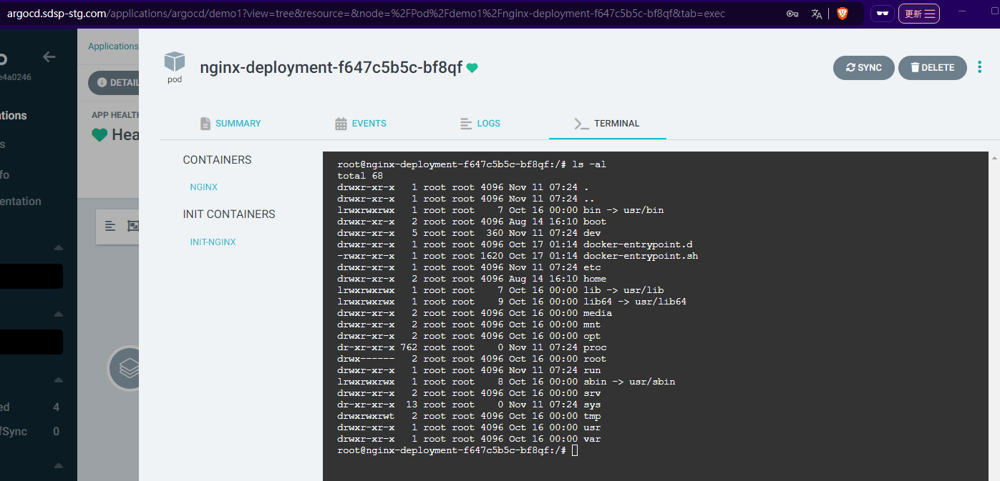
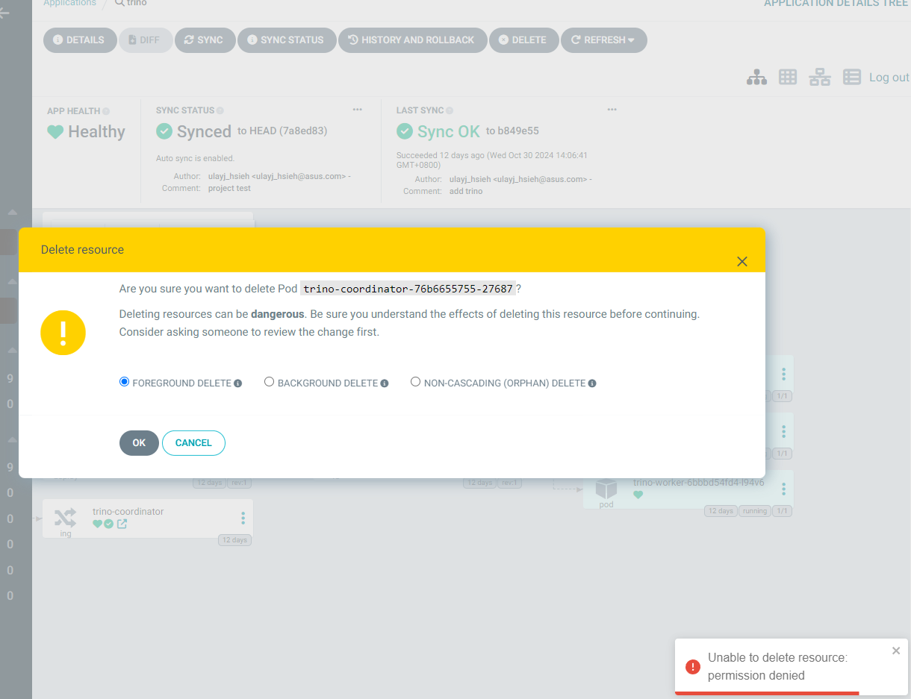

## ArgoCD Roles

### 內建角色

- **Admin (預設角色)**

  - **角色名稱**: `role:admin`
  - **權限**: 擁有 Argo CD 內所有應用程式與資源的完全訪問權限，包括建立、刪除、更新和管理所有資源。
  - **適用對象**: 系統管理員。

- **Read-Only (預設角色)**

  - **角色名稱**: `role:readonly`
  - **權限**: 只可檢視所有資源和應用程式，無法執行任何更改操作。
  - **適用對象**: 需要只讀檢視權限的使用者或監控人員。

### 自訂義角色

- **Project Admin**

  - **角色名稱**: `role:<project>-prj-admin`
  - **權限**: 在特定專案內具有完全控制權。
  - **設定範例**：針對 `aidsp` 專案的管理員角色
    ```yaml
    data:
      policy.csv: |
        p, role:aidsp-prj-admin, projects, *, aidsp, allow
        p, role:aidsp-prj-admin, applications, *, aidsp/*, allow
        p, role:aidsp-prj-admin, exec, create, aidsp/*, allow
        g, kevin, role:aidsp-prj-admin
    ```
    - **說明**: 允許 `aidsp-prj-admin` 角色對 `aidsp` 專案中的所有應用程式進行任何操作。
    - **適用對象**: 專案管理員，需要在整個專案範疇內執行操作。

- **Specific Application Developer**

  - **角色名稱**: `role:<application>-app-developer`
  - **權限**: 對特定應用程式的部分或全部操作權限。
  - **設定範例**： 針對 `podinfo` 應用程式的開發人員角色
    ```yaml
    data:
      policy.csv: |
        p, role:podinfo-app-developer, applications, *, podinfo/podinfo, allow
        p, role:podinfo-app-developer, exec, create, podinfo/podinfo, allow
        g, alice, role:podinfo-app-developer
    ```
    - **說明**: 此設置允許 `podinfo-app-developer` 角色對在 `podinfo` namespace 下的 `podinfo` 應用程式的所有操作（如同步、更新等）、查看 logs、以及針對 pod 進行 exec 操作。
    - **適用對象**: 僅需操作特定應用程式的開發人員，例如 `alice`。

## ArgoCD ConfigMap for RBAC & Web-Based Terminal 設定

因已存在的 ArgoCD 是透過 Helm Chart 安裝，故修改也透過 Helm Chart 來修改 `argocd-cm` 的設定，這樣可以保持 Helm 管理的狀態一致性，並方便將來的版本更新和設定管理。完整的配置如下，

```yaml
# values.yaml
configs:
  cm:
    exec.enabled: true
    accounts.ula: apiKey, login
  rbac:
    policy.csv: |
      p, role:podinfo-app-developer, applications, *, default/podinfo, allow
      p, role:podinfo-app-developer, exec, create, default/podinfo, allow
      g, ula, role:podinfo-app-developer
      p, role:aidsp-prj-admin, projects, *, aidsp, allow
      p, role:aidsp-prj-admin, applications, *, aidsp/*, allow
      p, role:aidsp-prj-admin, exec, create, aidsp/*, allow
      g, ula, role:aidsp-prj-admin
      g, ula, role:readonly
```

以下個別說明每個設定項的意義：

### 設定啟用 Web-based Terminal

```yaml
configs:
  cm:
    exec.enabled: true
```

### 設定用戶管理

Argo CD 沒有內建的用戶管理功能；故需要整合 SSO（單一登入）或使用本地用戶設定。以下是建立本地用戶的設定：

```yaml
configs:
  cm:
    accounts.ula: apiKey, login
```

- `apiKey`  允許產生用於存取 API 的令牌
- `login`  允許從 UI 登入

### 設定角色和權限

Argo CD 預設有兩個角色：`role:admin`（完整存取）和 `role:readonly`（唯讀存取）。以下配置建立自定義角色並分配權限：

```yaml
configs:
  rbac:
    policy.csv: |
      p, role:podinfo-app-developer, applications, *, default/podinfo, allow
      p, role:podinfo-app-developer, exec, create, default/podinfo, allow
      g, ula, role:podinfo-app-developer
      p, role:aidsp-prj-admin, projects, *, aidsp, allow
      p, role:aidsp-prj-admin, applications, *, aidsp/*, allow
      p, role:aidsp-prj-admin, exec, create, aidsp/*, allow
      g, ula, role:aidsp-prj-admin
      g, ula, role:readonly
```

## Patch ClusterRole 或 Role 以允許`argocd-server` exec pods

需要更新 argocd-server 的 role 或是 clusterrole 權限，將 `pods/exec` resources 的 create 動作權限加到 rules 中。

```bash
# patch clusterrole
kubectl patch clusterrole argocd-server --type='json' -p='[{"op": "add", "path": "/rules/-", "value": {"apiGroups": [""], "resources": ["pods/exec"], "verbs": ["create"]}}]'

# patch role in argocd namespace
kubectl patch role argocd-server -n argocd --type='json' -p='[{"op": "add", "path": "/rules/-", "value": {"apiGroups": [""], "resources": ["pods/exec"], "verbs": ["create"]}}]'
```

依據本文原先的 argocd 配置是使用 cluster-wide 的方式建立的 (意即有配置 clusterrole)，故 clusterrole 及 role 都有更新設定。

## 更新部署

```bash
helm upgrade argocd argo/argo-cd -f values.yaml -n argocd --version 7.3.11
```

## 設定 Local User 密碼

```bash
argocd login argocd.sdsp-stg.com
argocd account update-password \
  --account ula \
  --new-password 'zaq1@WSX'
```

## 驗證

使用 user ula 以及設定的密碼登入 Argocd UI，可以看到使用者

- 因為具備 read-only 角色，故可以看到所有 application
- 因為具備 aidsp-prj-admin，可以異動、刪除、執行 aidsp project 下的所有 application
  
- 因為具備 podinfo-app-developer，可以異動、刪除、執行 default project 下的 podinfo application
- 嘗試刪除 default/trino application，顯示錯誤
  
