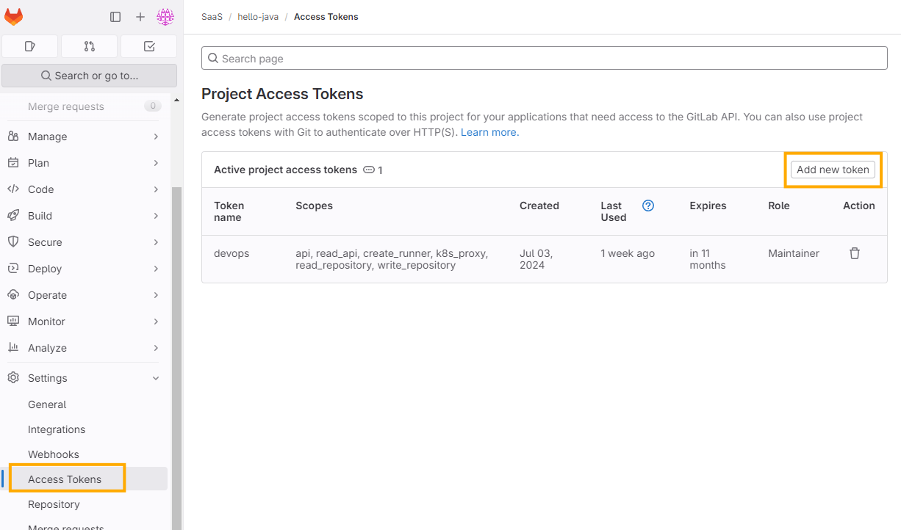
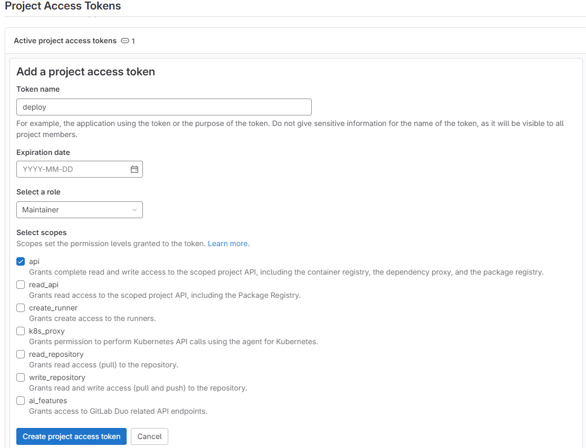
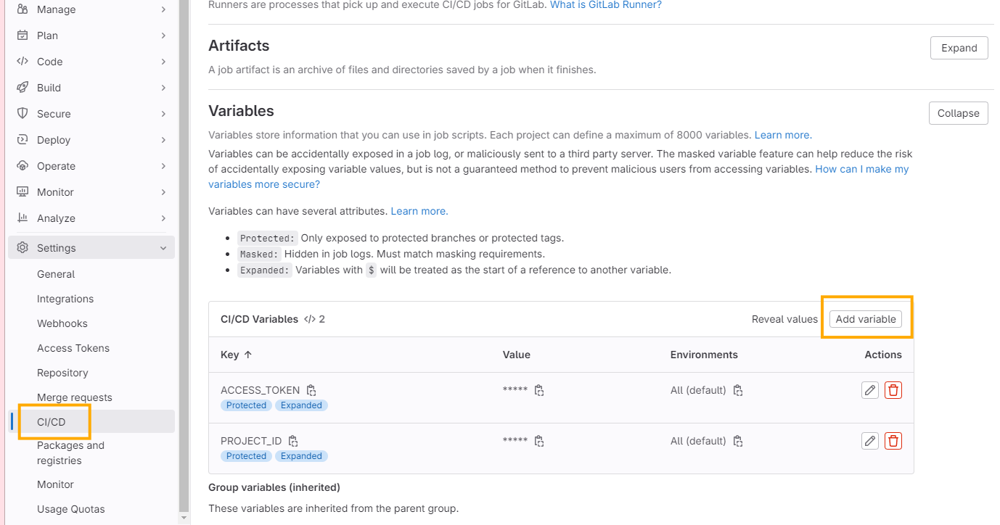
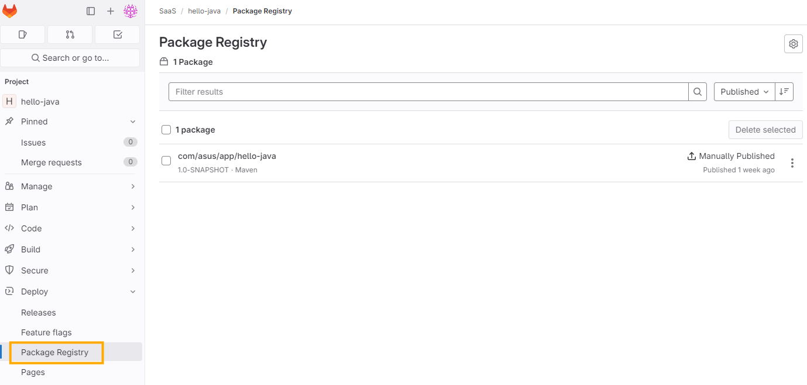
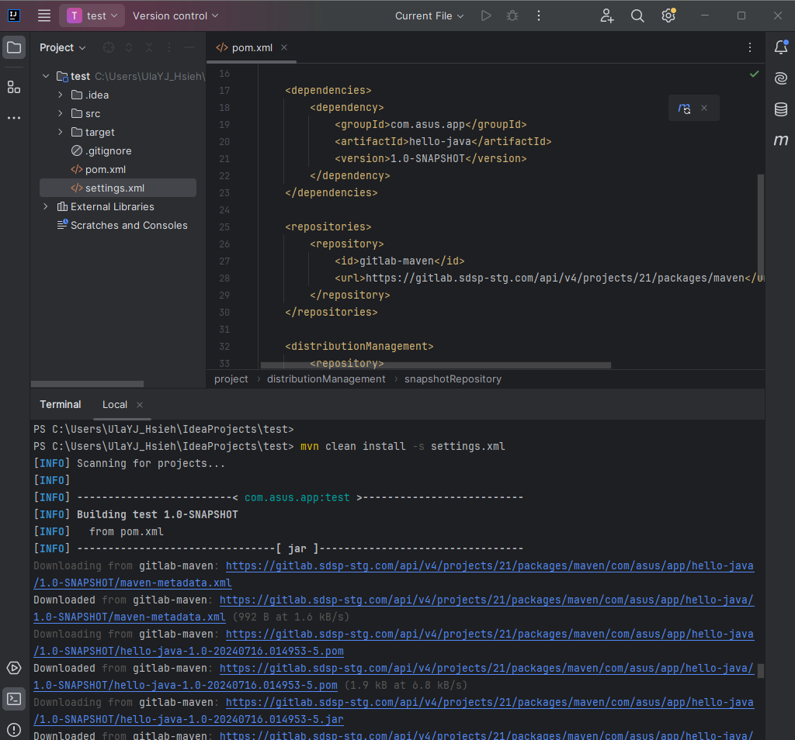

## Prerequisite

GitLab 中已有一個您欲打包發布的 java 倉庫/專案。

## 準備 `settings.xml`

### 選擇發包的身分驗證方式

| **Token type** | **Name must be** | **Token** | **Scope** |
| --- | --- | --- | --- |
| access token | Private-Token | Paste token as-is, or define an environment variable to hold the token | api |
| Deploy token | Deploy-Token | Paste token as-is, or define an environment variable to hold the token | read_package_registry, write_package_registry or both |
| CI Job token | Job-Token | `${CI_JOB_TOKEN}` |  |

### 在專案中新增 `settings.xml`

```xml
<settings>
    <servers>
        <server>
            <id>gitlab-maven</id>
            <configuration>
                <httpHeaders>
                    <property>
                        <name>Private-Token</name>
                        <value>${ACCESS_TOKEN}</value>
                    </property>
                </httpHeaders>
            </configuration>
        </server>
    </servers>
</settings>
```

### 配置 CICD Variables

本文範例身分驗證使用 Project Access Token，在 `Settings > Access Tokens` 建立後需要複製該一次性顯示的 Token，並放到 CICD Variables 中。





💡 可忽略不設置 Token 到期日。





進入 `Settings > CICD > Variables` 建立 `ACCESS_TOKEN` 變數，也順便新增 `CI_PROJECT_ID` 變數。



## 修改 `pom.xml`

新增 `repositories` 與 `distributionManagement` 設定項。

```xml
    <repositories>
        <repository>
            <id>gitlab-maven</id>
            <url>https://gitlab.sdsp-stg.com/api/v4/projects/${CI_PROJECT_ID}/packages/maven</url>
        </repository>
    </repositories>

    <distributionManagement>
        <repository>
            <id>gitlab-maven</id>
            <url>https://gitlab.sdsp-stg.com/api/v4/projects/${CI_PROJECT_ID}/packages/maven</url>
        </repository>
        <snapshotRepository>
            <id>gitlab-maven</id>
            <url>https://gitlab.sdsp-stg.com/api/v4/projects/${CI_PROJECT_ID}/packages/maven</url>
        </snapshotRepository>
    </distributionManagement>
```

## 修改 `.gitlab-ci.yml`

在原有的 pipeline 加上以下 deploy job。

```yaml
deploy:
    image: maven:latest
    # 指定 git runner tag, 否則使用預設
    #   tags:
    #     - k8s-stg
    script:
        - mvn deploy -s settings.xml
    only:
        - main
```

如專案沒有 `.gitlab-ci.yml`，則直接建立一個 `.gitlab-ci.yml` 內容直接放上面的 job 做發佈測試。

## Commit to Main

當專案 commit 到 main branch 後會啟動 pipeline，可以到 `Deploy > Package Registry` 查看結果。



## 補充: Install a package from gitlab package registry

在本地做其他專案開發時，如果要安裝發佈在 GitLab Package Registry 的 Package，請依照包管理的頁面說明，配置 `pom.xml`。


接著新增 `settings.xml` 設定 repo 的 authentication。

```xml
<settings>
  <servers>
    <server>
      <id>gitlab-maven</id>
      <configuration>
        <httpHeaders>
          <property>
            <name>Private-Token</name>
            <value>PROJECT ACCESS TOKEN</value>
          </property>
        </httpHeaders>
      </configuration>
      <!-- 或者使用一般帳密 -->
      <!--
        <username>擁有 Project 存取權的用戶名</username>
        <password>用戶密碼</password>
      -->
    </server>
  </servers>
</settings>
```

執行安裝

```bash
mvn clean install -s settings.xml
```

