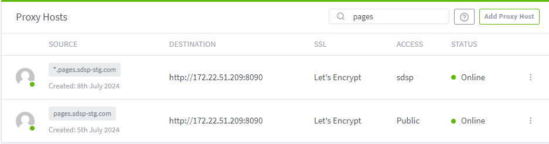
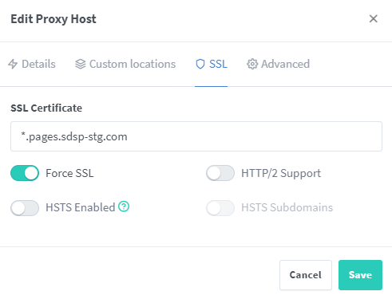
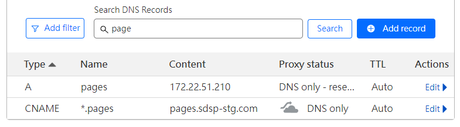
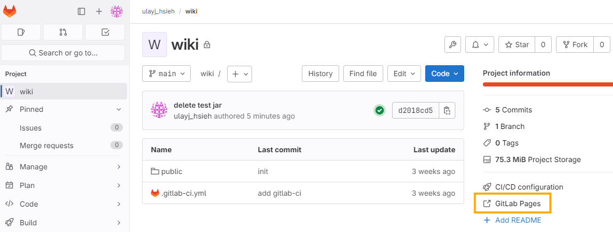
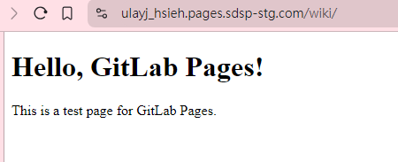

## 設定 GitLab

在 GitLab 的 docker 部署檔中設定以下 `GITLAB_OMNIBUS_CONFIG` ，再將 port mapping 到 host 8090 port 後，重啟 server。

```yaml
      	pages_external_url 'https://pages.sdsp-stg.com'
        gitlab_pages['enable'] = true
        gitlab_pages['listen_proxy'] = "0.0.0.0:8090"
        pages_nginx['enable'] = true
        pages_nginx['listen_https'] = false
        pages_nginx['redirect_http_to_https'] = false
        gitlab_pages['internal_gitlab_server'] = 'http://localhost:80'
```

## 設定 Nginx Proxy Manager

為了自動管理憑證更新，在 GitLab 前方使用了 Nginx Proxy Manager，故需要也為 Pages 建立代理。專案與 page 發佈的 URL 對照可參考[官網](https://docs.gitlab.com/ee/user/project/pages/getting_started_part_one.html)，本文範例設定使用 `pages.sdsp-stg.com` 做為 page 的 external URL，

| Type of GitLab Pages | Example path of a project in GitLab | Website URL |
| --- | --- | --- |
| User pages | `username/username.pages.sdsp-stg.com` | `http(s)://username.pages.sdsp-stg.com` |
| Group pages | `acmecorp/acmecorp.pages.sdsp-stg.com` | `http(s)://acmecorp.pages.sdsp-stg.com` |
| Project pages owned by a user | `username/my-website` | `http(s)://username.pages.sdsp-stg.com/my-website` |
| Project pages owned by a group | `acmecorp/webshop` | `http(s)://acmecorp.pages.sdsp-stg.com/webshop` |
| Project pages owned by a subgroup | `acmecorp/documentation/product-manual` | `http(s)://acmecorp.pages.sdsp-stg.com/documentation/product-manual` |

故除了 `pages.sdsp-stg.com` domain 外，還需要設定一個帶有萬用字符的 `*.pages.sdsp-stg.com` proxy 給真的會建立在各個 GitLab Project 的 Pages 使用。



在設定 SSL 時，需要簽發一張 `*.pages.sdsp-stg.com` 的憑證，通配符憑證只能匹配一級子域名，若使用 `*.sdsp-stg.com` 的話會報 `NET::ERR_CERT_COMMON_NAME_INVALID` 的錯誤。此外，還需要開啟強制使用 HTTPS `Force SSL` 連線。




## 設定 Cloudflare DNS

共設定了兩條 record，一個是 A Record，將 GitLab external page URL的 content 指定為 Nginx proxy manager 的 IP，另一個是 CNAME。



## 建立測試專案

通常 GitLab Page 都是將編譯完的靜態資源放到 public folder 下，本篇記錄使用一個簡單的 html 頁面測試是否能成功發佈。

### public/index.html

```html
<!DOCTYPE html>
<html lang="en">
<head>
    <meta charset="UTF-8">
    <meta name="viewport" content="width=device-width, initial-scale=1.0">
    <title>GitLab Pages Test</title>
</head>
<body>
    <h1>Hello, GitLab Pages!</h1>
    <p>This is a test page for GitLab Pages.</p>
</body>
</html>
```

## .gitlab-ci.yml

```yaml
pages:
  script:
  - echo "Do Nothing!"
  artifacts:
    paths:
    - public
  only:
  - main
```

待 pipeline 完成後，就可以查看頁面是否可以成功被訪問了。




