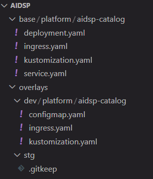
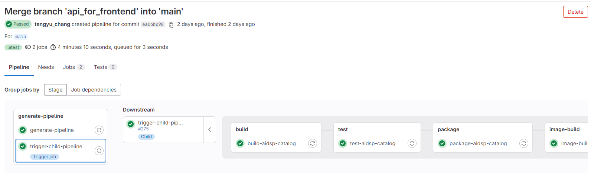
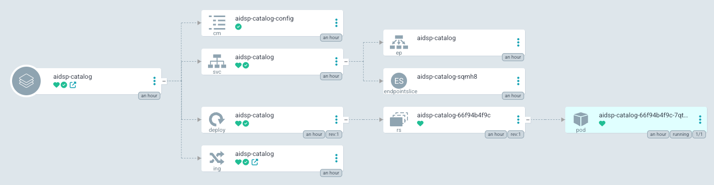

## Project Structure

```powershell
platform/
├── abc-catalog
│   ├── pom.xml
│   └── src
│       └── main
│           ├── java
│           │   └── org
│           │       └── ula
│           │           └── abc
│           │               └── catalog
│           │                   ├── CatalogApplication.java
│           │                   ├── config/
│           │                   ├── controller/
│           │                   ├── entity/
│           │                   ├── mapper/
│           │                   ├── openmetadata/
│           │                   └── service/
│           └── resources
│               ├── config
│               │   ├── application-dev.yml
│               │   ├── application-local.yml
│               │   ├── application-prod.yml
│               │   └── application.yml
│               ├── db
│               │   └── migration
│               │       └── V1__Initialize_table.sql
│               └── static
│                   └── favicon.ico
├── abc-common
│   ├── pom.xml
│   └── src
│       └── main
│           └── java
│               └── org
│                   └── ula
│                       └── abc
│                           └── common
│                               ├── api/
│                               ├── config/
│                               ├── converter/
│                               ├── exception/
│                               ├── mybatis/
│                               └── utils/
├── docker
│   └── abc-catalog
│       └── Dockerfile
├── pom.xml
└── README.md
```

The project is built as a mono git project, and multiple independent microservices will be placed in the same git repo. The current architecture is as above. `abc-common` is a shared module that places some functions that will be used repeatedly. This module only needs to build jar for reference by other modules, and does not need to be packaged into a mirror for independent deployment; `abc-catalog` is currently developed The first microservice application will be followed by other microservice applications such as `abc-ingestion`. These microservice applications will be packaged independently and need to be independently deployed on Kubernetes.

## .gitlab-ci.yml

```yaml
stages:
  - generate-pipeline

generate-pipeline:
  stage: generate-pipeline
  image: alpine:latest
  script:
    - apk add --no-cache git
    - |
      echo "Checking changes between $CI_COMMIT_BEFORE_SHA and $CI_COMMIT_SHA"
      SERVICES=$(git diff --name-only $CI_COMMIT_BEFORE_SHA $CI_COMMIT_SHA | cut -d/ -f1 | sort -u | grep ^abc- | grep -v "abc-common" || true)

      cat > child-pipeline.yml << 'EOF'
      stages:
        - dummy

      dummy-job:
        stage: dummy
        script:
          - echo "No services change detected!"
      EOF

      if [ -z "$SERVICES" ]; then
        echo "No services change detected!"
        exit 0
      fi

      echo "Detected services: $SERVICES"

      cat > child-pipeline.yml << 'EOF'
      default:
        tags:
          - k8s-dev
        image: maven:3.8-openjdk-17

      stages:
        - build
        - test
        - package
        - image-build
        - argocd-deploy

      variables:
        MAVEN_OPTS: "-Dmaven.repo.local=$CI_PROJECT_DIR/.m2/repository"
        MAVEN_CLI_OPTS: "--batch-mode --errors --fail-at-end --show-version -DinstallAtEnd=true -DdeployAtEnd=true"
        CD_REPO_URL: "https://gitlab.sdsp-stg.com/paas/argocd-mono/abc.git"
        CD_REPO_NAME: "abc"

      cache:
        key: ${CI_COMMIT_REF_SLUG}
        paths:
          - .m2/repository

      EOF

      for SERVICE in $SERVICES; do
        echo "Generating jobs for $SERVICE"
        cat >> child-pipeline.yml << EOF

      build-${SERVICE}:
        stage: build
        script:
          - mvn \$MAVEN_CLI_OPTS compile -pl ${SERVICE} -am

      test-${SERVICE}:
        stage: test
        script:
          - mvn \$MAVEN_CLI_OPTS test -pl ${SERVICE} -am
        needs:
          - build-${SERVICE}

      package-${SERVICE}:
        stage: package
        script:
          - mvn \$MAVEN_CLI_OPTS clean package -pl ${SERVICE} -am
        artifacts:
          paths:
            - ${SERVICE}/target/*.jar
          expire_in: 1 week
        needs:
          - test-${SERVICE}

      image-build-${SERVICE}:
        stage: image-build
        image:
          name: gcr.io/kaniko-project/executor:debug
          entrypoint: [""]
        before_script:
          - mkdir -p /kaniko/.docker
          - echo "{\"auths\":{\"\${HARBOR_URL}\":{\"auth\":\"\$(printf "%s:%s" "\${HARBOR_ADMIN_USERNAME}" "\${HARBOR_ADMIN_PASSWORD}" | base64 | tr -d '\n')\"}}}" > /kaniko/.docker/config.json
        script:
          - |
            /kaniko/executor \\
            --context "\${CI_PROJECT_DIR}" \\
            --dockerfile "\${CI_PROJECT_DIR}/docker/${SERVICE}/Dockerfile" \\
            --destination "\${HARBOR_URL}/\${CI_PROJECT_NAME}/${SERVICE}:\${CI_COMMIT_SHORT_SHA}" \\
            --destination "\${HARBOR_URL}/\${CI_PROJECT_NAME}/${SERVICE}:latest"
        needs:
          - package-${SERVICE}

      .deploy_template: &deploy_template
        stage: argocd-deploy
        image:
          name: registry.k8s.io/kustomize/kustomize:v5.4.2
          entrypoint: ["/bin/sh", "-c"]
        script:
          - |
            git clone https://oauth2:\${CI_BOT_TOKEN}@\${CD_REPO_URL#https://}
            cd \${CD_REPO_NAME}/overlays/\${DEPLOY_ENV}/\${CI_PROJECT_NAME}/${SERVICE}
            if [ ! -f kustomization.yaml ]; then 
              echo "kustomization.yaml not found"
              exit 1
            fi
            IMAGE_NAME="\${HARBOR_URL}/\${CI_PROJECT_NAME}/${SERVICE}"
            kustomize edit set image \${IMAGE_NAME}=\${IMAGE_NAME}:\${CI_COMMIT_SHORT_SHA}
            git config --global user.email "ci@gitlab.sdsp-stg.com"
            git config --global user.name "ci-bot"
            git remote set-url origin https://oauth2:\${CI_BOT_TOKEN}@\${CD_REPO_URL#https://}
            git add kustomization.yaml
            git commit -m "Update \${DEPLOY_ENV} ${SERVICE} image tag to \${CI_COMMIT_SHORT_SHA}"
            git push origin main
        needs:
          - image-build-${SERVICE}

      deploy-dev-${SERVICE}:
        <<: *deploy_template
        variables:
          DEPLOY_ENV: dev
        needs:
          - image-build-${SERVICE}

      EOF
      done

      cat child-pipeline.yml
  artifacts:
    paths:
      - child-pipeline.yml

trigger-child-pipeline:
  stage: generate-pipeline
  needs:
    - generate-pipeline
  trigger:
    include:
      - artifact: child-pipeline.yml
        job: generate-pipeline
    strategy: depend
```

## CI Desgin Logic

Because there are multiple microservices, not every commit will affect all microservices, so the child-pipeline method will be used to automatically generate which services (excluding abc-common) need to be built, tested, packaged, image-built and deployed. During the build and deploy phases, if there is no change in microservices, the dummy job will be executed without any action.

In the part of updating the CD, the image of kustomize is mainly used, which happens to contain git, so it can be used for git update operations. The actions are as follows:

1. git clone argocd project
2. cd target folder
3. Check whether kustomization.yaml exists
4. Use `kustomize edit` modify image tag
5. Set up git config. The git user used in this step is a role account such as ci-bot. On the account setting page, a personal access token with api, read_repository, and write_repository permissions is generated.
6. git add, git commit and git push

## CD Design Logic

Create an ArgoCD mono repo specifically to host the deployment of the platform project, and define manifests for multiple environments through kustomize.



The `base` folder contains basic application templates, while `overlays` are detailed adjustments for different environments. The applicationsets of ArgoCD in different environments are monitored under `overlays/dev/platform`, and the application template is directly specified to be placed in the platform namespace, and applications are dynamically created for different folders.


## Pipeline Execution Result




