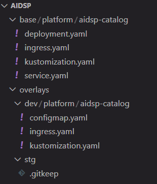
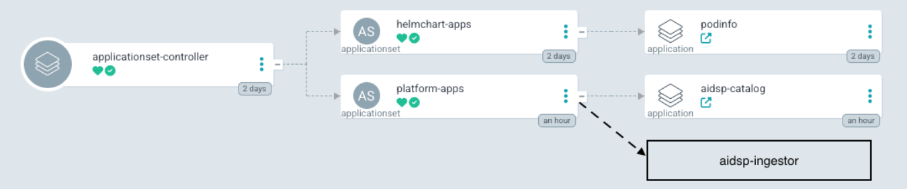
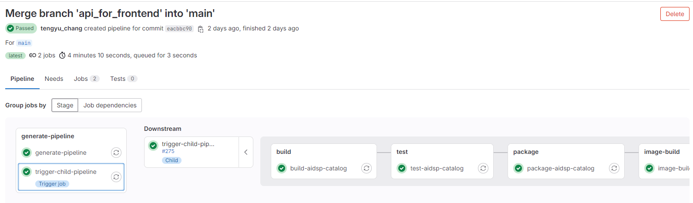
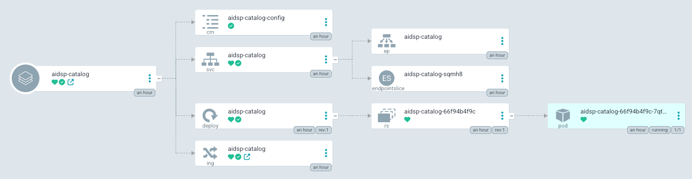

## 專案目錄

```powershell
platform/
├── abc-catalog
│   ├── pom.xml
│   └── src
│       └── main
│           ├── java
│           │   └── org
│           │       └── ula
│           │           └── abc
│           │               └── catalog
│           │                   ├── CatalogApplication.java
│           │                   ├── config/
│           │                   ├── controller/
│           │                   ├── entity/
│           │                   ├── mapper/
│           │                   ├── openmetadata/
│           │                   └── service/
│           └── resources
│               ├── config
│               │   ├── application-dev.yml
│               │   ├── application-local.yml
│               │   ├── application-prod.yml
│               │   └── application.yml
│               ├── db
│               │   └── migration
│               │       └── V1__Initialize_table.sql
│               └── static
│                   └── favicon.ico
├── abc-common
│   ├── pom.xml
│   └── src
│       └── main
│           └── java
│               └── org
│                   └── ula
│                       └── abc
│                           └── common
│                               ├── api/
│                               ├── config/
│                               ├── converter/
│                               ├── exception/
│                               ├── mybatis/
│                               └── utils/
├── docker
│   └── abc-catalog
│       └── Dockerfile
├── pom.xml
└── README.md
```

專案採用 mono git project 的方式建置，會將多個獨立的 microservices 放在同一個 git repo 中。目前有的架構如上， `abc-common` 是共用模組，放置一些會重複使用到的功能，該模組只需 build jar 為其他模組引用，無須打包成鏡像獨立部署；`abc-catalog` 為目前開發的第一個微服務應用，後續會在新增其他諸如 `abc-ingestion` 等多個微服務應用，這些微服務應用都會獨立打包鏡像並且需要獨立部署到 Kubernetes 上。

## .gitlab-ci.yml

```yaml
stages:
  - generate-pipeline

generate-pipeline:
  stage: generate-pipeline
  image: alpine:latest
  script:
    - apk add --no-cache git
    - |
      echo "Checking changes between $CI_COMMIT_BEFORE_SHA and $CI_COMMIT_SHA"
      SERVICES=$(git diff --name-only $CI_COMMIT_BEFORE_SHA $CI_COMMIT_SHA | cut -d/ -f1 | sort -u | grep ^abc- | grep -v "abc-common" || true)

      cat > child-pipeline.yml << 'EOF'
      stages:
        - dummy

      dummy-job:
        stage: dummy
        script:
          - echo "No services change detected!"
      EOF

      if [ -z "$SERVICES" ]; then
        echo "No services change detected!"
        exit 0
      fi

      echo "Detected services: $SERVICES"

      cat > child-pipeline.yml << 'EOF'
      default:
        tags:
          - k8s-dev
        image: maven:3.8-openjdk-17

      stages:
        - build
        - test
        - package
        - image-build
        - argocd-deploy

      variables:
        MAVEN_OPTS: "-Dmaven.repo.local=$CI_PROJECT_DIR/.m2/repository"
        MAVEN_CLI_OPTS: "--batch-mode --errors --fail-at-end --show-version -DinstallAtEnd=true -DdeployAtEnd=true"
        CD_REPO_URL: "https://gitlab.sdsp-stg.com/paas/argocd-mono/abc.git"
        CD_REPO_NAME: "abc"

      cache:
        key: ${CI_COMMIT_REF_SLUG}
        paths:
          - .m2/repository

      EOF

      for SERVICE in $SERVICES; do
        echo "Generating jobs for $SERVICE"
        cat >> child-pipeline.yml << EOF

      build-${SERVICE}:
        stage: build
        script:
          - mvn \$MAVEN_CLI_OPTS compile -pl ${SERVICE} -am

      test-${SERVICE}:
        stage: test
        script:
          - mvn \$MAVEN_CLI_OPTS test -pl ${SERVICE} -am
        needs:
          - build-${SERVICE}

      package-${SERVICE}:
        stage: package
        script:
          - mvn \$MAVEN_CLI_OPTS clean package -pl ${SERVICE} -am
        artifacts:
          paths:
            - ${SERVICE}/target/*.jar
          expire_in: 1 week
        needs:
          - test-${SERVICE}

      image-build-${SERVICE}:
        stage: image-build
        image:
          name: gcr.io/kaniko-project/executor:debug
          entrypoint: [""]
        before_script:
          - mkdir -p /kaniko/.docker
          - echo "{\"auths\":{\"\${HARBOR_URL}\":{\"auth\":\"\$(printf "%s:%s" "\${HARBOR_ADMIN_USERNAME}" "\${HARBOR_ADMIN_PASSWORD}" | base64 | tr -d '\n')\"}}}" > /kaniko/.docker/config.json
        script:
          - |
            /kaniko/executor \\
            --context "\${CI_PROJECT_DIR}" \\
            --dockerfile "\${CI_PROJECT_DIR}/docker/${SERVICE}/Dockerfile" \\
            --destination "\${HARBOR_URL}/\${CI_PROJECT_NAME}/${SERVICE}:\${CI_COMMIT_SHORT_SHA}" \\
            --destination "\${HARBOR_URL}/\${CI_PROJECT_NAME}/${SERVICE}:latest"
        needs:
          - package-${SERVICE}

      .deploy_template: &deploy_template
        stage: argocd-deploy
        image:
          name: registry.k8s.io/kustomize/kustomize:v5.4.2
          entrypoint: ["/bin/sh", "-c"]
        script:
          - |
            git clone https://oauth2:\${CI_BOT_TOKEN}@\${CD_REPO_URL#https://}
            cd \${CD_REPO_NAME}/overlays/\${DEPLOY_ENV}/\${CI_PROJECT_NAME}/${SERVICE}
            if [ ! -f kustomization.yaml ]; then 
              echo "kustomization.yaml not found"
              exit 1
            fi
            IMAGE_NAME="\${HARBOR_URL}/\${CI_PROJECT_NAME}/${SERVICE}"
            kustomize edit set image \${IMAGE_NAME}=\${IMAGE_NAME}:\${CI_COMMIT_SHORT_SHA}
            git config --global user.email "ci@gitlab.sdsp-stg.com"
            git config --global user.name "ci-bot"
            git remote set-url origin https://oauth2:\${CI_BOT_TOKEN}@\${CD_REPO_URL#https://}
            git add kustomization.yaml
            git commit -m "Update \${DEPLOY_ENV} ${SERVICE} image tag to \${CI_COMMIT_SHORT_SHA}"
            git push origin main
        needs:
          - image-build-${SERVICE}

      deploy-dev-${SERVICE}:
        <<: *deploy_template
        variables:
          DEPLOY_ENV: dev
        needs:
          - image-build-${SERVICE}

      EOF
      done

      cat child-pipeline.yml
  artifacts:
    paths:
      - child-pipeline.yml

trigger-child-pipeline:
  stage: generate-pipeline
  needs:
    - generate-pipeline
  trigger:
    include:
      - artifact: child-pipeline.yml
        job: generate-pipeline
    strategy: depend
```

## CI 設計邏輯

因為有多個 microservices，而不一定每個 commit 都會異動到所有 microservices，所以會透過 child-pipeline 的方式去自動生成需要為哪些 service (撇除 abc-common) 去做 build、test、package、image-build、以及 deploy 的階段，如果沒有 microservices 異動的話，則執行 dummy job 不做任何動作。

其中在更新 CD 的部分主要使用到的是 kustomize 的 image，裡面剛好包含了 git，所以可以拿來做 git 更新操作，動作如下：

1. git clone argocd project
2. cd target folder
3. 檢查 kustomization.yaml 是否存在
4. 使用 kustomize edit 修改 image 的 tag
5. 設定 git config，這個步驟使用到的 git user 是使用 ci-bot 這種角色性的帳號，在帳號設定頁面產生使用 api, read_repository, write_repository 權限的 personal access token。
6. git add, git commit and git push

## CD 設計邏輯

建立 ArgoCD mono repo 專門放置 platform 專案的部署，透過 kustomize 定義多個環境的 manifests。



base 的資料夾放置基本的 application 模板，overlays 則是針對不同環境的細部調整的部分。不同環境的 ArgoCD 的 applicationset 監聽在 `overlays/dev/platform` 下，並直接指定將 application template 放在 platform namespace，針對不同的資料夾，動態建立 application。



## Pipeline 執行結果




