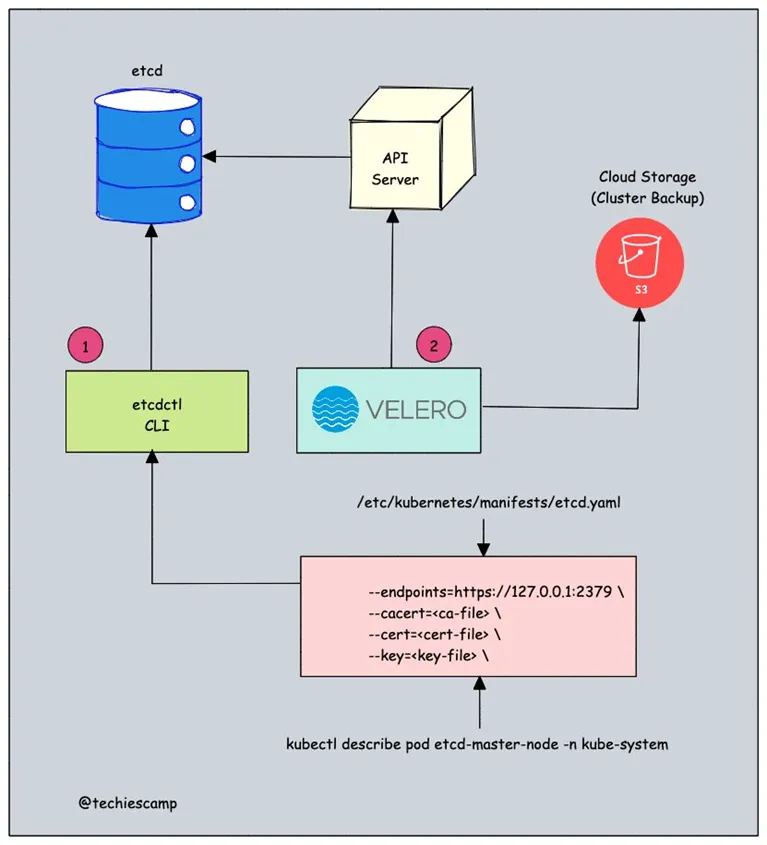
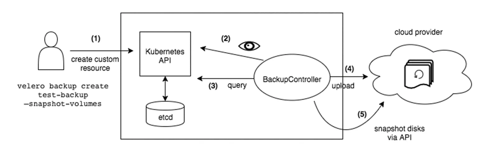
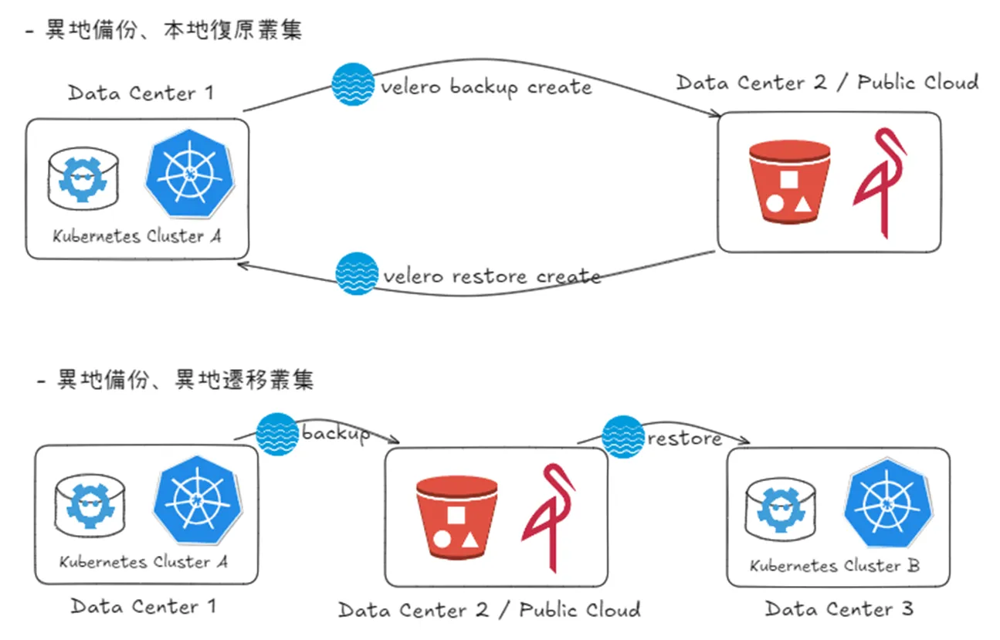
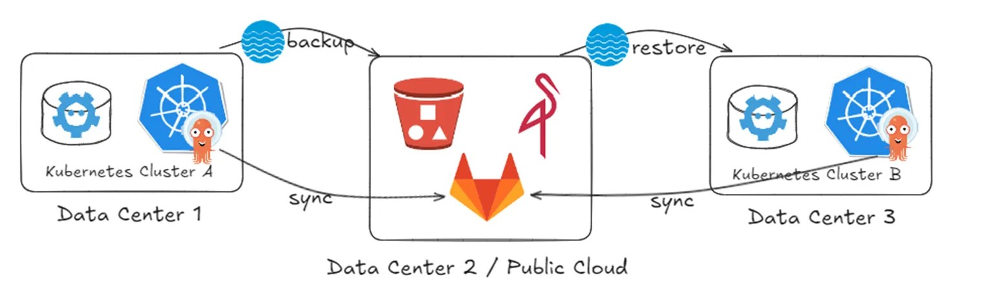

## **Kubernetes 備份目標**

- etcd：etcd 是一個分散式鍵值存儲，作為 Kubernetes 的主要資料存儲，維護叢集的配置資料和目前狀態。
- Persistent Volume (PV)：雖然 etcd 還原了 Kubernetes 集群狀態，但 persistent volume 的內容不屬於集群狀態的一部分，如資料庫中的資料。因此，除了 etcd 外，還需要備份 PV 的內容。

## **Etcd** **備份**

**etcdctl：**

- 直接備份 etcd：etcdctl 是一個命令行工具，直接與 etcd 數據庫互動，以創建整個 etcd 狀態的快照。這種方法適合在單個 etcd 集群中恢復數據丟失，通常用於低層級管理任務，例如在升級 etcd 之前進行備份。
- 需要訪問 etcd：使用 etcdctl 時，您需要直接訪問 etcd 服務器，並必須提供必要的 TLS 證書以進行安全通信。在受管 Kubernetes 環境(如公有雲)中，這可能是一個限制。

**Velero：**

- Kubernetes 資源備份：Velero 在更高的層次上運作，通過使用 Kubernetes API 不僅備份 etcd 數據，還備份整個 Kubernetes 資源的狀態，包括配置和持久卷。這允許全面的災難恢復和遷移能力，使用戶能夠在需要時將資源恢復到新的集群中。
- 靈活度高：Velero 允許根據 Label 或 Namespace 進行選擇性備份，使管理備份或恢復內容變得更加簡單。它還與雲存儲解決方案集成，用於存儲備份，相比於管理原始 etcd 快照，簡化了備份過程。

## **Velero 備份流程**

- 本地 Velero 用戶端 (velero cli) 發送備份指令。
- Kubernetes 叢集內就會建立一個 Backup 物件。
- BackupController 監控 Backup 物件並開始備份過程。
- BackupController 會向 API Server 查詢相關資料。
- BackupController 將查詢到的資料備份到遠端的物件儲存。

## **Velero 備份及復原方案**

## **異地備援的 CD 同步**

GitOps 也可以在切換到新環境後順利銜接同步狀態。

## **評估備援方案的指標**

- **RTO（復原時間目標）**：指系統從災難中恢復正常運行所需的最長時間。RTO 界定了業務可接受的最大停機時間，因此在 RTO 設定下，災難備援策略需滿足在該時間內恢復業務系統。
- **RPO（復原點目標）**：指可以承受的數據遺失量，即業務在災難發生後可接受的最大數據丟失範圍。RPO 越小，備援頻率和數據保存的要求越高，以確保數據更新頻繁且隨時可用。

## **異地備援考量**

需要異地備援的情況通常發生在原地無法復原、或最快的復原時間無法忍受的重大災難下，目的是確保業務仍能在另一地點繼續運行。可能的情況有：

- 重大自然災害：發生大範圍災害而導致機房的設備損毀。
- 大規模停電：發生長時間大規模停電，且備用電源無法持續供電時，系統無法正常運行。
- 資料損壞或遺失：由於人為錯誤或遭惡意攻擊（如勒索軟體），而造成本地數據的嚴重損壞或遺失。
- 無法滿足業務連續性的需求：當業務有極低的 RTO 和 RPO 要求，任何停機都會造成重大損失。

## Reference

- https://www.linkedin.com/posts/bibinwilson_kubernetes-learnkubernetes-devops-activity-7028601441518850048-xuvN
