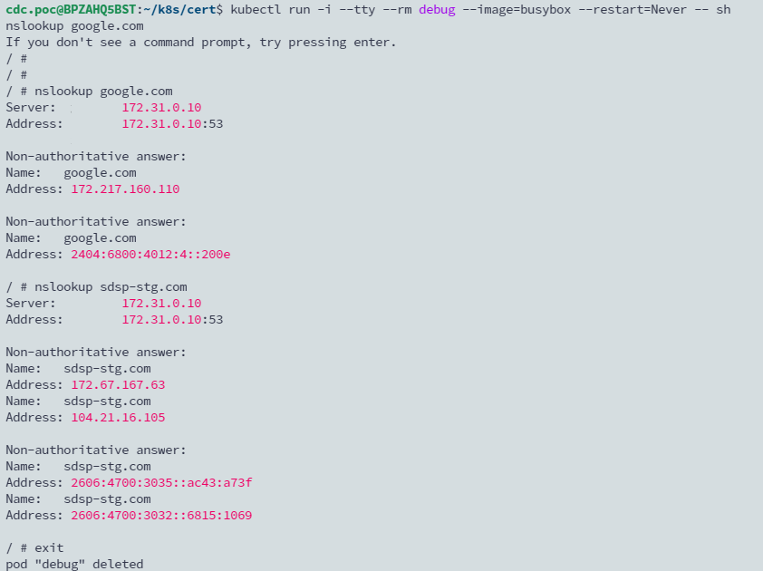

## TL; DR

在公司內網部署後 cluster issuer 以及 certificate 後，發現憑證一直要不到。

## Reason

查看 cert-manager-controller 的 log 發現以下錯誤訊息，發現是因為防火牆阻擋的關係，無法與外部的 DNS server 用 53 port 通訊。


## Solution

改成使用 kube-dns，可以先透過以下手法測試

```bash
kubectl run -i --tty --rm debug --image=busybox --restart=Never -- sh
```



接著透過以下 command 更新 helm chart

```bash
helm upgrade cert-manager jetstack/cert-manager \
  --namespace cert-manager \
  --set installCRDs=true \
  --set 'extraArgs={--dns01-recursive-nameservers-only,--dns01-recursive-nameservers=kube-dns.kube-system.svc.cluster.local:53}'
```

等 cert-manager-controller 自動重啟後，接著查看 log，可以發現到 cert-manager 改成使用內部 DNS 做解析了，但可能需要幾分鐘的時間，會先報 `propagation check failed" err="DNS record for \"sdsp-stg.com\" not yet propagated` 的錯誤，接著等 DNS 傳播完畢後就能看到成功要到憑證了。


查看憑證

```bash
kubectl get certificates.cert-manager.io -n cert-manager
```


