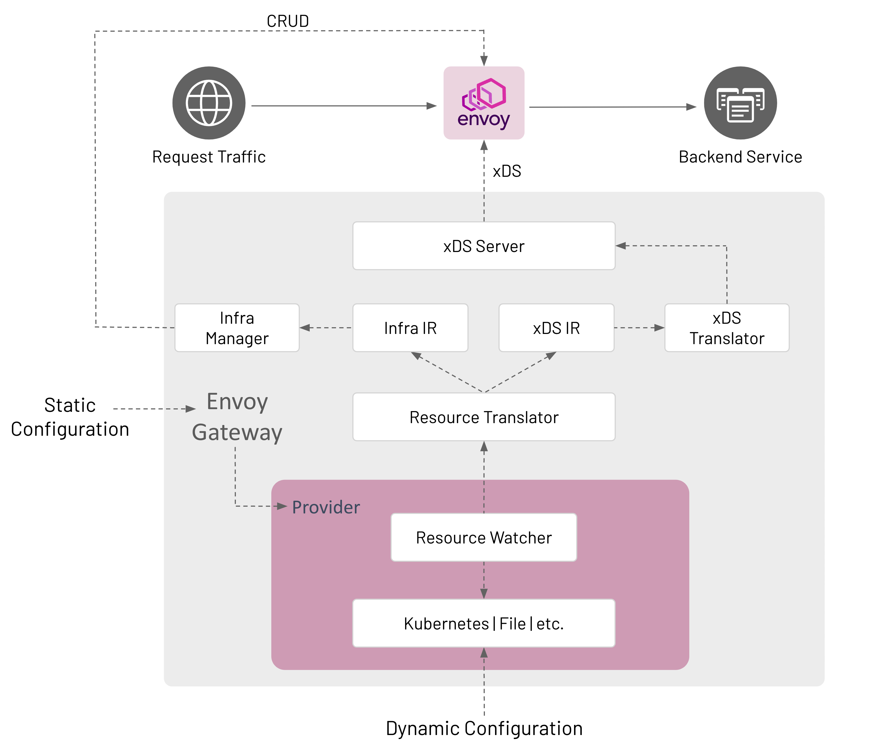
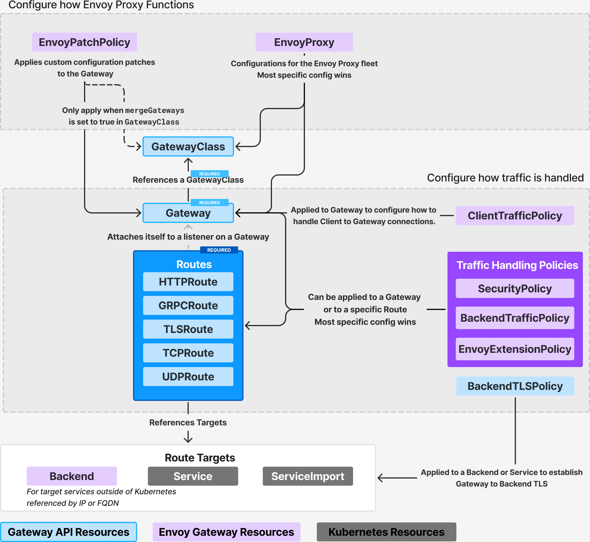
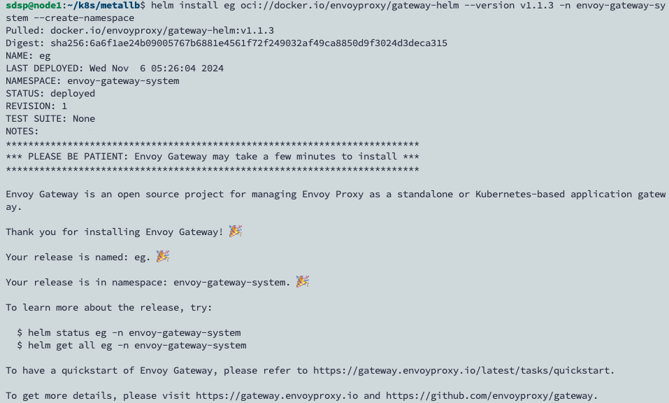
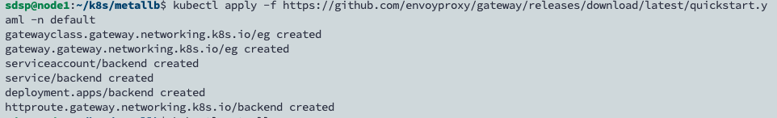
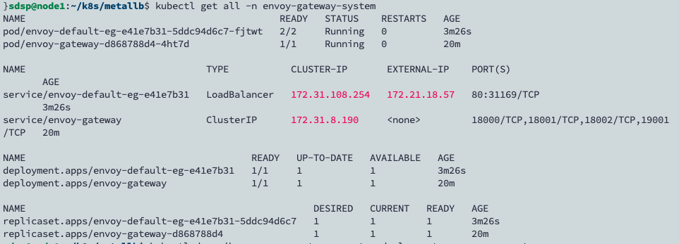
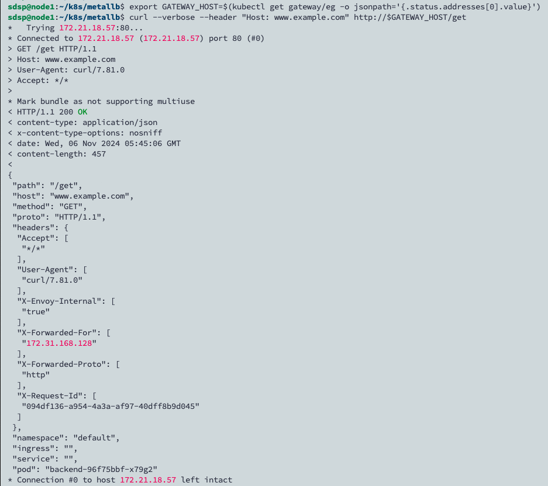

# Envoy Gateway Introduction and Installation

## 簡介

Envoy Gateway 是一個基於 Envoy Proxy 和 Kubernetes Gateway API 開發的開源 API Gateway，定位是作為一個輕量級的南北向網關，有以下特色：

-   簡化配置：透過與 Kubernetes Gateway API 直接集成，Envoy Gateway 允許開發人員使用 Kubernetes 自訂資源以聲明方式配置路由規則、安全性原則和流量管理。
-   性能和可擴展性：基於 Envoy Proxy 構建，提供高度的處理能力和效率，每秒輕鬆處理數千個服務和數百萬個請求。能夠隨需求增長而擴展。
-   安全功能：內建支援各種安全措施，例如 SSL/TLS Terminate、OAuth2、OIDC 驗證和細粒度存取控制。
-   可觀察性：提供全面的監控功能，包括詳細的指標、日誌和跟踪，可診斷和理解流量行為。

## 架構

在 Envoy Gateway 架構中，Envoy Gateway 作為**控制面(Control Plane)**，負責管理和配置數據流的控制層，用來設定路由規則、安全策略、負載平衡等配置。**數據面**由 **Envoy Proxy** 負責，它處理具體的數據請求。


-   **靜態配置初始化**
    -   **Envoy Gateway 啟動**時，通過靜態配置文件設置基本運行參數，確定初始操作設定。
-   **動態配置監控**
    -   **提供者（Provider）**：Envoy Gateway 與 Kubernetes 或其他配置源進行交互，以獲取動態配置。
    -   **資源監視器（Resource Watcher）**：持續監視 Kubernetes 中的資源變更（如 CRUD 操作），特別是與自定義資源定義（CRD）相關的變更。
-   **資源轉換**
    -   **資源轉換器（Resource Translator）**：當資源發生變更時，資源轉換器將外部資源轉換為 Envoy Gateway 可理解的格式，以便進一步處理。
-   **基礎設施管理**
    -   **基礎設施中間表示（Infra IR）**：基礎設施中間表示是將外部資源轉換後的中間格式，包含了 Kubernetes 集群內部需要的資源結構和配置。
    -   **基礎設施管理器（Infra Manager）**：負責將 Infra IR 轉換為 Kubernetes 集群的具體資源，對叢集中的資源 create/update/delete 進行管理。
-   **生成 xDS 配置並傳遞**
    -   **xDS 中間表示（xDS IR）**：\* discovery service，託管資料平面 xDS 配置的內部定義。
    -   **xDS 翻譯器（xDS Translator）**：將 xDS IR 轉換為 Envoy 使用的具體 xDS 資源。
    -   xDS 伺服器**（xDS Server）**：是 xDS gRPC Server，下發 xDS 訊息至 data plane 的 EnvoyProxy。
-   **Envoy 實例執行**
    -   **Envoy 代理**：Envoy 實例作為 data plane，負責接收並處理請求流量，依據 xDS 配置進行流量管理和路由。

自定義資源和 Gateway API 的標準資源的關係 ：


Envoy Gateway 基於 Gateway API 提供了以下這些自定義資源 ：

-   Policy Attachment：ClientTrafficPolicy、BackendTrafficPolicy、SecurityPolicy、EnvoyExtensionPolicy、EnvoyPatchPolicy。這些 Policy 可以關聯到 API Gateway 的 Gateway、HTTPRoute 和 GRPCRoute 資源上，以實現對流量的自定義處理。此資源得力於 Gateway API 的 Policy Attachment 的機制，為 Gateway API 提供了更好的可擴充性，允許各個 Controller 的實現在不修改 Gateway API 的情況下，透過關聯自訂的 Policy 到 Gateway 和 HTTPRoute 等資源上，使得 Gateway API 可以支援更多的流量管理、安全性、自訂擴充功能等功能。
-   HTTPRoute Filter：在 HTTPRoute 規則級別，支援 URL 重寫、直接響應以及其他高級的請求和響應處理功能。這個是基於 Gateway API extensionRefs \*\*\*\*機制，在 xRoute 中，例如 HTTPRoute，可以在 RouteRules 中新增自訂的 Filter，擴充物件進一步縮小，將面對單一路由規則以及後端服務。
-   自定義 Backend：Backend 可以用於 HTTPRoute 和 GRPCRoute 的規則中，將流量路由到自定義的後端服務，直接支援了非 K8s 服務的定義，可用於存取叢集外部的服務。

## Envoy Gateway Installation

### 安裝 MetalLB

```bash
helm repo add metallb https://metallb.github.io/metallb
helm install metallb metallb/metallb --create-namespace --namespace metallb-system
```

準備 IPPool 以及 L2Advertisement 聲明

```yaml
apiVersion: metallb.io/v1beta1
kind: IPAddressPool
metadata:
    name: ippool
    namespace: metallb-system
spec:
    addresses:
        - 172.21.18.56-172.21.18.58

---
apiVersion: metallb.io/v1beta1
kind: L2Advertisement
metadata:
    name: l2a
    namespace: metallb-system
```

### 安裝 Envoy Gateway

1. 安裝 Gateway API CRD 和 Envoy Gateway：

    ```bash
    helm install eg oci://docker.io/envoyproxy/gateway-helm --version v1.2.1 -n envoy-gateway-system --create-namespace
    ```

    確認安裝結果

    ```bash
    kubectl wait --timeout=5m -n envoy-gateway-system deployment/envoy-gateway --for=condition=Available
    ```

    
    成功的話回傳 `deployment.apps/envoy-gateway condition met`

2. 安裝 GatewayClass, Gateway, 示範應用程式 以及 HTTPRoute

    使用官方提供的 quickstart 安裝

    ```bash
    kubectl apply -f https://github.com/envoyproxy/gateway/releases/download/v1.1.3/quickstart.yaml -n default
    ```

    
    

3. 驗證安裝結果

    ```yaml
    export GATEWAY_HOST=$(kubectl get gateway/eg -o jsonpath='{.status.addresses[0].value}')
    curl --verbose --header "Host: www.example.com" http://$GATEWAY_HOST/get
    ```

    


## Reference
資料整理自幾個 envoy 社群大神部落格：
- https://jimmysong.io/
- https://www.zhaohuabing.com/
- https://www.liuxunzhuo.com/blog/eg-ga/
