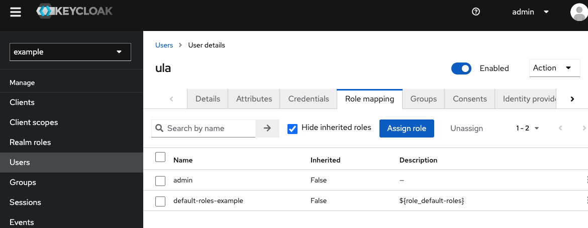
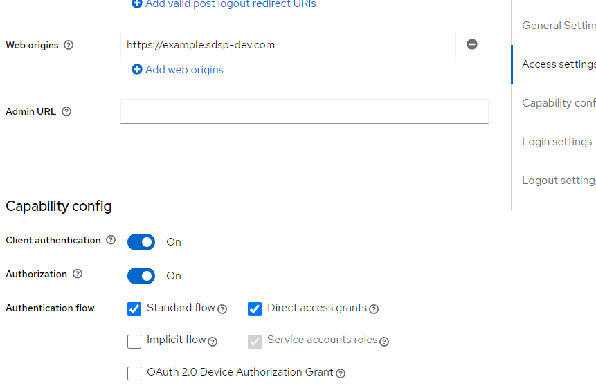
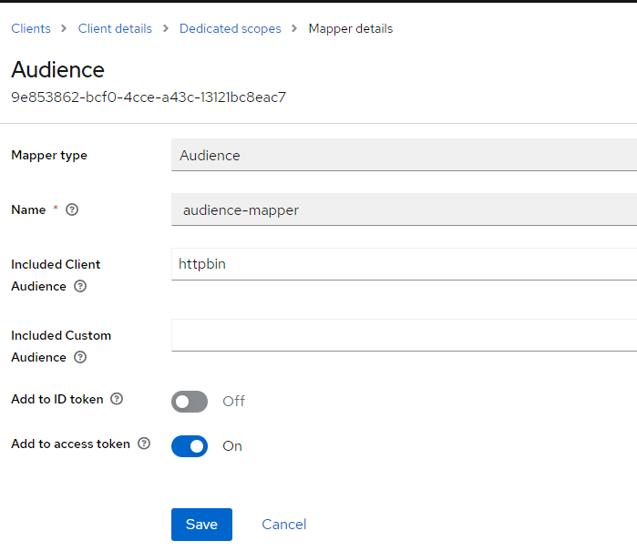
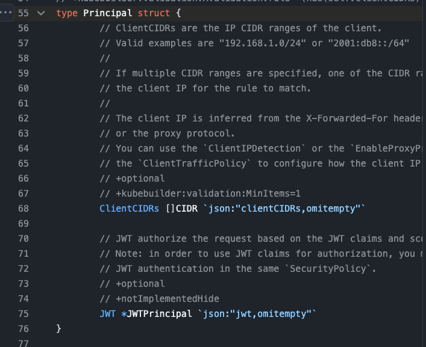
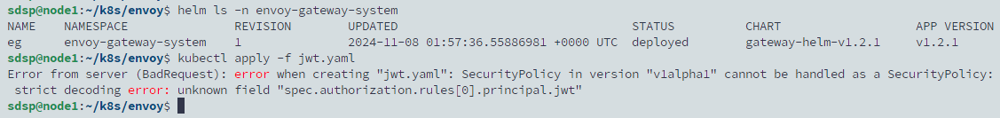

# JWT Claim Based Authorization

## 設定 KeyCloak

1. 建立 Role - admin
2. 將 admin role 綁定到 user ula

   

3. 設定 client 啟用 authorization

   

4. 在 client scopes 中新增與 client 同名的 audience mapper，並啟用新增到 access token

   

## 建立新的 SecurityPolicy

```yaml
apiVersion: gateway.envoyproxy.io/v1alpha1
kind: SecurityPolicy
metadata:
  name: authorization-jwt-claim
spec:
  targetRefs:
    - group: gateway.networking.k8s.io
      kind: HTTPRoute
      name: httpbin
  jwt:
    providers:
      - name: example
        issuer: https://keycloak.sdsp-dev.com/realms/example/protocol/openid-connect/auth
        audiences:
          - httpbin
        remoteJWKS:
          uri: https://keycloak.sdsp-dev.com/realms/example/protocol/openid-connect/certs
  authorization:
    defaultAction: Deny
    rules:
      - name: "allow-admin"
        action: Allow
        principal:
          jwt:
            provider: example
            claims:
              - name: realm_access.roles
                valueType: StringArray
                values: ["admin"]
```

但看官方文檔以及 source code 格式上卻沒有寫錯，

https://gateway.envoyproxy.io/docs/tasks/security/jwt-claim-authorization/

https://github.com/envoyproxy/gateway/blob/aeb68487e73674286b323ff402ff8425f1c6fc53/api/v1alpha1/authorization_types.go#L55



社群有開這個 issue https://github.com/envoyproxy/gateway/pull/4009，在最近被解決，但 11/8 測試時已在 Kubernetes 更新昨天 11/7 發布的新版 envoy gateway v1.2.1 版本，不過仍然失敗。


