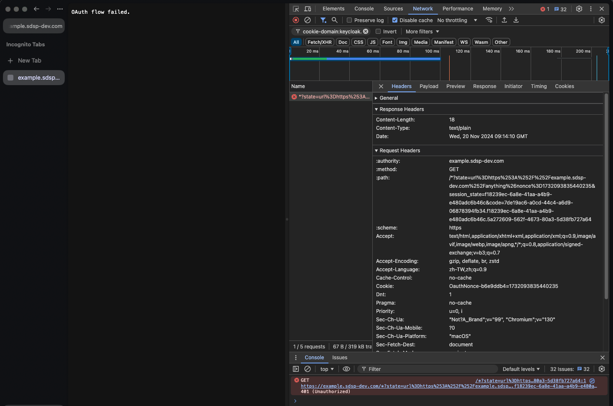
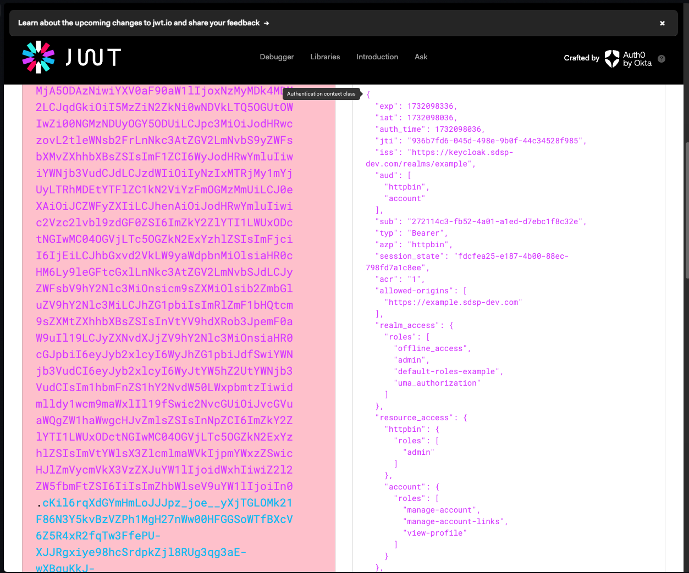
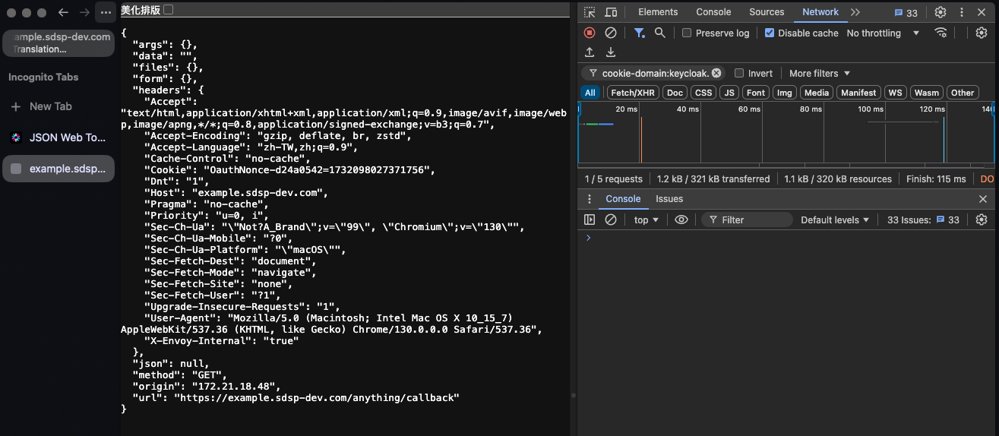

# JWT Claim Based Authorization

## 設定 KeyCloak

1. 建立 Role - admin
2. 將 admin role 綁定到 user ula

   

3. 設定 client 啟用 authorization

   

4. 在 client scopes 中新增與 client 同名的 audience mapper，並啟用新增到 access token

   

## 基於 OIDC Authentication 加上 jwt Claim Based Authorization 建立新的 SecurityPolicy

驗證過程邏輯為

1. 當用戶訪問應用時：
   - Envoy 將引導用戶到 Keycloak 的 authorizationEndpoint 進行驗證。
   - Keycloak 驗證用戶憑據並返回包含用戶信息的 JWT access token。
2. Envoy 通過配置的 remoteJWKS 驗證該 JWT 的簽名是否正確，並檢查 token 的 issuer 和 audiences 是否匹配。
3. 授權邏輯根據 JWT 的 claims (例如 realm_access.roles 或 resource_access.httpbin.roles) 檢查是否滿足規則。
4. 如果滿足任一規則，請求將被允許；否則將執行 defaultAction。

```yaml
# jwt.yaml
apiVersion: gateway.envoyproxy.io/v1alpha1
kind: SecurityPolicy
metadata:
  name: authorization-jwt-claim
spec:
  targetRefs:
    - group: gateway.networking.k8s.io
      kind: HTTPRoute
      name: httpbin
  oidc:
    provider:
      issuer: "https://keycloak.sdsp-dev.com/realms/example"
      authorizationEndpoint: "https://keycloak.sdsp-dev.com/realms/example/protocol/openid-connect/auth"
      tokenEndpoint: "https://keycloak.sdsp-dev.com/realms/example/protocol/openid-connect/token"
    clientID: "httpbin"
    clientSecret:
      name: "my-app-client-secret"
    redirectURL: "https://example.sdsp-dev.com/anything/callback"
    logoutPath: "/anything/logout"
  jwt:
    providers:
      - name: example
        issuer: https://keycloak.sdsp-dev.com/realms/example
        audiences:
          - httpbin
        remoteJWKS:
          uri: https://keycloak.sdsp-dev.com/realms/example/protocol/openid-connect/certs
  authorization:
    defaultAction: Deny
    rules:
      - name: "allow-admin"
        action: Allow
        principal:
          jwt:
            provider: example
            claims:
              - name: realm_access.roles
                valueType: StringArray
                values: ["admin"]
```

但看[官方文檔](https://gateway.envoyproxy.io/docs/tasks/security/jwt-claim-authorization/)以及 [source code](https://github.com/envoyproxy/gateway/blob/aeb68487e73674286b323ff402ff8425f1c6fc53/api/v1alpha1/authorization_types.go#L55) 格式上卻沒有寫錯。


## 更新 envoy gateway 版本

根據[官網文檔](https://gateway.envoyproxy.io/docs/install/install-yaml/#upgrading-from-v11)，更新 envoy gateway 到 v1.2.1 版本需要手動更新 CRD。

```
helm pull oci://docker.io/envoyproxy/gateway-helm --version v1.2.1 --untar
kubectl apply --force-conflicts --server-side -f ./gateway-helm/crds/gatewayapi-crds.yaml
kubectl apply --force-conflicts --server-side -f ./gateway-helm/crds/generated
```

安裝 Envoy Gateway v1.2.1:

```
helm upgrade eg oci://docker.io/envoyproxy/gateway-helm --version v1.2.1 -n envoy-gateway-system
```

## 重新測試

```
kubectl apply -f jwt.yaml
```

嘗試存取頁面，跳轉到 oidc redirect 登入畫面，使用具有 admin role 帳號的登入後，畫面顯示 `OAuth flow failed.`



但不確定是 envoy 的問題還是 keycloak 的問題

因為移除 authorization 後，在只有 authentication 的情況下存取 callback 網址，一樣有 `oauth flow failed` 錯誤

authentication 取得的 token 內容


移除 authentication 是可以正常存取 callback 的

