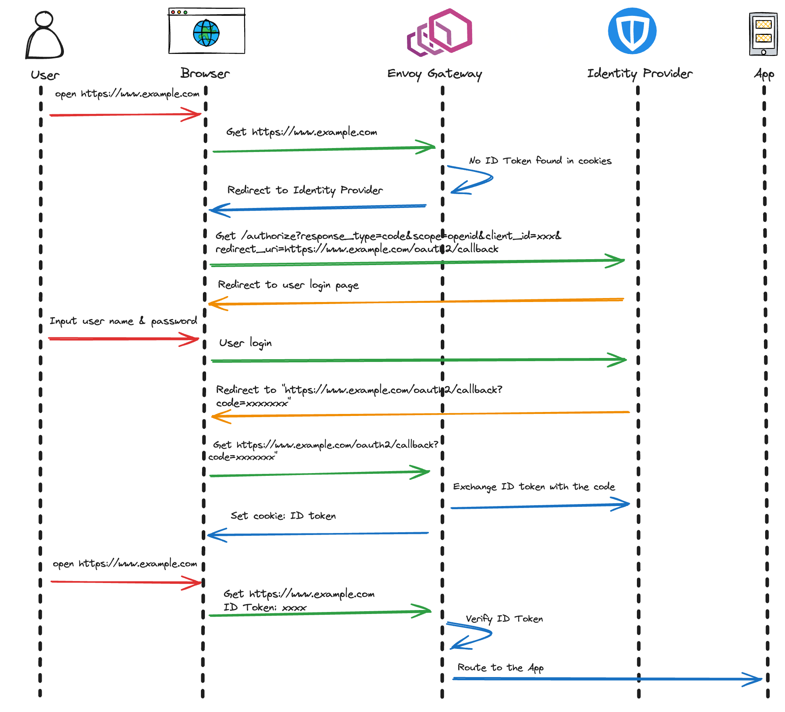
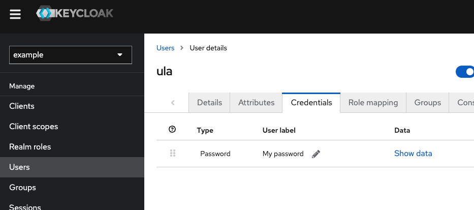
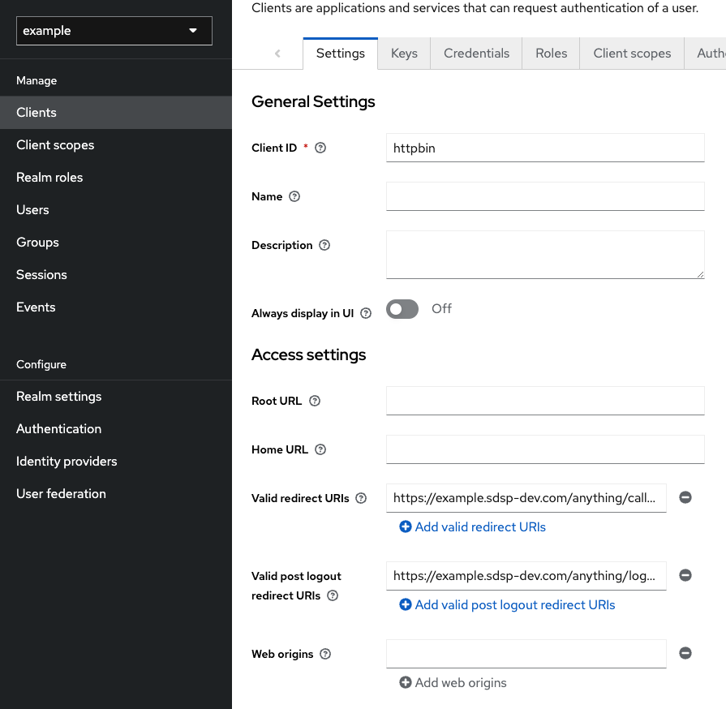
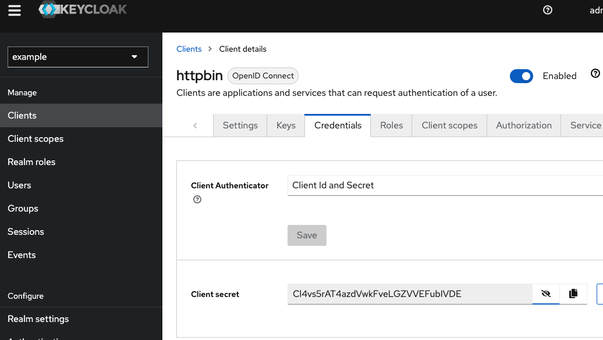
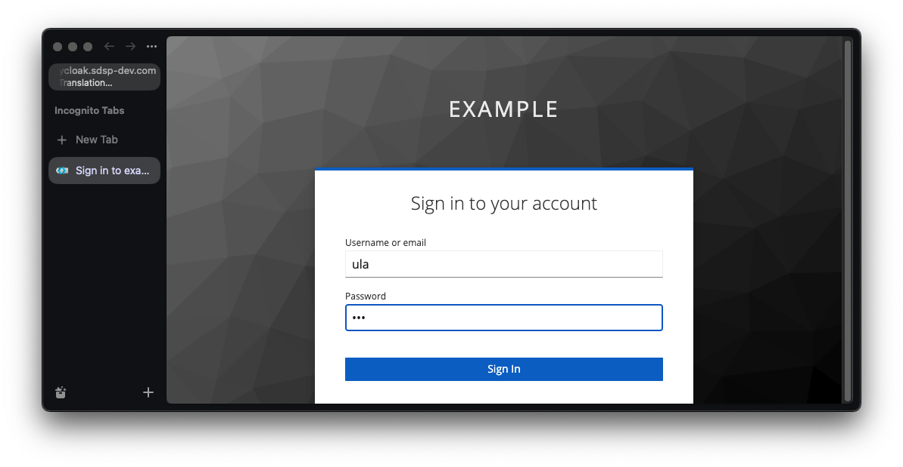
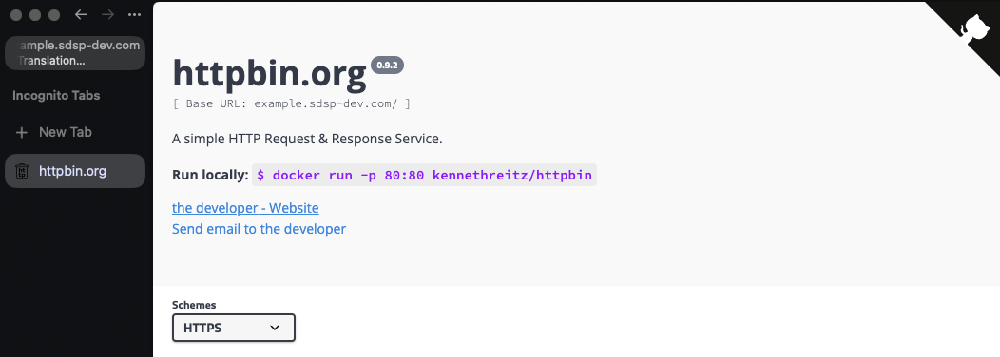
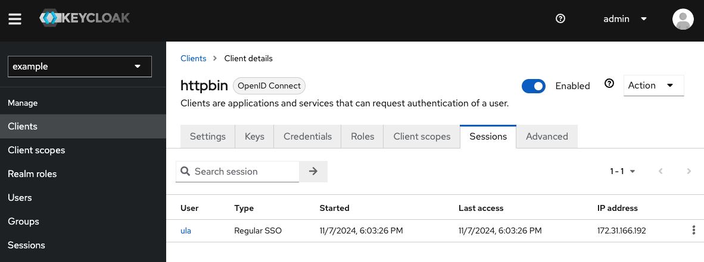

# OIDC Authentication for HTTPRoute



## OCID

OpenID Connect (OIDC) 是建置在 OAuth 2.0 之上的驗證標準。它擴展了 OAuth 2.0，使得應用程式不僅能夠獲取授權，還能夠驗證使用者的身份（Authentication）。除了 Access Token，還會產生以 JSON Web Token（JWT）格式編碼的 **ID Token**，其中包含使用者的身份資訊。

## Keycloak

Keycloak 是一個由 RedHat 開源的身分和存取管理 (IAM) 系統，提供有關使用者的身份驗證和授權資訊。它具有單點登入 (Single Sign-On, SSO)、允許社交網路登入、聯合身分管理(Identity Federation)、兩因素身份驗證 (2FA) 等功能。支持多種身份驗證協議（例如 OAuth 2.0、OpenID Connect、SAML 等）。

## 安裝 KeyCloak

在微服務架構中，建議為每個微服務建立單獨的資料庫，因此將為它建立一個單獨的資料庫。

```bash
helm install keycloak-db bitnami/postgresql --namespace keycloak --create-namespace --set global.storageClass=ceph-block
```

```yaml
# keycloak.yaml
apiVersion: v1
kind: Service
metadata:
  name: keycloak
  labels:
    app: keycloak
spec:
  ports:
    - name: http
      port: 80
      targetPort: 8080
  selector:
    app: keycloak
  type: ClusterIP
---
apiVersion: apps/v1
kind: Deployment
metadata:
  name: keycloak
  labels:
    app: keycloak
spec:
  replicas: 1
  selector:
    matchLabels:
      app: keycloak
  template:
    metadata:
      labels:
        app: keycloak
    spec:
      containers:
        - name: keycloak
          image: quay.io/keycloak/keycloak:21.1.2
          args: ["start", "--cache-stack=kubernetes"]
          env:
            - name: KEYCLOAK_ADMIN
              value: "admin"
            - name: KEYCLOAK_ADMIN_PASSWORD
              value: "admin"
            - name: KC_HEALTH_ENABLED
              value: "true"
            - name: KC_METRICS_ENABLED
              value: "true"
            - name: KC_HOSTNAME
              value: keycloak.sdsp-dev.com
            - name: KC_PROXY
              value: "edge"
            - name: KC_DB
              value: postgres
            - name: KC_DB_URL
              value: "jdbc:postgresql://keycloak-db-postgresql/postgres"
            - name: KC_DB_USERNAME
              value: "postgres"
            - name: KC_DB_PASSWORD
              valueFrom:
                secretKeyRef:
                  name: keycloak-db-postgresql
                  key: postgres-password
            - name: jgroups.dns.query
              value: keycloak
          ports:
            - name: jgroups
              containerPort: 7600
            - name: http
              containerPort: 8080
          readinessProbe:
            httpGet:
              scheme: HTTP
              path: /health/ready
              port: 8080

---
apiVersion: networking.k8s.io/v1
kind: Ingress
metadata:
  name: keycloak
  namespace: keycloak
spec:
  ingressClassName: nginx
  tls:
    - hosts:
        - keycloak.sdsp-dev.com
  rules:
    - host: keycloak.sdsp-dev.com
      http:
        paths:
          - path: /
            pathType: Prefix
            backend:
              service:
                name: keycloak
                port:
                  number: 8080
```

```bash
kubectl apply -f keycloak.yaml -n keycloak
```

## 部署 httpbin

```yaml
---
apiVersion: v1
kind: ServiceAccount
metadata:
  name: httpbin
---
apiVersion: v1
kind: Service
metadata:
  name: httpbin
  labels:
    app: httpbin
    service: httpbin
spec:
  ports:
    - name: http
      port: 8000
      targetPort: 80
  selector:
    app: httpbin
---
apiVersion: apps/v1
kind: Deployment
metadata:
  name: httpbin
spec:
  replicas: 1
  selector:
    matchLabels:
      app: httpbin
      version: v1
  template:
    metadata:
      labels:
        app: httpbin
        version: v1
    spec:
      serviceAccountName: httpbin
      containers:
        - image: docker.io/kennethreitz/httpbin
          imagePullPolicy: IfNotPresent
          name: httpbin
          ports:
            - containerPort: 80
---
apiVersion: gateway.networking.k8s.io/v1
kind: HTTPRoute
metadata:
  name: backend
spec:
  parentRefs:
    - name: eg
  hostnames:
    - "example.sdsp-dev.com"
  rules:
    - backendRefs:
        - group: ""
          kind: Service
          name: httpbin
          port: 8000
          weight: 1
      matches:
        - path:
            type: PathPrefix
            value: /
```

## 設定 KeyCloak

1. 建立 Realm - example
2. 建立 User - ula

   

3. 建立 Client - httpbin
   

## 建立 Keycloak Client Secret

查看 Client Secret



建立 secret

```bash
kubectl create secret generic my-app-client-secret --from-literal=client-secret=Cl4vs5rAT4azdVwkFveLGZVVEFubIVDE
```

## 建立 SecurityPolicy

```yaml
# spolicy.yaml
apiVersion: gateway.envoyproxy.io/v1alpha1
kind: SecurityPolicy
metadata:
  name: oidc-example
spec:
  targetRef:
    group: gateway.networking.k8s.io
    kind: Gateway
    name: eg
  oidc:
    provider:
      issuer: "https://keycloak.sdsp-dev.com/realms/example"
      authorizationEndpoint: "https://keycloak.sdsp-dev.com/realms/example/protocol/openid-connect/auth"
      tokenEndpoint: "https://keycloak.sdsp-dev.com/realms/example/protocol/openid-connect/token"
    clientID: "httpbin"
    clientSecret:
      name: "my-app-client-secret"
    redirectURL: "https://example.sdsp-dev.com/anything/callback"
    logoutPath: "/anything/logout"
```

```bash
kubectl apply -f spolicy.yaml
```

進行訪問，會跳轉到 keycloak 的登入畫面





查看後台 Clinet 可以看到存取的 Session 紀錄


## Reference

- 首圖取自社群大神 Huabing [Envoy Gateway：十分钟搞定单点登录（SSO）](https://www.zhaohuabing.com/post/2023-12-07-envoy-gateway-security-policy-oidc/)
