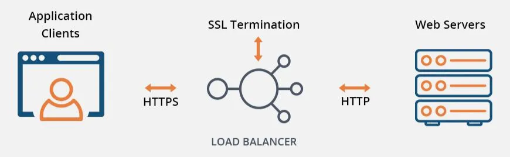
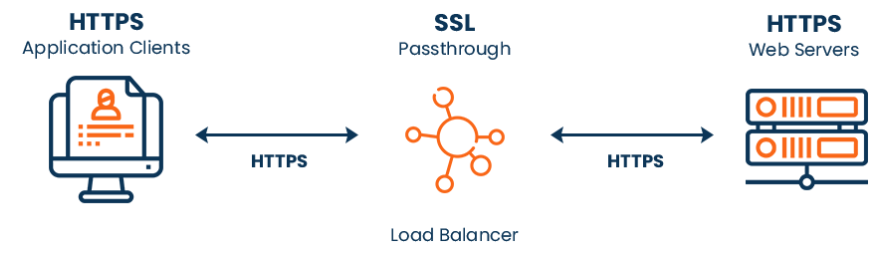
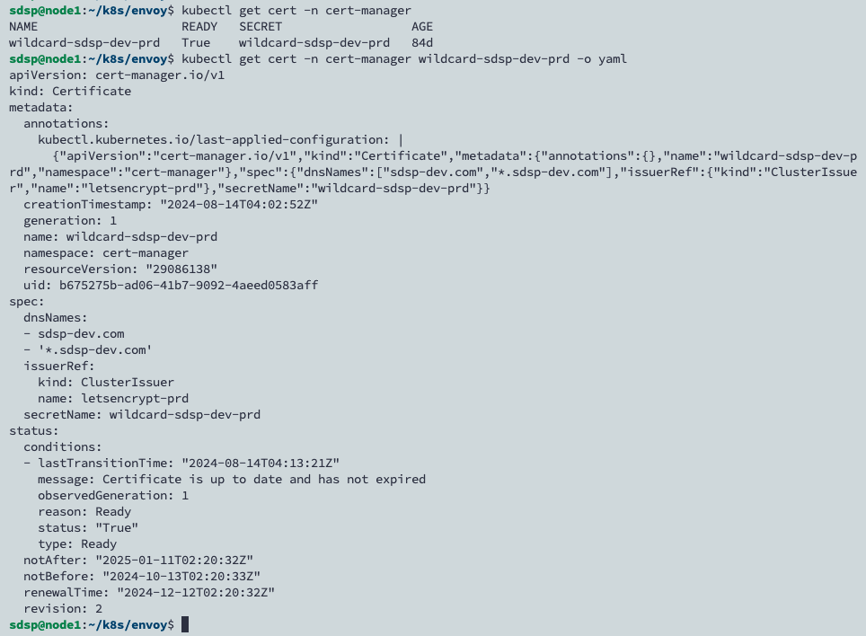
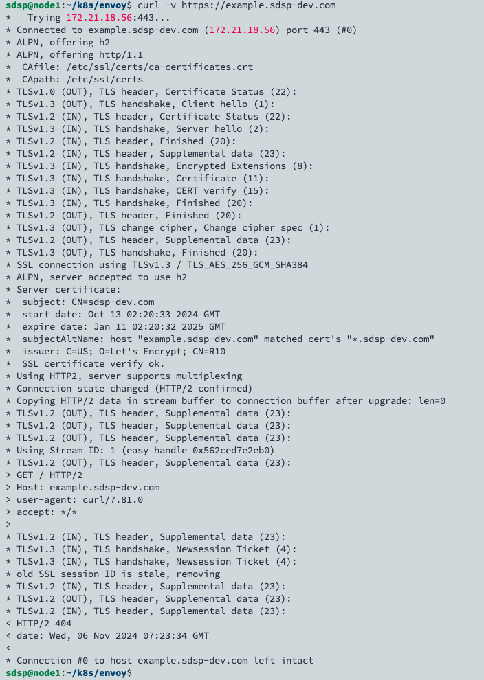

# TLS Termination for HTTPS

## Gateway API TLS Configuration

取自 [Gateway API 的官方文檔](https://gateway-api.sigs.k8s.io/guides/tls/#tls-configuration)，對於 Gateway 來說，涉及兩個連線：


- downstream：這是客戶端和網關之間的連線。
- upstream：這是網關與路由指定的後端資源之間的連線。這些後端資源通常是服務。

透過 Gateway API，可以獨立管理下游和上游連線的 TLS 配置。
對於下游連接，會根據 Listener Protocol，支援不同的 TLS Mode 和 Route Type。

| **Listener Protocol** | **TLS Mode** | **Route Type Supported** |
| --------------------- | ------------ | ------------------------ |
| TLS                   | Passthrough  | TLSRoute                 |
| TLS                   | Terminate    | TCPRoute                 |
| HTTPS                 | Terminate    | HTTPRoute                |
| GRPC                  | Terminate    | GRPCRoute                |




## TLS Termination 設定

先決條件是已經在環境中安裝 cert-manager，並透過 ClusterIssuer 建立憑證。



改成將 GatewayClass、Gateway 放到 envoy-gateway-system 命名空間下，並且為 Gateway 設定 `HTTPS` 的 Listener，另外因為 wildcard 憑證放置於 cert-manager 的 namespace 下，如果要跨 namespace 使用的話，需要定義 `ReferenceGrant` 資源：

```yaml
# quickstart.yaml
apiVersion: gateway.networking.k8s.io/v1
kind: GatewayClass
metadata:
  name: eg
  namespace: envoy-gateway-system
spec:
  controllerName: gateway.envoyproxy.io/gatewayclass-controller
---
apiVersion: gateway.networking.k8s.io/v1
kind: Gateway
metadata:
  name: eg
  namespace: envoy-gateway-system
spec:
  gatewayClassName: eg
  listeners:
    - name: https
      protocol: HTTPS
      port: 443
      hostname: "*.sdsp-dev.com"
      tls:
        certificateRefs:
          - kind: Secret
            group: ""
            name: wildcard-sdsp-dev-prd
            namespace: cert-manager
---
apiVersion: gateway.networking.k8s.io/v1beta1
kind: ReferenceGrant
metadata:
  name: allow-envoy-gateways-to-ref-secrets
  namespace: cert-manager
spec:
  from:
    - group: gateway.networking.k8s.io
      kind: Gateway
      namespace: envoy-gateway-system
  to:
    - group: ""
      kind: Secret
```

```bash
kubectl apply -f quickstart.yaml
```

在 Cloudflare 設定 A Record 後，執行測試

```bash
curl -v https://example.sdsp-dev.com
```



## Reference

- https://www.ssl2buy.com/wiki/ssl-passthrough-work
