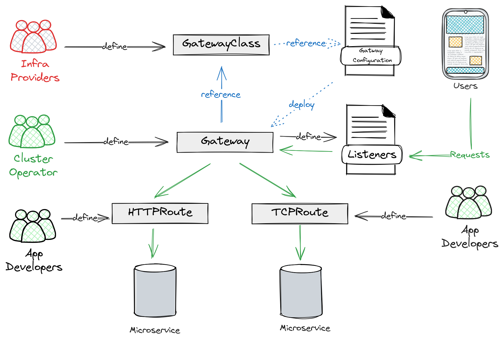
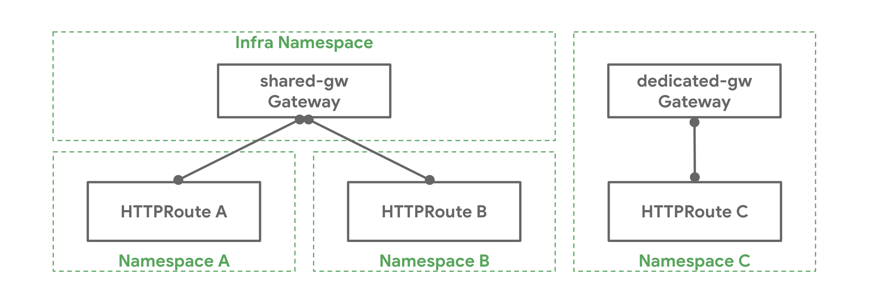
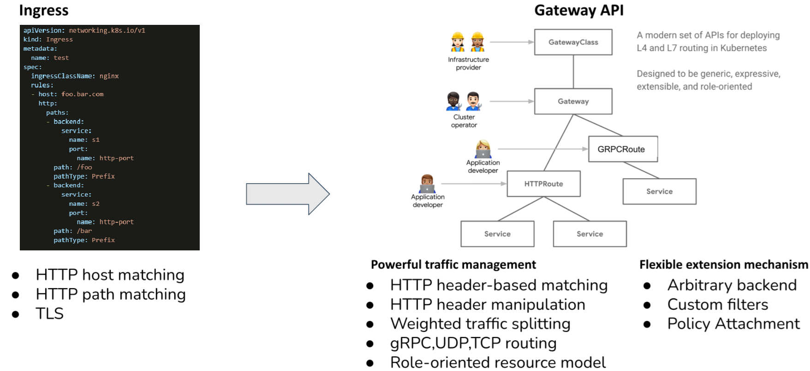
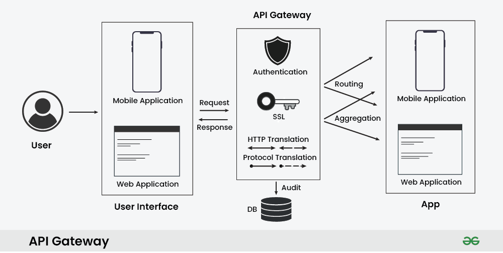

## 核心資源

- **GatewayClass**：定義了一組共享共同配置和行為的 Gateway，每個 GatewayClass 由一個控制器處理，但控制器可以處理多個 GatewayClass。（類似 Ingress 的 IngressClass 和 PersistentVolumes 的 StorageClass。）
- **Gateway**：是流量進入叢集的入口點，定義了負載平衡器的行為和配置。Gateway 透過將 Listener 綁定到一組 IP 位址來表示處理服務流量的基礎架構實例。
- {**HTTP, TCP, TLS, UDP, GRPC**} **Route**：定義了特定協定的規則，用於將請求從 Gateway 對應到 Kubernetes 服務。

## Gateway 跟 Route 的配置

Gateway 和 Route 可以有以下不同的關係：

- 一對一 - Gateway 和 Route 可由單一擁有者部署和使用，並具有一對一的關係。
- 一對多 - Gateway 可以綁定許多 Route，這些 Route 由來自不同 namespace 的不同團隊擁有。
- 多對一 - Route 可以綁定到多個 Gateway，允許單一 Route 同時控制不同 IP、負載平衡器或網路上的應用程式暴露。

_(右圖為一對多，左圖為一對一)_

## Kubernetes Ingress 與 Gateway API 的差異

Kubernetes 的 Ingress 和 Gateway API 都是管理流量進入 Kubernetes 集群內部服務的重要工具，但它們在功能和設計上有明顯的不同。以下是主要差異：

### 1. 流量管理範圍

- **Ingress**：主要專注於第七層（L7）的 HTTP 和 HTTPS 流量。
- **Gateway API**：設計用於處理第七層（L7）和第四層（L4）流量，支持更廣泛的協議，包括 TCP、UDP、HTTP 和 gRPC。

### 2. 資源結構

- **Ingress**：使用單一資源類型（Ingress）來定義路由規則，由 Ingress Controller 負責解析和管理這些規則。
- **Gateway API**：有多個自定義資源定義（CRDs），如  **`GatewayClass`**、**`Gateway`**  和各種  **`Route`**  類型（例如  **`HTTPRoute`**、**`TCPRoute`**），Gateway API 通過 Gateway Controller 進行管理。

### 3. 自定義和擴展性

- **Ingress**：自定義能力有限；添加身份驗證或速率限制等功能通常需要透過選定的 controller (如 nginx) 加上特定的註解，導致 provider 鎖定，移植困難。
- **Gateway API**：提供對高級路由功能的內建支持，如基於標頭的匹配、[流量拆分(traffic splitting)](https://gateway-api.sigs.k8s.io/guides/traffic-splitting/)、[請求鏡像(request mirroring)](https://gateway-api.sigs.k8s.io/guides/http-request-mirroring/)等，而無需自定義註解。

### 4. 角色分離

- 多租戶集群下可分為兩種不同的角色：
  - **應用程序開發人員的角色**：需要定義如何通過 Ingress 資源將外部流量引導到應用程式的不同部分。
  - **Cluster Operator 的角色**：負責維護 Kubernetes 叢集的運行，包括資源管理、安全性設置、網路配置和流量管理。需要監控和管理 Ingress Controller，確保流量進出叢集的安全性、穩定性和性能。
- **Ingress**：因為只提供單一 ingress 資源，這可能導致在多租戶環境中的配置錯誤。
- **Gateway API**：通過將 Gateway 的配置與流量的路由分開，明確劃分角色，減少了在多租戶環境中的衝突，並通過基於角色的訪問控制（RBAC）增強安全性。

Gateway API 將部署和配置基礎設施的職責分給三個角色：基礎設施提供者、叢集維運人員及應用開發人員。下表匯總了這些角色。

| **角色**           | **Gateway API 資源的擁有者** | **職責**                       |
| ------------------ | ---------------------------- | ------------------------------ |
| **基礎設施提供者** | **GatewayClass**             | **管理叢集相關基礎設施**       |
| **集群維運人員**   | **Gateway, GatewayClass\***  | **為應用程式開發人員管理集群** |
| **應用程式開發者** | **HTTPRoute**                | **管理應用**                   |

\*_如果叢集維運人員安裝並管理 Gateway API 實現，而非使用基礎設施提供者提供的實現，那麼他們將管理 GatewayClass 資源。_

### 5. 遷移和可攜性

- **Ingress**：雖然被廣泛採用，但其對特定實現的依賴(如前面提到的註解)會使在不同 providers 之間遷移變得複雜。
- **Gateway API**：強調在不同實現 (implementation) 和環境之間的可攜性，減少遷移成本和與 provider 轉換的複雜性。

## 來自官網的 FQA

1. **Gateway API 會取代 Ingress API 嗎？**
   不會。目前沒有計劃棄用此 API，我們預計大多數 Ingress 控制器將無限期地支援它。
2. **Ingress 和 Gateway API 有什麼不同？**
   Ingress 主要目標是使用簡單的聲明式語法公開 HTTP 應用程式。Gateway API 公開了更通用的 API 給 Proxying 使用，可用於除 HTTP 之外的更多協議，並對更多基礎設施元件進行建模，以便為叢集操作員提供更好的部署和管理選項。

## 其他 FQA

1. 要選擇 api gateway (ex. envoy gateway) 還是需要 service mesh (ex. istio)?

   - 如果只需要管理進入系統的流量，且不涉及微服務之間的複雜互動，選擇 Envoy Gateway 即可。
   - 如果系統內部有大量的微服務之間需要高級的通信管理，並且希望提升系統的可觀察性和安全性，則建議採用 Istio 或其他 Service Mesh 解決方案。
     可參考 [這篇 Do I need a gateway or a service mesh?](https://tetrate.io/blog/do-i-need-a-gateway-or-a-service-mesh/) 或是 [這篇 gateway 跟 service mesh 的關係](https://jimmysong.io/blog/envoy-gateway-introduction/)

2. 在前後端分離的微服務環境中，使用者、API Gateway、以及前後端的關係是什麼？
   
   瀏覽器直接從 Web 伺服器加載靜態資源（如 HTML、CSS、JavaScript、圖像等）。當前端需要與後端 API 通訊時，例如提交表單、獲取數據、更新狀態等，這些請求會經過 API Gateway。API Gateway 會根據設定進行流量控制、身份驗證、協議轉換或路由到合適的後端服務。  
   如果你在 Kubernetes 中完全不使用 Ingress，而是統一通過 Gateway API 來管理所有流量，那麼廣義來說，前端服務的所有流量，包括靜態資源和動態 API 調用，都會經過 API Gateway。

## Reference

- https://tech.aufomm.com/explore-kubernetes-gateway-api-with-kong-ingress-controller/
- https://gateway-api.sigs.k8s.io/
- https://www.geeksforgeeks.org/what-is-api-gateway-system-design/
