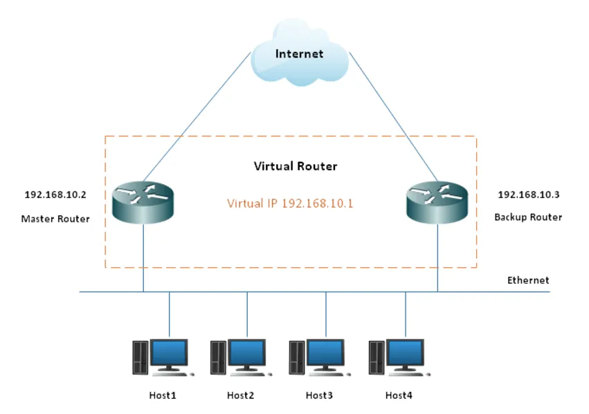
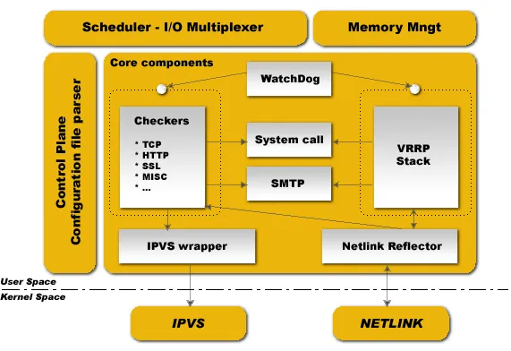
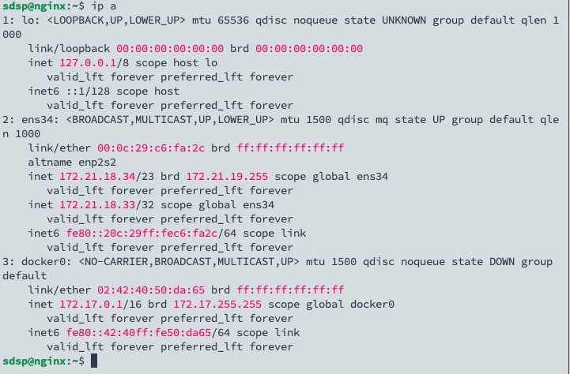
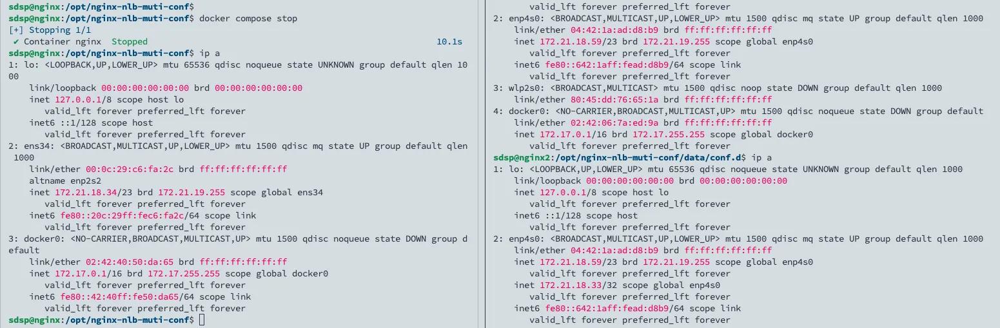
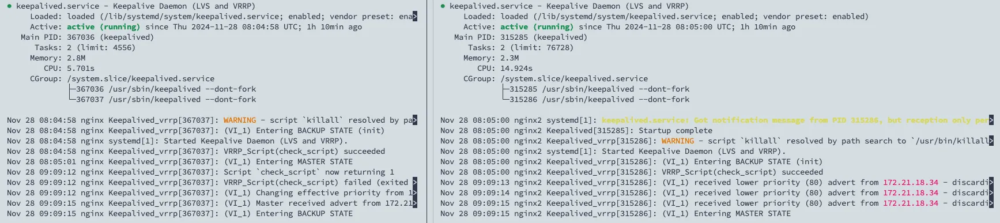
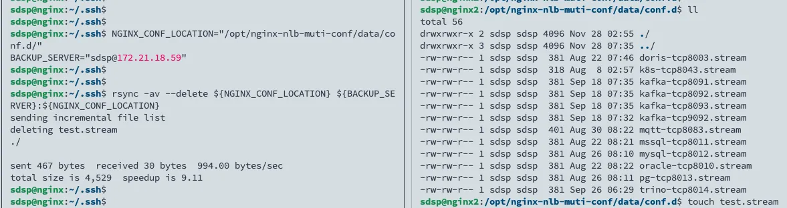

## **VRRP**

VRRP (Virtual Router Redundancy Protocol) is a network protocol designed to improve the availability of routers in an IP network. It allows multiple routers to work together on the same network to form a virtual router using a virtual IP, ensuring that when the primary router fails, a backup router can automatically take over.



### Election Mechanism

VRRP uses an election mechanism to determine the status of the routers. A group of routers running VRRP forms a virtual router, with one router in the Master state and others in the Backup state. The Master router is also called the primary router, while the Backup routers are the standby routers.

## Keepalived

Keepalived is one of the implementations of VRRP. It provides high availability by allowing multiple servers to share a virtual IP (VIP). Keepalived also offers flexible health check functionality, supporting TCP, HTTP, HTTPS, or custom scripts to monitor the health status of backend servers and services, ensuring that only functioning nodes accept traffic.



- **Checkers**: Monitors the health status of backend server nodes and isolates failures.
- **VRRP Stack**: Implements VRRP functionality, enabling failover for frontend load balancer clusters.
- **SMTP**: Provides email notifications for failure alerts.
- **System Call**: Calls system core functions to handle failure isolation and failover.
- **WatchDog**: Periodically checks the status of Checkers and VRRP Stack. If either fails, it can take recovery actions (e.g., restarting).
- **IPVS Wrapper**: A third-party module introduced by Keepalived to achieve IP-based load balancing clusters through IPVS.
- **NETLINK Reflector**: Primarily used to implement advanced routing frameworks and related network functions.

### Keepalived Unicast and Multicast

Keepalived's VRRP implementation supports two modes: multicast and unicast.

- **Multicast Mode**: The standard mode for VRRP and the default mode in Keepalived. In multicast mode, VRRP instances send their Advertisement messages to a specific multicast address (usually 224.0.0.18), and all VRRP instances listen on this address. The advantage of multicast mode is that it does not require the VRRP instances to know the IP addresses of other instances, but the network must support multicast (e.g., network interfaces must be in MULTICAST mode).
- **Unicast Mode**: In unicast mode, VRRP instances send their Advertisement messages directly to the IP addresses of other VRRP instances. The advantage is that it does not require network equipment to support multicast, but the IP addresses of other VRRP instances must be specified in the configuration. This mode is suitable for networks that do not support multicast or when higher security is required to avoid broadcasting to all nodes.

### Keepalived Use Cases

The most common and general use cases include the following:

- **Keepalived + LVS**
- **Keepalived + HAProxy**
- **Keepalived + Nginx**

## Adding Keepalived High Availability to Nginx Server

Since there are only two Nginx servers in the environment, unicast mode is chosen.

### Environment

- Ubuntu 22.04
- Nginx (run as Docker with host network)
  - MASTER: 172.21.18.34
  - BACKUP: 172.21.18.59

### Install Keepalived

On both servers, run:

```bash
sudo apt-get install keepalived
```

### Prepare `keepalived.conf`

- **MASTER**

```toml
# /etc/keepalived/keepalived.conf
global_defs {
    router_id nginx1
    script_user root
    enable_script_security
}

vrrp_script check_script {
    script "killall -0 nginx"
    interval 2
    weight -20
}

vrrp_instance VI_1 {
    state MASTER
    interface ens34
    virtual_router_id 251
    priority 100
    advert_int 1

    authentication {
        auth_type PASS
        auth_pass 123456
    }
    track_script {
        check_script
    }
    unicast_src_ip 172.21.18.34
    unicast_peer {
        172.21.18.59
    }
    virtual_ipaddress {
        172.21.18.33
    }
}
```

- **BACKUP**

```toml
# /etc/keepalived/keepalived.conf
global_defs {
    router_id nginx1
    script_user root
    enable_script_security
}

vrrp_script check_script {
    script "killall -0 nginx"
    interval 2
    weight -20
}

vrrp_instance VI_1 {
    state BACKUP
    interface enp4s0
    virtual_router_id 251
    priority 90
    advert_int 1

    authentication {
        auth_type PASS
        auth_pass 123456
    }
    track_script {
        check_script
    }
    unicast_src_ip 172.21.18.59
    unicast_peer {
        172.21.18.34
    }
    virtual_ipaddress {
        172.21.18.33
    }
}
```

### Start Keepalived

```bash
sudo systemctl daemon-reload
sudo systemctl enable --now keepalived
```

Check the MASTER server, and you'll see that the VIP has successfully been bound to the specified network interface.



### Test

After stopping the MASTER Nginx, you will see the VIP move to the BACKUP Nginx.



Check the logs to see more clearly that the role has switched due to the lowered priority.



### Sync Nginx Configurations Between Servers

We'll use `rsync` to sync configurations. Ensure that the MASTER Nginx server can SSH into the BACKUP Nginx server without a password.

The `rsync` function is shown in the diagram below, where it synchronizes files between two specified directories.



Create a cron script:

```bash
#!/bin/bash
set -ueo pipefail

NGINX_CONF_LOCATION="/usr/local/nginx/conf/"
BACKUP_SERVER="root@10.0.0.44"

# sed to extract the second line of rsync output
rsync_result=$(rsync -av --delete ${NGINX_CONF_LOCATION} ${BACKUP_SERVER}:${NGINX_CONF_LOCATION} | sed -n "2p")
if [ -z ${rsync_result} ];then
  echo "the configuration file has not changed"
else
  echo "changed nginx config, reload Backup Nginx"
  ssh ${BACKUP_SERVER} "docker exec nginx nginx -s reload"
fi
```

Set execution permissions:

```bash
chmod +x sync-ha-nginx.sh
```

Open the current user's `crontab` file:

```bash
crontab -e
```

In the `crontab` editor, add a new rule to execute the script every 5 minutes.

```bash
*/5 * * * * /opt/nginx-nlb-muti-conf/sync-ha-nginx.sh
```

Use the following command to view all scheduled tasks for the current user:

```bash
crontab -l
```

If there are issues with the script execution, check the system's cron logs to troubleshoot:

```bash
grep CRON /var/log/syslog
```

## References

- [VRRP Protocol Overview](https://www.wlink-tech.com/art/vrrp-protocal)
- [Keepalived Introduction](https://www.haxi.cc/archives/Keepalived%E4%BB%8B%E7%BB%8D.html)
- [Keepalived Detailed Guide](https://zahui.fan/posts/0cebb8ae/)
