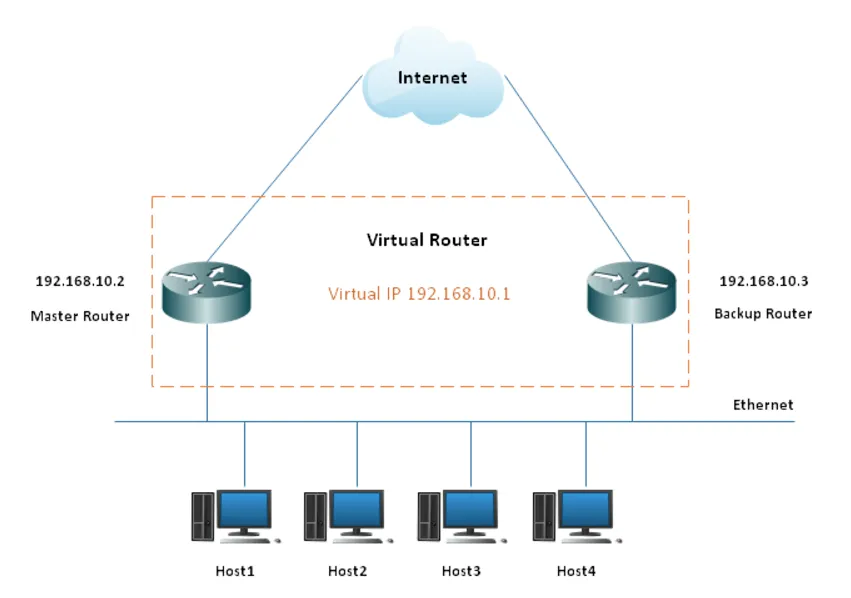
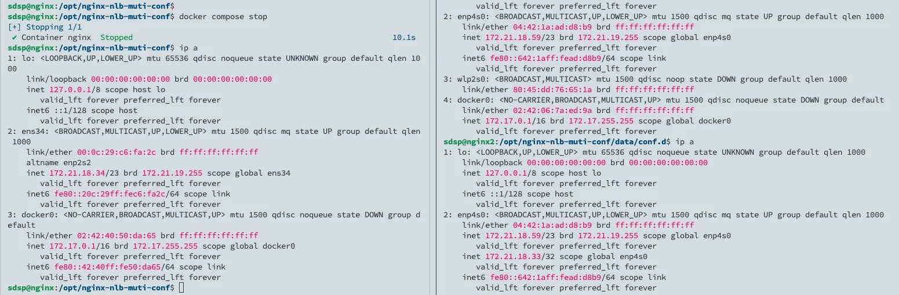

## **VRRP**

VRRP (Virtual Router Redundancy Protocol) 是一種網路協議，旨在提高 IP 網路中的路由器可用性。它允許多個路由器在同一網路上協同工作，形成一個使用虛擬 IP 的虛擬路由器，確保當主路由器發生故障時，備用路由器能夠自動接管。



### 選舉機制

VRRP 使用選舉機制來確定路由器的狀態，運行 VRRP 的一組路由器對外構成了一個虛擬路由器，其中一台路由器處於 Master 狀態，其他處於 Backup 狀態。所以主路由器又叫做 Master 路由器，備援路由器又叫做 Backup 路由器。

## Keepalived

Keepalived 是 VRRP 的實現之一，通過讓多台服務器共享一個虛擬 IP（VIP）來提供高可用性。提供靈活的健康檢查功能，支持通過 TCP、HTTP、HTTPS 或自定義腳本檢測後端伺服器和服務的健康狀態，確保只有正常運行的節點能接受流量。


- Checkers：對後端伺服器節點進行健康狀態監測和故障隔離。
- VRRP Stack：實作 VRRP 功能的模組，VRRP 功能可以實現對前端調度器叢集的故障切換(failover)。
- SMTP：可以提供透過通知故障訊息的郵件。
- System Call：呼叫系統核心功能完成故障隔離和故障切換。
- WatchDog：週期性的去偵測 Checkers 和 VRRP Stack 的運作狀態，一旦 Checkers 和 VRRP Stack 發生故障，Watch Dog 就能夠偵測並採取恢復措施（重啟）。
- IPVS Wrapper：該模組是 Keepalived 引進的第三方模組，透過 IPVS 可以實現基於 IP 的負載平衡叢集。
- NETLINK Reflector ：主要用於實現一些進階路由框架和一些相關的網路功能。

### Keepalived 單播與組播

Keepalived 的 VRRP（Virtual Router Redundancy Protocol）實作支援兩種模式：組播和單播。

- 群播模式：VRRP 的標準模式，也是 Keepalived 的預設模式。在組播模式中，VRRP 執行個體將其通告（Advertisement）訊息傳送到一個特定的組播位址（通常是 224.0.0.18），所有的 VRRP 實例都監聽這個位址。這種模式的優點是不需要知道其他 VRRP 實例的 IP 位址，但是需要網路設備支援組播。(如 ifconfig 的網卡需有 MULTICAST 模式)
- 單播模式：在單播模式中，VRRP 執行個體將其通告訊息直接傳送到其他 VRRP 執行個體的 IP 位址。這種模式的優點是它不需要網路設備支援組播，但是它需要在組態中指定其他 VRRP 實例的 IP 位址。適合無法支持組播的網路，或者需要更高的安全性，避免廣播到所有節點。

### Keepalived 應用場景

最常用且通用的用法就是以下幾種：

- Keepalived + LVS
- Keepalived + haproxy
- Keepalived + nginx

## 為 Nginx Server 加上 Keepalived 高可用

因為環境中只有兩台 nginx，故選擇使用單播模式。

### 環境

- Ubuntu 22.04
- Nginx (run as docker with host network)
  - MASTER: 172.21.18.34
  - BACKUP: 172.21.18.59

### 安裝 Keepalived

在兩台 server 中執行

```bash
sudo apt-get install keepalived
```

### 準備 keepalived.conf

- MASTER

  ```toml
  # /etc/keepalived/keepalived.conf
  global_defs {
      router_id nginx1
      script_user root
      enable_script_security
  }

  vrrp_script check_script {
      script "killall -0 nginx"
      interval 2
      weight -20
  }

  vrrp_instance VI_1 {
      state MASTER
      interface ens34
      virtual_router_id 251
      priority 100
      advert_int 1

      authentication {
          auth_type PASS
          auth_pass 123456
      }
      track_script {
          check_script
      }
      unicast_src_ip 172.21.18.34
      unicast_peer {
          172.21.18.59
      }
      virtual_ipaddress {
          172.21.18.33
      }
  }
  ```

- BACKUP

  ```toml
  # /etc/keepalived/keepalived.conf
  global_defs {
      router_id nginx1
      script_user root
      enable_script_security
  }

  vrrp_script check_script {
      script "killall -0 nginx"
      interval 2
      weight -20
  }

  vrrp_instance VI_1 {
      state BACKUP
      interface enp4s0
      virtual_router_id 251
      priority 90
      advert_int 1

      authentication {
          auth_type PASS
          auth_pass 123456
      }
      track_script {
          check_script
      }
      unicast_src_ip 172.21.18.59
      unicast_peer {
          172.21.18.34
      }
      virtual_ipaddress {
          172.21.18.33
      }
  }
  ```

### 啟動 keepalived

```bash
sudo systemctl daemon-reload
sudo systemctl enable --now keepalived
```

查看 MASTER 可以發現到 VIP 已經成功綁定到指定網卡了。


### 測試

將 MASTER Nginx 停止後，可以看到 VIP 移動到 BACKUP Nginx



查看 log 可以更清楚看到因為 priority 降低後，角色發生轉換。


### 同步兩邊 Nginx 設定

將會使用 rsync 同步，請確保 MASTER Nginx server 可以正常透過 ssh 免密碼登入 BACKUP Nginx Server。

rsync 的作用如下圖實驗所示，會同步指定的兩個 folder 的檔案內容。


建立 cron 腳本：

```bash
#!/bin/bash
set -ueo pipefail

NGINX_CONF_LOCATION="/usr/local/nginx/conf/"
BACKUP_SERVER="root@10.0.0.44"

# sed 提取 rsync 第二行的輸出
rsync_result=$(rsync -av --delete ${NGINX_CONF_LOCATION} ${BACKUP_SERVER}:${NGINX_CONF_LOCATION} | sed -n "2p")
if [ -z ${rsync_result} ];then
  echo "the configuration file has not changed"
else
  echo "changed nginx config, reload Backup Nginx"
  ssh ${BACKUP_SERVER} "docker exec nginx nginx -s reload"
fi
```

設定執行權限

```bash
chmod +x sync-ha-nginx.sh
```

打開當前使用者的 `crontab` 文件

```bash
crontab -e
```

在 `crontab` 編輯器中，添加一條新的規則，指定每 5 分鐘執行一次腳本。

```bash
*/5 * * * * /opt/nginx-nlb-muti-conf/sync-ha-nginx.sh
```

使用以下命令來查看當前使用者的 `crontab` 中的所有定時任務：

```bash
crontab -l
```

如果腳本執行時遇到問題，可以查看系統的 `cron` 日誌來幫助排查：

```bash
grep CRON /var/log/syslog
```

## Reference

- https://www.wlink-tech.com/art/vrrp-protocal
- [https://www.haxi.cc/archives/Keepalived 介绍.html](https://www.haxi.cc/archives/Keepalived%E4%BB%8B%E7%BB%8D.html)
- https://zahui.fan/posts/0cebb8ae/
