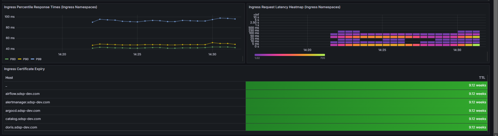

## TL; DR

隨著愈來愈多的資源透過 ingress 開放服務，就有需要將 ingress 納入監控的目標之中，本篇記錄如何為基於之前已經用 helm 安裝的 ingess 加上監控。

## 修改 values.yaml


之前是使用 helm chart 安裝的話，請根據下面的 values.yaml 更新設定

```yaml
controller:
  podAnnotations:
    prometheus.io/port: "10254"
    prometheus.io/scrape: "true"
  metrics:
    enabled: true
    serviceMonitor:
      enabled: true
      additionalLabels:
        release: kube-prometheus-stack
```

## 更新部署

```yaml
helm upgrade ingress-nginx ingress-nginx/ingress-nginx -n ingress-nginx -f values.yaml --version 4.11.2
```


更新完後 controller 會自動重啟 pod，並多出 metrics 的 service。

## 查看 prometheus

當 controller 重啟後會陸續被 prometheus 加到監控目標。


## 設定 Grafana Dashboard

使用 [NGINX Ingress Controller](https://grafana.com/grafana/dashboards/21336-nginx-ingress-controller/) Dashboard



