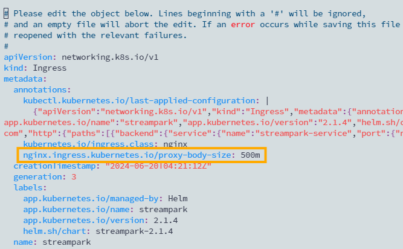
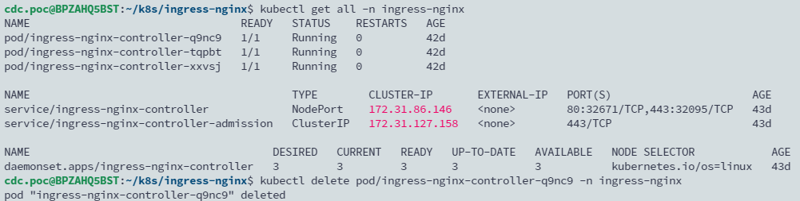

## TL; DR

在透過 ingress 開放的服務中 (如 StreamPark) 上傳檔案時遇到 `413 Request Entity Too Large` ，原因是因為 nginx 預設給客戶端上船的檔案大小限制為 1 MB。

## Solution

暫時的解法是在 ingress 資源中新增 annotation

```yaml
nginx.ingress.kubernetes.io/proxy-body-size: "500M"
```



**永久的解法**是為 ingress nginx controller 的 config 中加上 proxy-body-size 設定項，為未來建立的 ingress 資源都加大上傳檔案的大小限制。

本篇範例的 controller 是使用 helm chart 安裝，故找到安裝變數檔 values.yaml，並在 `controller:` 項目中找到 `config:` ，加上下面行：

```yaml
proxy-body-size: "5000m"
```

重新安裝 ingress nginx，並刪除舊的 pod 使異動生效。

```bash
helm upgrade ingress-nginx ingress-nginx/ingress-nginx -n ingress-nginx -f values.yaml
kubectl get all -n ingress-nginx
kubectl delete pod/ingress-nginx-controller-q9nc9 -n ingress-nginx
kubectl delete pod/ingress-nginx-controller-tqpbt -n ingress-nginx
kubectl delete pod/ingress-nginx-controller-xxvsj -n ingress-nginx
```


