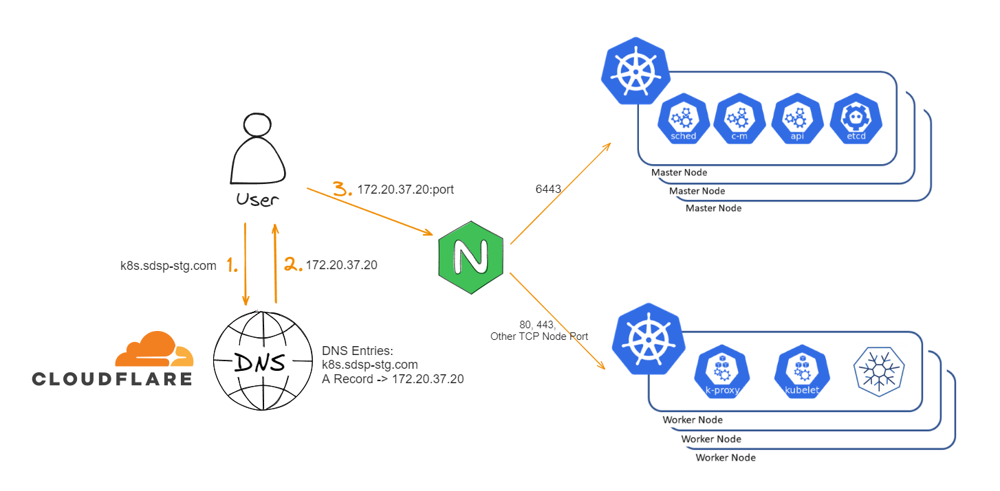
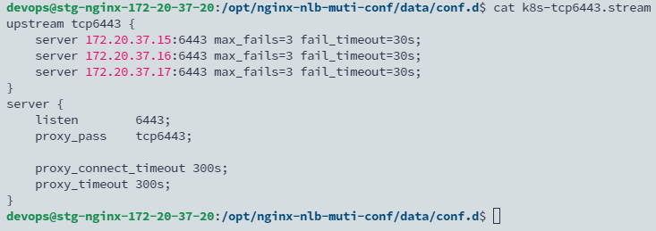

## TL; DR
The current Kubernetes HA (High Availability) architecture on my lab utilizes Nginx as a Load Balancer. When Kubernetes is deployed by Kubespray, the API server endpoint can be configured to an external load balancer.

<!--more-->

## Architecture Overview



In this setup, Nginx serves as the load balancer for API server requests, which distributes traffic across multiple master nodes to ensure high availability. This configuration requires modifications to the Kubespray deployment files to specify the load balancer details.

## Configuration

Locate the `all.yml` file in the sample inventory provided by Kubespray:

[inventory/sample/group_vars/all/all.yml](https://github.com/kubernetes-sigs/kubespray/blob/master/inventory/sample/group_vars/all/all.yml)

```yaml
## External LB example config
## apiserver_loadbalancer_domain_name: "elb.some.domain"
# loadbalancer_apiserver:
#   address: 1.2.3.4
#   port: 1234
```
  
<br>  

Therefore, you need to modify group_vars more before deploying ansible playbook.


```bash
vi inventory/mycluster/group_vars/all/all.yml
```

Uncomment the example configuration for the external load balancer and adjust the values to fit your setup. An example configuration is provided below:

```bash
apiserver_loadbalancer_domain_name: "k8s.sdsp-dev.com"
# Configure the Nginx IP address and forwarding port here
loadbalancer_apiserver:
   address: 172.20.37.19
   port: 6443
```

## Additional information
Nginx stream config for Kubernetes API Servers.



## Reference

- https://www.youtube.com/watch?v=u_1f3WyvtQE