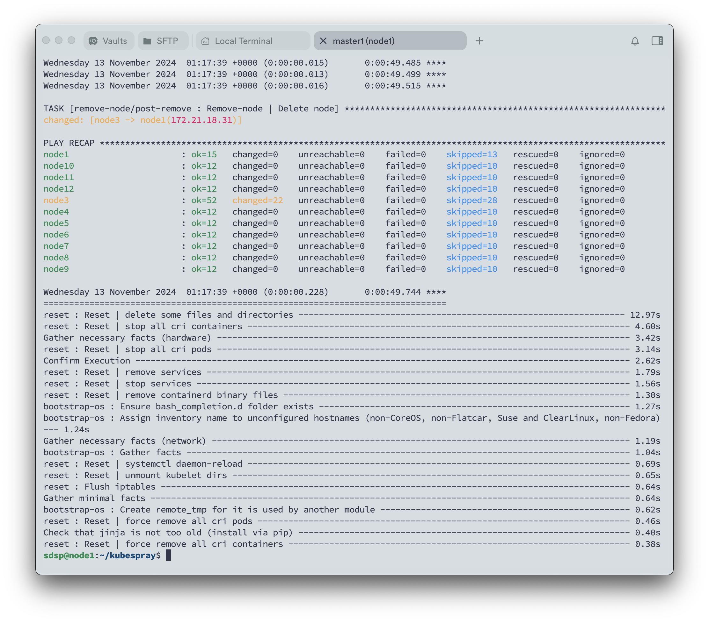

1. Append the new host to the inventory.

```
vi inventory/mycluster/hosts.yaml
```

2. Run cluster.yml
   Run cluster.yml. You can NOT use scale.yml for that.

```
ansible-playbook -i inventory/mycluster/hosts.yaml --become --become-user=root cluster.yml
```

</br>

The removal nodes here cannot be the first node, if you want to remove the first node, please follow next section's instruction.


3. Remove old control plane nodes
   With the old node still in the inventory, run remove-node.yml. You need to pass -e node=NODE_NAME to the playbook to limit the execution to the node being removed. If the node you want to remove is not online, you should add reset_nodes=false and allow_ungraceful_removal=true to your extra-vars.

```
ansible-playbook -i inventory/mycluster/hosts.yaml --become --become-user=root remove-node.yml -e "node=node2,node3"
```



4. Update deleted nodes in inventory.

```
vi inventory/mycluster/hosts.yaml
```

## Replace the first master node

Currently you can't remove the first node in your kube_control_plane and etcd-master list. If you still want to remove this node you have to:

1. Change order of current control planes
   Modify the order of your control plane list by pushing your first entry to any other position. E.g. if you want to remove node-1 of the following example:

```
  children:
    kube_control_plane:
      hosts:
        node-1:
        node-2:
        node-3:
    kube_node:
      hosts:
        node-1:
        node-2:
        node-3:
    etcd:
      hosts:
        node-1:
        node-2:
        node-3:
```

change your inventory to:

```
  children:
    kube_control_plane:
      hosts:
        node-2:
        node-3:
        node-1:
    kube_node:
      hosts:
        node-2:
        node-3:
        node-1:
    etcd:
      hosts:
        node-2:
        node-3:
        node-1:
```

2. Upgrade the cluster
   run upgrade-cluster.yml or cluster.yml. Now you are good to go on with the removal.
