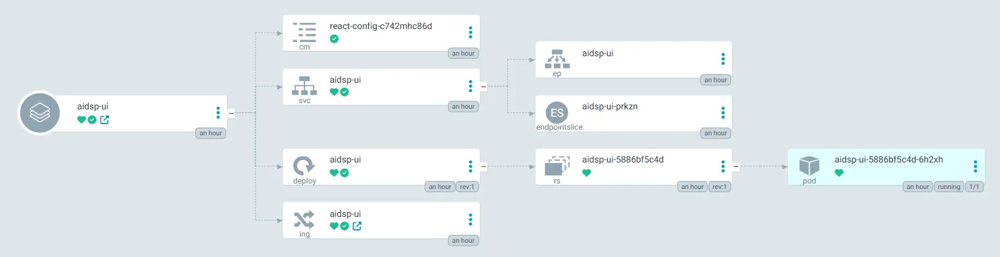

## TL; DR

Document how to ignore resources defined in the base when deploying Kustomize resources.

## Demand Description

Here is the kustomization declaration in base layer:

```yaml
apiVersion: kustomize.config.k8s.io/v1beta1
kind: Kustomization
resources:
  - deployment.yaml
  - service.yaml
  - httproute.yaml
```

There is currently an overlay environment that needs to be deployed, and the requirement is to remove the HTTPRoute and replace it with Ingress.

## Implementation

overlay kustomization.yaml

```yaml
apiVersion: kustomize.config.k8s.io/v1beta1
kind: Kustomization

configMapGenerator:
  - literals:
      - HOST=http://aidsp-catalog:80
      - VERSION=v1
    name: react-config

resources:
  - ../../../../base/platform/aidsp-ui
  - ingress.yaml

patchesStrategicMerge:
  - delete-route.yaml

images:
  - name: harbor.sdsp-stg.com/platform/aidsp-ui
    newName: harbor.sdsp-stg.com/platform/aidsp-ui
    newTag: 2663827e
```

delete-route.yaml

```yaml
$patch: delete
apiVersion: gateway.networking.k8s.io/v1
kind: HTTPRoute
metadata:
  name: aidsp-ui
```

ingress.yaml

```yaml
apiVersion: networking.k8s.io/v1
kind: Ingress
metadata:
  name: aidsp-ui
spec:
  ingressClassName: nginx
  rules:
    - host: "aidsp.sdsp-stg.com"
      http:
        paths:
          - path: /
            pathType: Prefix
            backend:
              service:
                name: aidsp-ui
                port:
                  number: 3000
```

Here is the result, as you can see, the HTTPRoute resource is successfully replaceby by Ingress resource.


