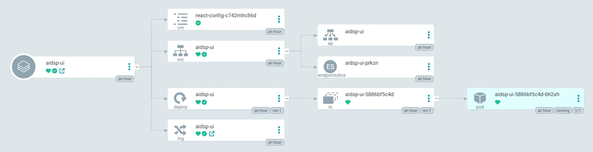

## TL; DR

紀錄如何在部署 kustomize 資源時忽略 base 定義好的資源。

## 需求描述

目前 base 的 kustomization 如下：

```yaml
apiVersion: kustomize.config.k8s.io/v1beta1
kind: Kustomization
resources:
  - deployment.yaml
  - service.yaml
  - httproute.yaml
```

今天有一個 overlay 環境需要部署，而需求是需要將其中的 httproute 移除，改使用 ingress 取代。

## 實作

overlay kustomization.yaml

```yaml
apiVersion: kustomize.config.k8s.io/v1beta1
kind: Kustomization

configMapGenerator:
  - literals:
      - HOST=http://aidsp-catalog:80
      - VERSION=v1
    name: react-config

resources:
  - ../../../../base/platform/aidsp-ui
  - ingress.yaml

patchesStrategicMerge:
  - delete-route.yaml

images:
  - name: harbor.sdsp-stg.com/platform/aidsp-ui
    newName: harbor.sdsp-stg.com/platform/aidsp-ui
    newTag: 2663827e
```

delete-route.yaml

```yaml
$patch: delete
apiVersion: gateway.networking.k8s.io/v1
kind: HTTPRoute
metadata:
  name: aidsp-ui
```

ingress.yaml

```yaml
apiVersion: networking.k8s.io/v1
kind: Ingress
metadata:
  name: aidsp-ui
spec:
  ingressClassName: nginx
  rules:
    - host: "aidsp.sdsp-stg.com"
      http:
        paths:
          - path: /
            pathType: Prefix
            backend:
              service:
                name: aidsp-ui
                port:
                  number: 3000
```

部署結果，可以看到成功移除 httproute 資源並新增 ingress 資源。


