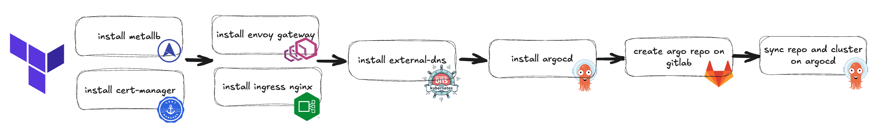

## TL; DR

紀錄如何在 Mac 上建立可以測試 Terraform 自動化建立 Kubernetes PaaS 部署的環境。

## 自動化平台交付的設計過程與最終部署目標

目前公司研發的產品是數據平台，其基礎建設是基於 Kubernetes，所以環境在交付時希望能透過自動化流程加速建置作業。
首先，Kubernetes 本身的建置是採用 Kubespray（地端）以及 Terraform （公有雲）自動化建立。Kubernetes 之上的 Application 是使用 ArgoCD 將部署自動化，並且還能為整個基礎設施的配置進行版本控制。而 ArgoCD 本身的部署則是選用 Terraform 實現 0 人工介入的環境交付。



最終希望可以在 Kubernetes 上完成 MetalLB, Cert Manager, Ingress Nginx, Envoy Gateway, 以及 ArgoCD 的部署，且到自動化同步所有其他數據平台會用到的 Application。以下為測試條件：

- 全部在 Mac 環境進行
- 建立 Kubernetes 集群
- 能夠透過 MetalLB 使用 Load Balancer Type Service
- 透過 External DNS 同步 Ingress Controller 的 LoadBalancer IP 與指定的 Ingress 資源
- 透過上面已同步的 FQDN 存取 ArgoCD Server UI 查看部署結果

## 環境準備

首先很簡單的想說透過 Minikube 直接在本地端搭建 Kubernetes 環境，但發現建好的 Minikube 無法用 Docker Bridge 上的其他 IP 當作 MetalLB 的 IP Pool Address，而且 MacOS 也沒辦法很順利的使用 Terraform，所以最後決定安裝 VMware 並跑一個 Ubuntu VM，且因為需要在 VM 上存取 ArgoCD 網頁，故選擇安裝 Ubuntu Desktop 版本。接著透過 Kind 進行 Kubernetes 的快速部署。

### sudoer 免密設定

```sh
sudo vi /etc/sudoers
%sudo   ALL=(ALL:ALL) NOPASSWD:ALL
```

### 安裝 Docker

```sh
sudo apt update
sudo apt upgrade
curl -fsSL https://get.docker.com -o install-docker.sh
sudo sh install-docker.sh
sudo usermod -aG docker ${USER}
su - ${USER}
sudo apt-get install -y apache2-utils # 為了 terraform 腳本中用到的 htpasswd 而安裝的 pkg
```

### 安裝 Terraform

```sh
sudo apt-get update && sudo apt-get install -y gnupg software-properties-common
wget -O- https://apt.releases.hashicorp.com/gpg | \
gpg --dearmor | \
sudo tee /usr/share/keyrings/hashicorp-archive-keyring.gpg > /dev/null
echo "deb [signed-by=/usr/share/keyrings/hashicorp-archive-keyring.gpg] \
https://apt.releases.hashicorp.com $(lsb_release -cs) main" | \
sudo tee /etc/apt/sources.list.d/hashicorp.list
sudo apt update
sudo apt-get install terraform
```

### 安裝 Kind

```sh
[ $(uname -m) = aarch64 ] && curl -Lo ./kind https://kind.sigs.k8s.io/dl/v0.25.0/kind-linux-arm64
chmod +x ./kind
sudo mv ./kind /usr/local/bin/kind
```

### 安裝 kubectl

```sh
curl -LO "https://dl.k8s.io/release/$(curl -L -s https://dl.k8s.io/release/stable.txt)/bin/linux/arm64/kubectl"
curl -LO "https://dl.k8s.io/release/$(curl -L -s https://dl.k8s.io/release/stable.txt)/bin/linux/arm64/kubectl.sha256"
echo "$(cat kubectl.sha256) kubectl" | sha256sum --check
sudo install -o root -g root -m 0755 kubectl /usr/local/bin/kubectl
```

### 安裝 Kind 集群

準備 kind.yaml 配置檔

```yaml
kind: Cluster
apiVersion: kind.x-k8s.io/v1alpha4
name: kind
networking:
  # the default CNI will not be installed
  disableDefaultCNI: true
  # WARNING: It is _strongly_ recommended that you keep this the default
  # (127.0.0.1) for security reasons. However it is possible to change this.
  apiServerAddress: "0.0.0.0"
  # By default the API server listens on a random open port.
  # You may choose a specific port but probably don't need to in most cases.
  # Using a random port makes it easier to spin up multiple clusters.
  apiServerPort: 6443
  podSubnet: "10.244.0.0/16"
  serviceSubnet: "10.96.0.0/12"
  kubeProxyMode: "ipvs"
nodes:
  - role: control-plane
    kubeadmConfigPatches:
      - |
        kind: ClusterConfiguration
        metadata:
          name: config
        apiServer:
          certSANs:
          - localhost
          - 127.0.0.1
          - kubernetes
          - kubernetes.default.svc
          - kubernetes.default.svc.cluster.local
          - kind
          - 0.0.0.0
  - role: worker
    extraPortMappings:
      - containerPort: 80
        hostPort: 80
        # optional: set the bind address on the host
        # 0.0.0.0 is the current default
        listenAddress: "0.0.0.0"
        # optional: set the protocol to one of TCP, UDP, SCTP.
        # TCP is the default
        protocol: TCP
      - containerPort: 443
        hostPort: 443
        # optional: set the bind address on the host
        # 0.0.0.0 is the current default
        listenAddress: "0.0.0.0"
        # optional: set the protocol to one of TCP, UDP, SCTP.
        # TCP is the default
        protocol: TCP
```

建立集群

```sh
kind create cluster --config kind.yaml
```

安裝 Calico

```sh
curl https://raw.githubusercontent.com/projectcalico/calico/v3.29.1/manifests/calico.yaml -O
vi calico.yaml
```

修改 pod 跑的 IPV4 CIDR

```yaml
- name: CALICO_IPV4POOL_CIDR
  value: "10.244.0.0/16"
```

開始安裝

```sh
kubectl apply -f calico.yaml
```

查看部署狀態

```sh
kubectl get nodes
```
