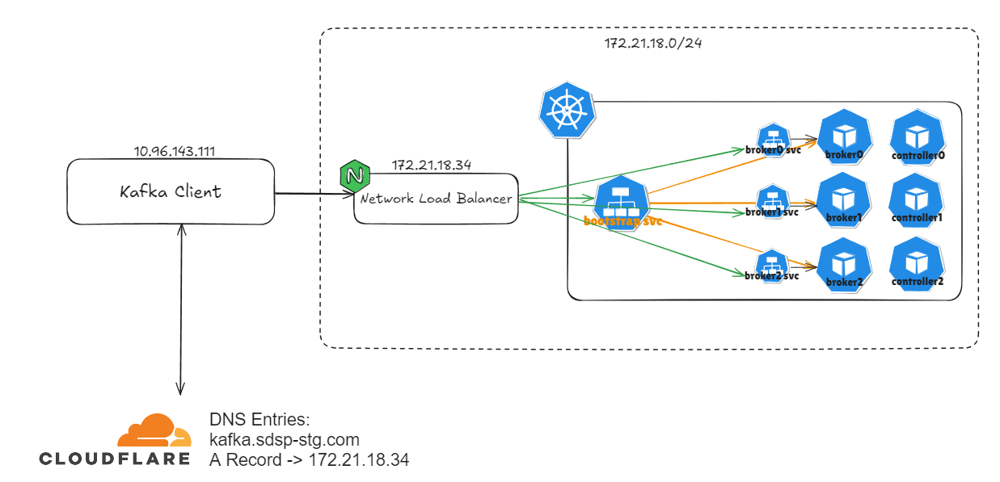
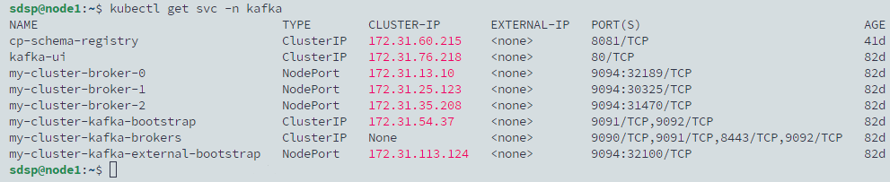
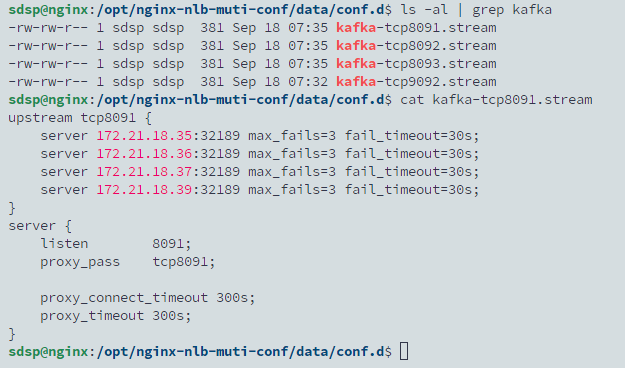
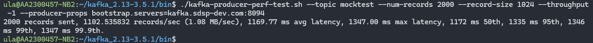

## TL; DR

Kafka 使用 Strimzi Operator 部署在 Kubernetes 集群上，並透過 NodePort 當為對外 headless 的 service 供客戶端存取。當客戶端存在於網段外部時，遇到 `Disconnected from node 1 due to timeout` 的錯誤。

## 錯誤描述

外部客戶端連線時會報錯：

```
[kafka-admin-client-thread | flink-kafka-quickstart-enumerator-admin-client] INFO org.apache.kafka.clients.NetworkClient - [AdminClient clientId=flink-kafka-quickstart-enumerator-admin-client] Node 2 disconnected.
[kafka-admin-client-thread | flink-kafka-quickstart-enumerator-admin-client] INFO org.apache.kafka.clients.NetworkClient - [AdminClient clientId=flink-kafka-quickstart-enumerator-admin-client] Cancelled in-flight API_VERSIONS request with correlation id 2 due to node 2 being disconnected (elapsed time since creation: 7ms, elapsed time since send: 7ms, request timeout: 3600000ms)
[kafka-admin-client-thread | flink-kafka-quickstart-enumerator-admin-client] INFO org.apache.kafka.clients.NetworkClient - [AdminClient clientId=flink-kafka-quickstart-enumerator-admin-client] Node 1 disconnected.
[kafka-admin-client-thread | flink-kafka-quickstart-enumerator-admin-client] INFO org.apache.kafka.clients.NetworkClient - [AdminClient clientId=flink-kafka-quickstart-enumerator-admin-client] Cancelled in-flight API_VERSIONS request with correlation id 3 due to node 1 being disconnected (elapsed time since creation: 4ms, elapsed time since send: 4ms, request timeout: 3600000ms)
[kafka-admin-client-thread | flink-kafka-quickstart-enumerator-admin-client] INFO org.apache.kafka.clients.NetworkClient - [AdminClient clientId=flink-kafka-quickstart-enumerator-admin-client] Node 0 disconnected.
```

或是：

```
[2024-09-18 16:28:17,666] WARN [Producer clientId=perf-producer-client] Got error produce response with correlation id 4 on topic-partition mocktest-0, retrying (2147483646 attempts left). Error: REQUEST_TIMED_OUT. Error Message: Disconnected from node 1 due to timeout (org.apache.kafka.clients.producer.internals.Sender)
[2024-09-18 16:28:17,669] WARN [Producer clientId=perf-producer-client] Got error produce response with correlation id 5 on topic-partition mocktest-0, retrying (2147483646 attempts left). Error: REQUEST_TIMED_OUT. Error Message: Disconnected from node 1 due to timeout (org.apache.kafka.clients.producer.internals.Sender)
[2024-09-18 16:28:17,669] WARN [Producer clientId=perf-producer-client] Got error produce response with correlation id 6 on topic-partition mocktest-0, retrying (2147483646 attempts left). Error: REQUEST_TIMED_OUT. Error Message: Disconnected from node 1 due to timeout (org.apache.kafka.clients.producer.internals.Sender)
[2024-09-18 16:28:17,669] WARN [Producer clientId=perf-producer-client] Got error produce response with correlation id 7 on topic-partition mocktest-0, retrying (2147483646 attempts left). Error: REQUEST_TIMED_OUT. Error Message: Disconnected from node 1 due to timeout (org.apache.kafka.clients.producer.internals.Sender)
[2024-09-18 16:28:17,670] WARN [Producer clientId=perf-producer-client] Got error produce response with correlation id 8 on topic-partition mocktest-0, retrying (2147483646 attempts left). Error: REQUEST_TIMED_OUT. Error Message: Disconnected from node 1 due to timeout (org.apache.kafka.clients.producer.internals.Sender)
[2024-09-18 16:28:47,774] WARN [Producer clientId=perf-producer-client] Got error produce response with correlation id 12 on topic-partition mocktest-0, retrying (2147483645 attempts left). Error: REQUEST_TIMED_OUT. Error Message: Disconnected from node 1 due to timeout (org.apache.kafka.clients.producer.internals.Sender)
[2024-09-18 16:29:17,883] WARN [Producer clientId=perf-producer-client] Got error produce response with correlation id 15 on topic-partition mocktest-0, retrying (2147483644 attempts left). Error: REQUEST_TIMED_OUT. Error Message: Disconnected from node 1 due to timeout (org.apache.kafka.clients.producer.internals.Sender)
org.apache.kafka.common.errors.TimeoutException: Expiring 15 record(s) for mocktest-0:120000 ms has passed since batch creation
org.apache.kafka.common.errors.TimeoutException: Expiring 15 record(s) for mocktest-0:120000 ms has passed since batch creation
org.apache.kafka.common.errors.TimeoutException: Expiring 15 record(s) for mocktest-0:120000 ms has passed since batch creation
org.apache.kafka.common.errors.TimeoutException: Expiring 15 record(s) for mocktest-0:120000 ms has passed since batch creation
```

## 部署架構



## 正確配置

```yaml
spec:
  kafka:
    version: 3.7.1
    metadataVersion: 3.7-IV4
    listeners:
      - name: plain
        port: 9092
        type: internal
        tls: false
      - name: external
        port: 9094
        type: nodeport
        tls: false
        configuration:
          bootstrap:
            nodePort: 32100
          brokers:
            - broker: 0
              advertisedHost: kafka.sdsp-dev.com
              advertisedPort: 8091
            - broker: 1
              advertisedHost: kafka.sdsp-dev.com
              advertisedPort: 8092
            - broker: 2
              advertisedHost: kafka.sdsp-dev.com
              advertisedPort: 8093
```

更新後，查看 service 可以發現每個 broker 都有獨立的 NodePort service。



接著也需要為這些 broker 的 service 設置 nlb 轉發。



然後從外部 client 使用 loadbalancer svc 測試 broker 的連線


