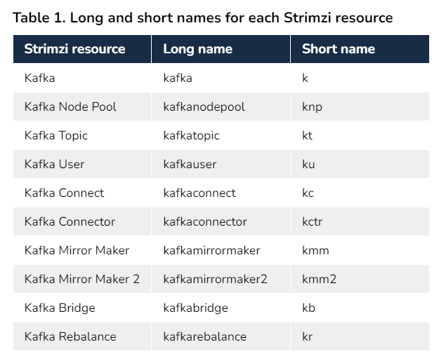
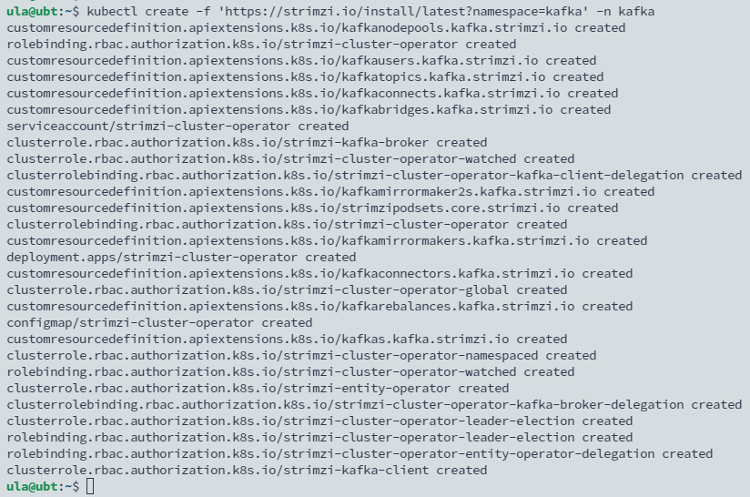
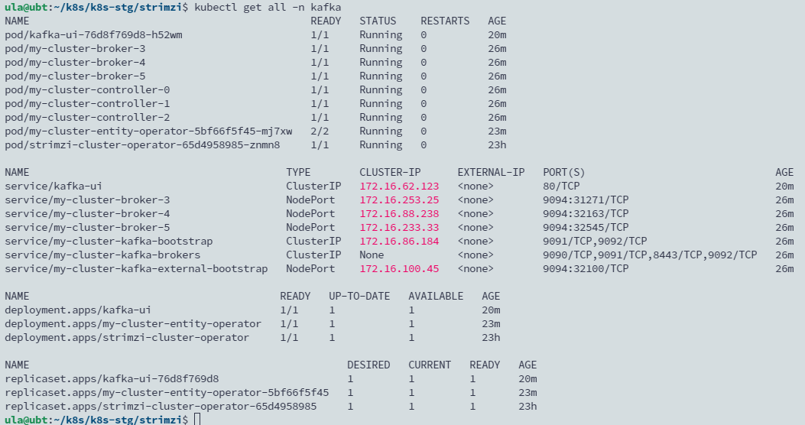
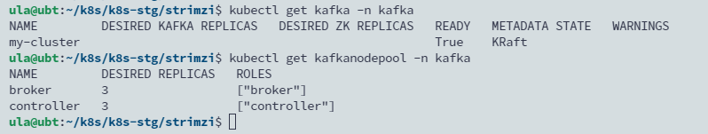
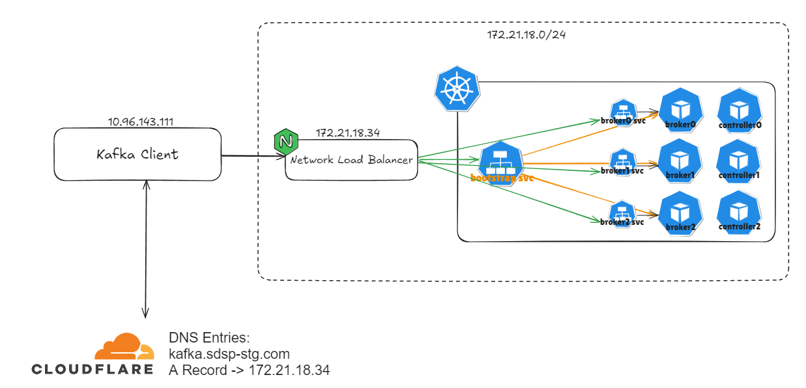

## Introduction

 In addition to Kafka Broker, the Kafka ecosystem also includes Kafka Connect, Kafka Bridge, Mirror Maker, etc. Setting up Kafka in Kubernetes through an Operator is easier than writing multiple manifests or installing multiple helm charts. This article selects Strimzi, which has the most stars in the Kafka Operator project on GitHub. The following table provides a list of resources that Stimzi can deploy.

<!--more-->



## Strimzi Operator Deployment Best Practice

- Installing the Strimzi Operator in a different namespace from the Kafka Cluster and other Kafka components it manages to ensure clear separation of resources and configuration.
- A Kubernetes installs only a single Strimzi Operator to manage all Kafka instances.
- Updated Strimzi Operator and supported Kafka versions to reflect the latest features and enhancements.


## Operator Installation

```yaml
kubectl create ns kafka
kubectl create -f 'https://strimzi.io/install/latest?namespace=kafka' -n kafka
```



## Kafka Cluster Deployment

```bash
wget https://github.com/strimzi/strimzi-kafka-operator/releases/download/0.41.0/strimzi-0.41.0.tar.gz
tar zxvf strimzi-0.41.0.tar.gz
cd strimzi-0.41.0
cp examples/kafka/kraft/kafka.yaml .
vi kafka.yaml
```

Modify the deployment file. Deployment of Kafka cluster in KRaft mode requires the use of KafkaNodePool resources, so the yaml of the above two node pools are resources that must be deployed.

```yaml
apiVersion: kafka.strimzi.io/v1beta2
kind: KafkaNodePool
metadata:
  name: controller
  labels:
    strimzi.io/cluster: my-cluster
spec:
  replicas: 3
  roles:
    - controller
  storage:
    type: jbod
    volumes:
      - id: 0
        type: persistent-claim
        size: 100Gi
        kraftMetadata: shared
        deleteClaim: false
        class: ceph-csi-rbd-hdd # Replace with existing storage class
---

apiVersion: kafka.strimzi.io/v1beta2
kind: KafkaNodePool
metadata:
  name: broker
  labels:
    strimzi.io/cluster: my-cluster
spec:
  replicas: 3
  roles:
    - broker
  storage:
    type: jbod
    volumes:
      - id: 0
        type: persistent-claim
        size: 100Gi
        kraftMetadata: shared
        deleteClaim: false
        class: ceph-csi-rbd-hdd # Replace with existing storage class
---

apiVersion: kafka.strimzi.io/v1beta2
kind: Kafka
metadata:
  name: my-cluster
  annotations:
    strimzi.io/node-pools: enabled
    strimzi.io/kraft: enabled
spec:
  kafka:
    version: 3.7.1
    metadataVersion: 3.7-IV4
    listeners:
      - name: plain
        port: 9092
        type: internal
        tls: false
      - name: external
        port: 9094
        type: nodeport # Added external nodeport service
        tls: false
        configuration:
          bootstrap:
            nodePort: 32100 # Specify the nodeport occupied by bootstrap. If the broker is not specified one by one, the Operator will automatically assign it.
          brokers:
          - broker: 0
            advertisedHost: kafka.sdsp-dev.com
            advertisedPort: 8091
          - broker: 1
            advertisedHost: kafka.sdsp-dev.com
            advertisedPort: 8092
          - broker: 2
            advertisedHost: kafka.sdsp-dev.com
            advertisedPort: 8093
    config:
      offsets.topic.replication.factor: 3
      transaction.state.log.replication.factor: 3
      transaction.state.log.min.isr: 2
      default.replication.factor: 3
      min.insync.replicas: 2
  entityOperator:
    topicOperator: {}
    userOperator: {}
```

Start deployment

```yaml
kubectl -n kafka apply -f kafka.yaml
```



View kafka and kafka node pool customized resource




## Load Balance for Kafka

The load forwarding rules of Nginx Load Balance must include the Node Ports of all Worker Nodes occupied by Bootstrap and Brokers.

The following is an example of setting up the Bootstrap port:

```yaml
upstream tcp9094 {
    server 172.20.37.42:32100 max_fails=3 fail_timeout=30s;
    server 172.20.37.42:32100 max_fails=3 fail_timeout=30s;
    server 172.20.37.42:32100 max_fails=3 fail_timeout=30s;
    server 172.20.37.42:32100 max_fails=3 fail_timeout=30s;
    server 172.20.37.42:32100 max_fails=3 fail_timeout=30s;
    server 172.20.37.42:32100 max_fails=3 fail_timeout=30s;
}

server {
    listen        9094;
    proxy_pass    tcp9094;
 
    proxy_connect_timeout 300s;
    proxy_timeout 300s;
}
```

## Deployment Architecture




When setting the external settings, you need to also specify the nodeport of each broker. Otherwise, when the client exists outside the network segment, you will encounter the error Disconnected from node 1 due to timeout.


For example:
```
[kafka-admin-client-thread | flink-kafka-quickstart-enumerator-admin-client] INFO org.apache.kafka.clients.NetworkClient - [AdminClient clientId=flink-kafka-quickstart-enumerator-admin-client] Node 2 disconnected.
[kafka-admin-client-thread | flink-kafka-quickstart-enumerator-admin-client] INFO org.apache.kafka.clients.NetworkClient - [AdminClient clientId=flink-kafka-quickstart-enumerator-admin-client] Cancelled in-flight API_VERSIONS request with correlation id 2 due to node 2 being disconnected (elapsed time since creation: 7ms, elapsed time since send: 7ms, request timeout: 3600000ms)
[kafka-admin-client-thread | flink-kafka-quickstart-enumerator-admin-client] INFO org.apache.kafka.clients.NetworkClient - [AdminClient clientId=flink-kafka-quickstart-enumerator-admin-client] Node 1 disconnected.
[kafka-admin-client-thread | flink-kafka-quickstart-enumerator-admin-client] INFO org.apache.kafka.clients.NetworkClient - [AdminClient clientId=flink-kafka-quickstart-enumerator-admin-client] Cancelled in-flight API_VERSIONS request with correlation id 3 due to node 1 being disconnected (elapsed time since creation: 4ms, elapsed time since send: 4ms, request timeout: 3600000ms)
[kafka-admin-client-thread | flink-kafka-quickstart-enumerator-admin-client] INFO org.apache.kafka.clients.NetworkClient - [AdminClient clientId=flink-kafka-quickstart-enumerator-admin-client] Node 0 disconnected.
```

Or another example:

```
[2024-09-18 16:28:17,666] WARN [Producer clientId=perf-producer-client] Got error produce response with correlation id 4 on topic-partition mocktest-0, retrying (2147483646 attempts left). Error: REQUEST_TIMED_OUT. Error Message: Disconnected from node 1 due to timeout (org.apache.kafka.clients.producer.internals.Sender)
[2024-09-18 16:28:17,669] WARN [Producer clientId=perf-producer-client] Got error produce response with correlation id 5 on topic-partition mocktest-0, retrying (2147483646 attempts left). Error: REQUEST_TIMED_OUT. Error Message: Disconnected from node 1 due to timeout (org.apache.kafka.clients.producer.internals.Sender)
[2024-09-18 16:28:17,669] WARN [Producer clientId=perf-producer-client] Got error produce response with correlation id 6 on topic-partition mocktest-0, retrying (2147483646 attempts left). Error: REQUEST_TIMED_OUT. Error Message: Disconnected from node 1 due to timeout (org.apache.kafka.clients.producer.internals.Sender)
[2024-09-18 16:28:17,669] WARN [Producer clientId=perf-producer-client] Got error produce response with correlation id 7 on topic-partition mocktest-0, retrying (2147483646 attempts left). Error: REQUEST_TIMED_OUT. Error Message: Disconnected from node 1 due to timeout (org.apache.kafka.clients.producer.internals.Sender)
[2024-09-18 16:28:17,670] WARN [Producer clientId=perf-producer-client] Got error produce response with correlation id 8 on topic-partition mocktest-0, retrying (2147483646 attempts left). Error: REQUEST_TIMED_OUT. Error Message: Disconnected from node 1 due to timeout (org.apache.kafka.clients.producer.internals.Sender)
[2024-09-18 16:28:47,774] WARN [Producer clientId=perf-producer-client] Got error produce response with correlation id 12 on topic-partition mocktest-0, retrying (2147483645 attempts left). Error: REQUEST_TIMED_OUT. Error Message: Disconnected from node 1 due to timeout (org.apache.kafka.clients.producer.internals.Sender)
[2024-09-18 16:29:17,883] WARN [Producer clientId=perf-producer-client] Got error produce response with correlation id 15 on topic-partition mocktest-0, retrying (2147483644 attempts left). Error: REQUEST_TIMED_OUT. Error Message: Disconnected from node 1 due to timeout (org.apache.kafka.clients.producer.internals.Sender)
org.apache.kafka.common.errors.TimeoutException: Expiring 15 record(s) for mocktest-0:120000 ms has passed since batch creation
org.apache.kafka.common.errors.TimeoutException: Expiring 15 record(s) for mocktest-0:120000 ms has passed since batch creation
org.apache.kafka.common.errors.TimeoutException: Expiring 15 record(s) for mocktest-0:120000 ms has passed since batch creation
org.apache.kafka.common.errors.TimeoutException: Expiring 15 record(s) for mocktest-0:120000 ms has passed since batch creation
```