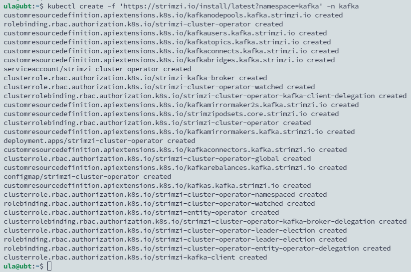
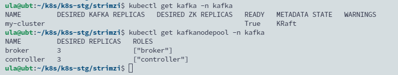
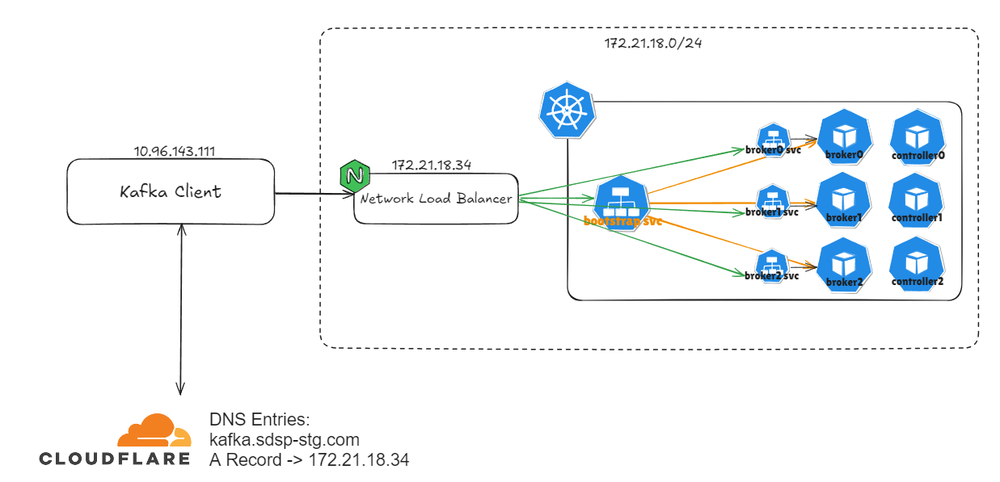

## Introduction

Kafka 生態系除了 Kafka Broker 外，還有 Kafka Connect, Kafka Bridge, Mirror Maker … 等，透過 Operator 來架設會比需要寫多的 manifest 或裝多個 helm chart 來的好用。本篇選擇 GitHub 上 Kafka Operator project 星星數最多的 Strimzi，下表為 Stimzi 提供可以部屬的資源列表。

<!--more-->


## Strimzi Operator Deployment Best Practice

- 將 Strimzi Operator 安裝在其管理的 Kafka Cluster 及其他 Kafka component 不同的 namespace 中，以確保資源和配置的明確分離。
- 一座 Kubernetes 只安裝單一 Strimzi Operator 來管理所有 Kafka 實例。
- 更新 Strimzi Operator 和支援的 Kafka 版本，以反映最新的功能和增強功能。

## 安裝 Operator

```yaml
kubectl create ns kafka
kubectl create -f 'https://strimzi.io/install/latest?namespace=kafka' -n kafka
```



## 部署 kafka cluster

```bash
wget https://github.com/strimzi/strimzi-kafka-operator/releases/download/0.41.0/strimzi-0.41.0.tar.gz
tar zxvf strimzi-0.41.0.tar.gz
cd strimzi-0.41.0
cp examples/kafka/kraft/kafka.yaml .
vi kafka.yaml
```

修改部署文件，KRaft 模式部署 Kafka 叢集需要使用 KafkaNodePool 資源，所以上面兩個 node pool 的 yaml 是必須部署的資源。

```yaml
apiVersion: kafka.strimzi.io/v1beta2
kind: KafkaNodePool
metadata:
  name: controller
  labels:
    strimzi.io/cluster: my-cluster
spec:
  replicas: 3
  roles:
    - controller
  storage:
    type: jbod
    volumes:
      - id: 0
        type: persistent-claim
        size: 100Gi
        kraftMetadata: shared
        deleteClaim: false
        class: ceph-csi-rbd-hdd # 替換成現有的 storage class
---

apiVersion: kafka.strimzi.io/v1beta2
kind: KafkaNodePool
metadata:
  name: broker
  labels:
    strimzi.io/cluster: my-cluster
spec:
  replicas: 3
  roles:
    - broker
  storage:
    type: jbod
    volumes:
      - id: 0
        type: persistent-claim
        size: 100Gi
        kraftMetadata: shared
        deleteClaim: false
        class: ceph-csi-rbd-hdd # 替換成現有的 storage class
---

apiVersion: kafka.strimzi.io/v1beta2
kind: Kafka
metadata:
  name: my-cluster
  annotations:
    strimzi.io/node-pools: enabled
    strimzi.io/kraft: enabled
spec:
  kafka:
    version: 3.7.1
    metadataVersion: 3.7-IV4
    listeners:
      - name: plain
        port: 9092
        type: internal
        tls: false
      - name: external
        port: 9094
        type: nodeport # 新增對外 nodeport 服務
        tls: false
        configuration:
          bootstrap:
            nodePort: 32100 # 指定 bootstrap 占用的 nodeport，broker 如不一一指定的話，Operator 會自動指派
          brokers:
          - broker: 0
            advertisedHost: kafka.sdsp-dev.com
            advertisedPort: 8091
          - broker: 1
            advertisedHost: kafka.sdsp-dev.com
            advertisedPort: 8092
          - broker: 2
            advertisedHost: kafka.sdsp-dev.com
            advertisedPort: 8093
    config:
      offsets.topic.replication.factor: 3
      transaction.state.log.replication.factor: 3
      transaction.state.log.min.isr: 2
      default.replication.factor: 3
      min.insync.replicas: 2
  entityOperator:
    topicOperator: {}
    userOperator: {}
```

開始部署

```yaml
kubectl -n kafka apply -f kafka.yaml
```


查看 kafka 以及 kafka node pool customized resource




## 為 Kafka 設定 Load Balance

Nginx Load Balance 的負載轉發規則須將 Bootstrap 以及 Brokers 所占用的所有 Worker Node 的 Node Port。

以下是 Bootstrap port 的設定範例：

```yaml
upstream tcp9094 {
    server 172.20.37.42:32100 max_fails=3 fail_timeout=30s;
    server 172.20.37.42:32100 max_fails=3 fail_timeout=30s;
    server 172.20.37.42:32100 max_fails=3 fail_timeout=30s;
    server 172.20.37.42:32100 max_fails=3 fail_timeout=30s;
    server 172.20.37.42:32100 max_fails=3 fail_timeout=30s;
    server 172.20.37.42:32100 max_fails=3 fail_timeout=30s;
}

server {
    listen        9094;
    proxy_pass    tcp9094;
 
    proxy_connect_timeout 300s;
    proxy_timeout 300s;
}
```

## 部署架構




在設置 external 的設定時，需要也把每個 broker 的 nodeport 指定好，否則當客戶端存在於網段外部時，會遇到 Disconnected from node 1 due to timeout 的錯誤。


例如：
```
[kafka-admin-client-thread | flink-kafka-quickstart-enumerator-admin-client] INFO org.apache.kafka.clients.NetworkClient - [AdminClient clientId=flink-kafka-quickstart-enumerator-admin-client] Node 2 disconnected.
[kafka-admin-client-thread | flink-kafka-quickstart-enumerator-admin-client] INFO org.apache.kafka.clients.NetworkClient - [AdminClient clientId=flink-kafka-quickstart-enumerator-admin-client] Cancelled in-flight API_VERSIONS request with correlation id 2 due to node 2 being disconnected (elapsed time since creation: 7ms, elapsed time since send: 7ms, request timeout: 3600000ms)
[kafka-admin-client-thread | flink-kafka-quickstart-enumerator-admin-client] INFO org.apache.kafka.clients.NetworkClient - [AdminClient clientId=flink-kafka-quickstart-enumerator-admin-client] Node 1 disconnected.
[kafka-admin-client-thread | flink-kafka-quickstart-enumerator-admin-client] INFO org.apache.kafka.clients.NetworkClient - [AdminClient clientId=flink-kafka-quickstart-enumerator-admin-client] Cancelled in-flight API_VERSIONS request with correlation id 3 due to node 1 being disconnected (elapsed time since creation: 4ms, elapsed time since send: 4ms, request timeout: 3600000ms)
[kafka-admin-client-thread | flink-kafka-quickstart-enumerator-admin-client] INFO org.apache.kafka.clients.NetworkClient - [AdminClient clientId=flink-kafka-quickstart-enumerator-admin-client] Node 0 disconnected.
```

或是

```
[2024-09-18 16:28:17,666] WARN [Producer clientId=perf-producer-client] Got error produce response with correlation id 4 on topic-partition mocktest-0, retrying (2147483646 attempts left). Error: REQUEST_TIMED_OUT. Error Message: Disconnected from node 1 due to timeout (org.apache.kafka.clients.producer.internals.Sender)
[2024-09-18 16:28:17,669] WARN [Producer clientId=perf-producer-client] Got error produce response with correlation id 5 on topic-partition mocktest-0, retrying (2147483646 attempts left). Error: REQUEST_TIMED_OUT. Error Message: Disconnected from node 1 due to timeout (org.apache.kafka.clients.producer.internals.Sender)
[2024-09-18 16:28:17,669] WARN [Producer clientId=perf-producer-client] Got error produce response with correlation id 6 on topic-partition mocktest-0, retrying (2147483646 attempts left). Error: REQUEST_TIMED_OUT. Error Message: Disconnected from node 1 due to timeout (org.apache.kafka.clients.producer.internals.Sender)
[2024-09-18 16:28:17,669] WARN [Producer clientId=perf-producer-client] Got error produce response with correlation id 7 on topic-partition mocktest-0, retrying (2147483646 attempts left). Error: REQUEST_TIMED_OUT. Error Message: Disconnected from node 1 due to timeout (org.apache.kafka.clients.producer.internals.Sender)
[2024-09-18 16:28:17,670] WARN [Producer clientId=perf-producer-client] Got error produce response with correlation id 8 on topic-partition mocktest-0, retrying (2147483646 attempts left). Error: REQUEST_TIMED_OUT. Error Message: Disconnected from node 1 due to timeout (org.apache.kafka.clients.producer.internals.Sender)
[2024-09-18 16:28:47,774] WARN [Producer clientId=perf-producer-client] Got error produce response with correlation id 12 on topic-partition mocktest-0, retrying (2147483645 attempts left). Error: REQUEST_TIMED_OUT. Error Message: Disconnected from node 1 due to timeout (org.apache.kafka.clients.producer.internals.Sender)
[2024-09-18 16:29:17,883] WARN [Producer clientId=perf-producer-client] Got error produce response with correlation id 15 on topic-partition mocktest-0, retrying (2147483644 attempts left). Error: REQUEST_TIMED_OUT. Error Message: Disconnected from node 1 due to timeout (org.apache.kafka.clients.producer.internals.Sender)
org.apache.kafka.common.errors.TimeoutException: Expiring 15 record(s) for mocktest-0:120000 ms has passed since batch creation
org.apache.kafka.common.errors.TimeoutException: Expiring 15 record(s) for mocktest-0:120000 ms has passed since batch creation
org.apache.kafka.common.errors.TimeoutException: Expiring 15 record(s) for mocktest-0:120000 ms has passed since batch creation
org.apache.kafka.common.errors.TimeoutException: Expiring 15 record(s) for mocktest-0:120000 ms has passed since batch creation
```