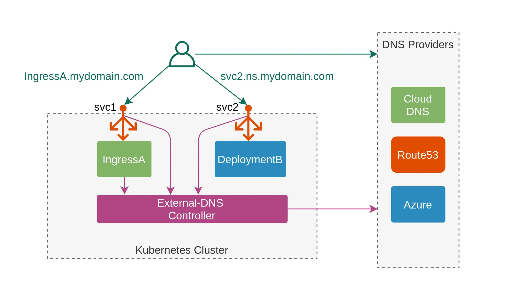
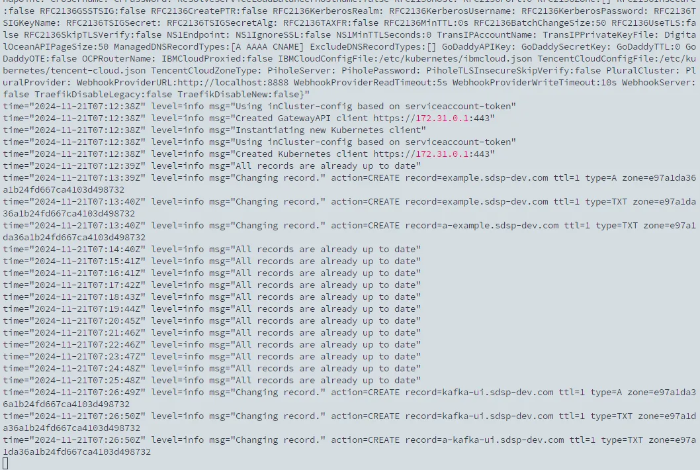

## TL; DR

紀錄怎麼使用 external dns 同步 Cloudflare 上的 ingress 跟 gateway api httproute 的 A record。

## External DNS

ExternalDNS 是一個開源的 Kubernetes 組件，專門用於自動管理 DNS 記錄。它通過監控 Kubernetes 資源（如 Service、Ingress、Gateway API 等），將這些資源的外部訪問地址（如 LoadBalancer 的 IP 與域名）與 DNS 提供商同步，實現自動化的 DNS 管理。

ExternalDNS 支援多種 DNS 提供商，常見的有 Cloudflare、AWS Route53、Google Cloud DNS 等。



## 建立 Cloudflare API Token Secret

```bash
kubectl create ns external-dns
kubectl create secret generic cloudflare-api-key -n external-dns --from-literal=apiKey=-KUuuVZyLxxxxxxxxxxxxxxxxx
```

確保 API Token 的權限包含指定 zone 的 `Zone.DNS`

## 安裝 External DNS

```yaml
provider:
  name: cloudflare

env:
  - name: CF_API_TOKEN
    valueFrom:
      secretKeyRef:
        name: cloudflare-api-key
        key: apiKey

# txtOwnerId: ${YOUR_ID}

sources:
  - gateway-httproute
  - ingress

domainFilters:
  - sdsp-dev.com
```

其中：

- CF_API_TOKEN 使用第一步驟創建的 secret，並確保權限包含指定 zone 的 `Zone.DNS` 。
- sources 支援 service、ingress、gateway API 的各種 route、istio-virtualservice，詳細請參考[官網](https://kubernetes-sigs.github.io/external-dns/v0.15.0/docs/sources/sources/)。
- 如果需求可以特別指定使用自定義的 txtOwnerId，否則預設為 “default”。

## 查看 DNS 同步



## Reference

- https://networkop.co.uk/post/2020-08-k8s-gateway/
