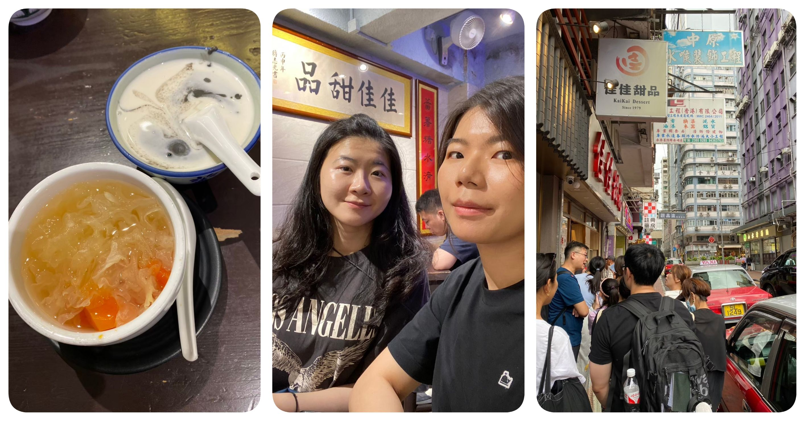
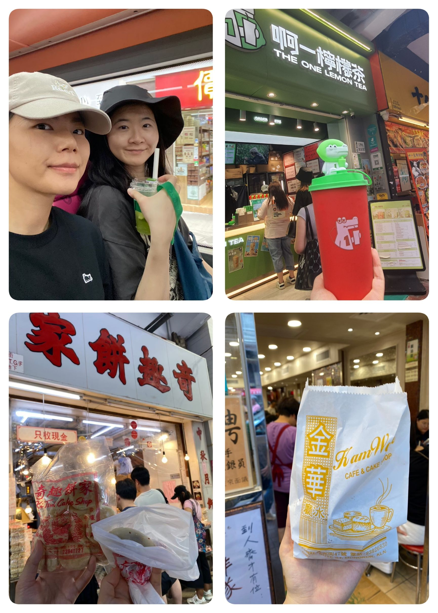

+++
title= "四天三夜香港遊記🥮"
date= 2024-11-01T15:00:00+08:00
categories = [
    "Travel"
]
tags= ["Life"]
slug= "hongkong-2024"
image = "cover.jpg"
+++

## TL; DR
趁著學期結束後，在六月的最後一個禮拜犒賞自己在職碩一結束後來場香港四天三夜遊 (｡í _ ì｡)

## 行前
這次從四月提議、到五月底真正決定出發，總共拖了一個月 XD 最後終於在出發前的一個月才找好機票跟飯店，飯店是在去樹林上班的路上看到便宜、後來住了之後超滿意的 OTTO Hotel，兩晚 $5400。後來還決定為了蛋塔多住一晚，而千挑萬選的 168 youth hostel，一晚 $1500，只能說對得起價格 (´・Å・`) 機票的話可惜沒有注意到這幾年都會有的國泰買一送一的活動，就用大概高雄香港快運 $6800、台北長榮 $7900 的來回價格買了。  
然後用了十年的護照也在今年即將到期了，翻舊護照還翻到之前去美國加拿大的出入境章，時間真的過得飛快 ( •́ὤ•̀) 五月底請了一個下午去辦新護照，沒想到外交部就在青島東路，剛好還遇到很久違的大型集會 （青鳥運動）。高中的時候一直很有印象班導對於我們竟然不知道行政院長是誰而驚訝，然後跟我們說身為公民就是需要有公民責任。那時候不懂政治是什麼，但沒想到十幾年後的現在也會如此投身其中。原來這就是長大！  
接著在出發前就又激發了 J 的屬性質，發現了去趣這個好用的行程安排 APP，然後每天狂看遊記分享找景點跟美食，最後共調整了三次的行程最後才底定好 🤣

## DAY1
這次終於不是紅眼班機，早上六點出門搭公車去坐機捷綽綽有餘。自從之前去美國首次自己坐飛機後就再也沒獨自坐過，姊甚至是第一次，所以各自從高雄跟桃機出發的我們一路的跟對方說現在在哪個階段了 XD 暑假的人潮果然不可小覷，這時段的飛機班次太多了，導致誤點了半小時才起飛 🥹  
另外還有一個小插曲，入境時因為空姐在飛機上說可以不用填入境小卡，所以在海關閘口前沒填完全部的欄位就急急忙忙地去排隊，殊不知海關還是跟我要了，再殊不知交出沒填完整的小卡還是順利入境了 ᕕ ( ᐛ ) ᕗ  
姊先幫我拿好行李，會合後在機場大廳領事先在 klook 買好的八達通，再去買機場跟市區來回的城巴快線 A21 & A25 套票 HKD$60，從機場到市區的班次很幸運坐到了幾乎是直達的 A25，比坐捷運方便（不需拉行李轉車），而且還比捷運便宜很多！  

*<small>左上：桃機滿滿的checkin人潮、右上：來自姐的checkin回報、下：A25空空的舒適車廂</small>*

### Hashtag b
到了飯店所在的尖沙咀後，先順道去了 hashtag B 買千層蛋塔，幸運的是不用排幾組就很快買到了！買了兩個蛋塔跟一個開心果酥

接著去飯店 checkin，大概在飯店前繞了兩圈才發現入口 XDD 一進飯店就覺得選對了，房間不大，但對於寸土寸金的香港來說已經很舒適了，最棒的是隔音做得很好，兩晚住下來沒找到一個缺點！
 

稍作休息後便出發原本的首站六安居吃飯，路上首次體驗了叮叮車。原本想體驗傳統的港式飲茶推車的，殊不知只開早上，幸好還有備案，還是排行程的時候猶豫很久最後捨棄的生記粥品！

### 生記粥品專家
點了牛肉跟魚的口味各一碗，粥本身煮到連米粒都看不見，喝起來很清爽又很香！店家坐落於巷弄，門口很不起眼，所以還差點走到馬路上的同名麵店 🤣 原本看網路評價都是需要排隊的，但因為是平日、又是兩點時的非用餐時間，所以除了不用排隊之外，連餐點都打了折！

### 中環街市-檸檬王、陳意齋、蘭芳園、泰昌餅家
去搭中環半山手扶梯的路上先去檸檬王跟陳意齋買了伴手禮，接著順利的搭到往上的手扶梯免去爬坡的辛苦，喝了蘭芳園的絲襪奶茶（外帶無需排隊！）、意猶未盡的還在隔壁 LINLEE 買了凍檸茶，再來一顆泰昌餅家的傳統蛋塔（買完還到對巷的某間咖啡廳外的石椅上坐著享用）
 
*<small>在googlemaps上找到石椅的確切位置，感謝 Green Waffle Diner 的貢獻 XDD</small>*

### 荷李活道 wall mural、crazy of art
沒有在預定行程內，但走沒幾步發現了一個小地標。

### 大館 - SHARISHARI
舊警署監獄古蹟的遺址變成藝術展覽館，展示了香港殖民地時期的建築風格和歷史。
  
  
  
然後沒細逛很久就跑到隔壁的口袋名單之一的 SHARISHARI 吃冰 XD 點了伯爵奶茶口味，份量十足，裡面的黃豆粉很香、裡面還加了奶凍跟餅乾屑，整理來說還不錯！

### 石板街
走中環砵甸乍街去港口的路上的一個拍照景點 - 石板街，這時候腳已經有腫脹的感覺了，還記得在走這條的時候，因為是下坡、又這麼多石板做為障礙，我跟姐都在哀嚎 😂

### 天星小輪、維多利亞港
接下來是我最期待的行程，從中環坐小渡輪回尖沙咀！天星小輪一次只需要 HKD$5 用八達通通行上船後十分鐘就可以直達尖沙咀，一邊吹風一邊欣賞港口美景，非常推薦！

在去港口的路上會經過長長的天橋，正好還遇到下班時間，看到許多的正裝上班族通勤，才體會到身處在商業重地之中的繁忙。另外還有路過沒想像中大的香港摩天輪 🎡  
下船後還正好趕上八點的燈光秀，剛好挑到好位置欣賞這世界三大夜景之一的維多利亞港！
 
 
 

### 妹記大排檔
回到飯店休息後，九點還是堅持出去吃晚餐，這間妹記大排檔原本不在我做功課的名單內，但是剛好看到為了去香港而加入的 line 社群裡面的人大力讚賞，而很巧的就坐落在飯店的正前方，便也順便來試試香港的大排檔餐廳！
點了一個公仔麵、炒青菜跟烤乳鴿，結果最好吃的是燙青菜，其次是烤乳鴿 XDD 公仔麵口味太重了沒辦法順利吃完
 

## DAY2
### 新興食家
第一站早午餐來堅尼地城的港式飲茶新興食家，還沒11點所以不需要排隊，但裡面也幾乎是滿座的情況。因為用餐區小到沒辦法從推車點餐，也因為座位有限，人數少的話絕對會需要併桌，但整體餐點好吃，點餐的服務阿姨態度也跟網路上說的完全不一樣，非常友善！吃飽出來還很幸運的發現外面已經開始在排隊了，再次讚嘆我的排程 d(`･∀･)b 
 

### 石牆樹群、小紅書籃球場
吃飽後走來附近的兩個景點，一個是石牆樹群，另外一個是去年小紅書爆紅的籃球場拍照景點。在抵達籃球場前，還以為是直接可以遠眺的風景，結果抵達後發現風景得隔著藍球網拍 XDD 能發現的人真的很厲害
 

### 怪獸大樓
變形金剛的取景地怪獸大樓是由多棟大廈組成的，從外觀看上去如同被巨大的怪獸吞噬，因而得其名。每層交錯，是典型的香港蝸居，密密麻麻的窗戶裡藏著無數人的故事與日常。

 

### BlueHouse
排行程時無意間看到的地標 BlueHouse，藍屋以前是一所醫院，現今列為香港一級歷史建築物。令人驚喜的是這邊的建築竟然不僅只有藍色，周邊的建築物每一棟都擁有獨特的顏色，與藍屋相互輝映，形成一幅充滿活力的城市風景。

 

### 新光戲院、香港街景、路上美食
在從堅尼地城回到中環、再去銅鑼灣上以及回到中環的路上買的小食物有：
1. ifc mall 裡面的 FineFood 拿破崙蛋糕配 % Arabica 咖啡，特別到這間購物商場裡面去找論壇上推薦的帝苑酒店的 FineFood 櫃位買拿破崙，順便還買了一盒黑鹽口味的蝴蝶酥，這邊真的完全不用排隊，有夠隱密！
 
2. 百事吉餅店的蝴蝶酥跟拿破崙派，蝴蝶酥是伴手禮，拿破崙蛋糕回到飯店吃的心得是果然還是找不到小時候在皇朝酒店吃的味道，但有時候我在想，長大後明明吃過這麼多不一樣的拿破崙，總還是覺得皇朝的最棒，也或許是因為小時候吃的時候是暑假在大陸玩的美好時光，所以才那麼難以被取代。
3. 新光戲院旁的涼茶，茶是用碗公裝好然後就站在店家前面喝完，很特別的體驗！然後因為那時候是感冒末期，可是這兩天又放縱的吃了一堆冰品，所以為了彌補喉嚨點了化痰茶 (⁰▿⁰) 
4. 銅鑼灣店的 BakeHouse，經過沒人在排隊的另一家熱門蛋塔店，就馬上各買了一顆站在門口吃，剛出爐的蛋塔真的很讚！

接著是在銅鑼灣走的一堆路上拍到的絕美街景，香港真的是座神奇又矛盾的城市。擁擠的人潮擠滿了每一寸土地，卻又能在車水馬龍的街道上感受到寬闊的自由。古老的建築和現代的高樓大廈並肩而立，前面才看到灰暗密集的社區、馬上又有色彩飽和的街景。果真是要自由行才能深入感受到城市的魅力。

### 譚仔三哥米線
晚餐吃飯店附近譚仔三哥的過橋米線，兩個人一碗再加上土匪雞翼。終於可以理解為什麼香港人這麽喜歡吃了！榮登我香港行的前三！
 

### 廟街夜市、澳洲牛奶公司
吃飽後坐公車去廟街夜市逛逛，夜市相較於台灣遜色很多，沒有特別的食物。幸好還可以順便去附近的澳洲牛奶公司吃個燉奶當點心。燉奶點冰的，吃起來就是很濃郁的奶酪，好好吃！
 
回程還順便去逛了 Baleno，姊買了一件排汗 T恤，這間簡直就是台灣的佐丹奴嘛 XD

## DAY3
今天要從很棒的 OTTO 退房了 T_T 早上趁姐在準備的時候，先去珍妮小熊扛四盒餅乾當伴手禮。九點半就到了，沒想到人已經排了好大一圈，不過幸好結帳流程很快，所以十點一到沒多久就順利買到了！
 
退房後再回到珍妮小熊的同一棟住商大樓 XD 第二間青旅也在同一棟，因為下午三點才能入住，幸好可以先免費寄放行李 ヽ(●´∀`●)ﾉ

### 麥文記麵家
不小心沒注意到開店時間，還沒 12 點就到了麥文記，在附近晃晃回去後剛好營業，點了鮮蝦雲吞、牛腩撈麵還有芥蘭菜，鮮蝦跟網路評價敘述一樣的新鮮好吃，另外芥蘭菜意外鮮脆～

吃飽出來後一樣發現在排隊了，優秀的時間管理能力 (⁎⁍̴̛ᴗ⁍̴̛⁎)‼

### 佳佳甜品
正餐吃完後來隔壁吃甜品，雖然需要排隊，不過也剛好在等的同時下起一場雨，可惜的是楊枝甘露賣完了，所以點了芝麻糊拼杏仁露還有木瓜銀耳。芝麻糊很香，但是是可以想像的味道。

### 彩虹邨籃球場
來到彩虹站的彩虹邨，籃球場很特別的位在停車上頂樓，在高度的籃球場剛好是一個很好的平台將五顏六色的大樓收進相機畫面裡！然後功課沒做仔細，在社區裡繞兩圈沒找到籃球場到底在哪，就在放棄之際，看到有很明顯是遊客的人爬上停車場頂樓，才發現原來在上面 ლ(´•д• ̀ლ

### 旺角的各種街
來到旺角的各種街上吃東西
1. 啊一檸檬茶、茶救星球苦瓜檸檬茶，在香港嘗試各種牌子的檸檬茶 XD 結論是第一天喝的林里最好喝，啊一完全沒味道啊！然後苦瓜檸檬茶蠻特別的。
2. 花園街市場奇趣餅家，這間是無意間在市場裡面經過的生意很好的餅店，買了紅豆麻糬餅跟光酥餅，紅豆麻糬餅中規中矩，光酥餅的部份吃不太懂 XDD 還記得吃不完拿來當隔天帶蛋塔回去塞縫隙的防撞墊 =v=
3. 晶華冰廳菠蘿油，不愧是網上評論中香港最佳菠蘿油！直接不用排隊就外帶買到一顆剛出爐的，外表菠蘿酥的部分極脆，奶油很香！好好吃 (๑´ㅂ`๑)
4. 蛋仔記雞蛋仔，香港的特色小吃，中規中矩的味道跟口感，吃起來就跟在台灣吃的一樣 ^_^
5. 富豪雪糕，沒有特別紀錄雪糕車出沒的位置，但真的很容易遇到，這邊應該是剛好司機臨時停車回來，被前面的客人攔截，我們跟著排，買完就開走了 🤣 傳統的香草雪糕，但吃起來意外清爽～
 
 

紀錄旺角的熱鬧街頭，還有在旺角特地走了一個上海街 618 的景點，這邊有點像松山文創，一樓還有樂團在演奏，整棟樓都是販賣一些文青的小物。

### 帝苑拿餅
從旺角直接搭公車回到尖沙咀的帝苑酒店拿一個禮拜前在網路上訂好的蝴蝶酥～買了兩盒巧克力跟兩袋原味，巧克力很貴，但回家享用後才理解他的價值，餅乾的部分很脆，但上面的巧克力居然是濕潤的、甜度剛好，還好有買兩盒！  
在去的路上剛好可以欣賞白天的維多利亞港口～
 
 

### 168 Hostel
傍晚回到青旅，終於可以 checkin 看看內裝到底長怎樣了，首先青旅是在一棟很有年代感的住商大樓裡面，多有年代感可以參考珍妮小熊排隊的照片環境 XD 幸好早上來探過路，不難找到位置。青旅內部雖也看起來老舊，但所幸環境很整潔，還有飲水機可以使用。
 

### 炯記燒臘
原本這趟行程要吃有名的甘牌燒鵝，但第二天看到經過時的人潮就果斷放棄，所以留最後一個晚上在附近找燒臘店吃。點了兩份雙拼選了四種不一樣的燒臘，叉燒、油雞、腩仔、燒鵝，燒鵝果然是最厲害的！飯也是粒粒分明，加上鵝油很香很好吃。

## DAY4
### BakeHouse
留到第四天的最終目的就是去旅館附近的 bakehouse 帶蛋塔回台灣！！！所以早上六點半起床，不到七點就去店門口排隊了，到的時候已經有兩個人在門口等候了，等到八點一開門，後面目測應該排了 30 個人有，果然還是早起的鳥兒有蟲吃 🥹 買了兩盒外加一顆可頌當早餐

### 回程 - A21、香港機場翠園
買完蛋塔就到飯店對面的車站牌等 A21 回機場，出門就發現下起大雨，幸好要回程啦！回程的 A21 人就非常多，還好我們上車的尖沙咀站在前段，還有位置可以坐到機場。  
到機場後去吃了最後一餐港式，翠園，奶油豬仔包剛出爐外表酥脆、內裡鬆軟，然後麵食點了牛肉河粉還有酸辣蝦米粉，湯頭都很好喝，還有機會絕對要再點酸辣蝦米粉！！！

## THE END
完美的結束香港的美食之旅啦～行程排得都很滿意，該吃的都有吃到，沒有排太多隊，不鬆不緊的景點，很棒！ ♥(´∀` )