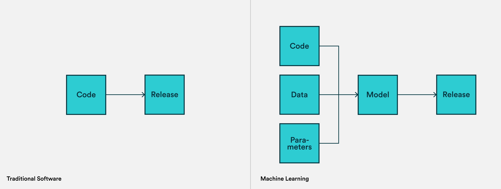

## 定義

- Wiki  
  MLOps （Machine Learning Operations）是持續性機器學習模型管理與部署的實踐，可以幫助機器學習模型開發團隊有效地執行模型的實驗、管理、部署等任務。讓資料科學家和機器學習工程師能夠緊密合作，從而加速模型的開發部署過程並提升模型的品質。
- 各大公有雲的定義
  - Google：MLOps 是一種機器學習工程文化和做法，旨在統一機器學習系統開發（Dev）和機器學習系統維運（Ops）。實施 MLOps 意味著您將在機器學習系統建置流程的所有步驟（包括整合、測試、發布、部署和基礎架構管理）中實現自動化和監控。
  - Microsoft：MLOps 是基於可提高工作流程效率的 DevOps 原理與做法。目標是更快試驗和開發模型，更快地將模型部署到生產環境，品質保證和端到端追蹤。
  - Amazon：ML 考慮了 AI/ML 專案在專案管理、CI/CD 和品質保證方面的獨特方面，幫助客戶縮短交付時間，減少缺陷並提高資料科學家的工作效率。
- 我的理解  
  MLOps 是機器學習生命周期管理方法論。

## 為什麼需要 MLOps

- 機器學習管理範疇
  - **資料品質與管理**
    - 需要建立完善的資料治理機制，包括資料收集、清理、標註、版本控制等流程
  - **模型生命週期管理**
    - 模型從開發、訓練到部署的整個過程需要標準化管理
    - 需要追蹤並記錄模型的訓練過程、超參數、評估指標等
    - 模型效能會隨時間衰退，需要建立監控機制及重訓練流程
  - **跨團隊協作**
    - 設計、訓練與推理(部署)通常由不同人負責
    - 強調資料科學家、機器學習工程師和營運團隊之間的協作。
  - **系統整合與維運**
    - 模型部署後的監控、維護和更新需要專門的運維策略
    - ML 專案需要大量運算資源和存儲空間，需要有效的資源管理策略
- **ML Code 只是冰山一角**
  
  Google 於 2015 年在 NIPS 上發表了《Hidden Technical Debt in Machine Learning Systems》。作者提出，如今大量機器學習庫和框架方便易用，但由於缺乏系統化的理論指導導致形成了大量技術負債，在生成環境中面臨高昂的維護成本。
  機器學習的程式碼開發只佔的機器學習系統的一小部分，更多在資料管理、系統營運和維護上花費的精力。

## **MLOps Vs DevOps**

- CI/CD in DevOPS v.s. MLOPS
  - CI 不再只是測試和驗證 code 和 components，還包括測試和驗證資料、資料的模式和模型本身。
  - CD 不再是一個單一的 software package 或 service，而是一個應該自動部署另一個服務（模型預測服務）的系統（一個 ML training pipeline）。
  - CT 是 ML 系統獨有的新屬性，它與自動重新訓練和服務模型有關。
- 版本控制
  
  對於機器學習，程式碼並不是唯一不斷變化的輸入。數據是另一個需要管理的關鍵輸入，超參數、元數據、日誌以及最後的模型也是如此。
- 所需硬體以及發佈時間
  
  對於大多數軟體專案來說，建置成本是完全無關緊要的，release 時間可能是一個重要指標，但我們往往不會去在意花了多少資源去 build。
  訓練機器學習模型，尤其是深度學習，往往是非常運算密集的。較大的模型可能需要數小時到數週的時間來訓練，這意味著 MLOps 設定需要更複雜地管理機器。

## MLOps 成熟度 (Google)

Google 的 MLOps 成熟度模型採等級 0 至 2 ，微軟也有[機器學習作業成熟度模型](https://docs.microsoft.com/zh-tw/azure/architecture/example-scenario/mlops/mlops-maturity-model)的定義分為等級 0 至 5。

### **MLOps Lebel 0 : 手動的過程**

- **特點**：
  - **手動訓練**：Pipeline 中每個步驟（包括資料準備、模型訓練和驗證）都是手動的過程。
  - **手動部署**：模型部署到生產環境中是手動完成的，缺乏自動化工具。
  - **訓練與佈署之間有時間延遲**：數據科學家和工程師之間的工作流是分離的，先由資料科學家建立模型放在特定的儲存空間後，再由後續的維運工程師進行建置。
  - **有限的版本控制**：模型和代碼的版本控制不完善，難以追溯和復現。
- **挑戰**：
  - 部署速度慢且容易出錯。
  - 可能會導致 training-serving skew （訓練與應用偏差）。
  - 缺乏可觀測性和監控手段，難以跟蹤模型的性能和行為。

### **MLOps Lebel 1 : 機器學習管道自動化流程**

MLOps 等級 1 導入自動化訓練流程 （CT)。

- **特點**：
  - **自動化流水線**：建立了基本的自動化流水線，用於數據準備、模型訓練和評估。在這樣的架構下，推送到生產環境的不是單純的模型，而是一整個 pipeline ，然而 pipeline 仍需 IT 團隊手動部屬。
  - **版本控制**：開始使用版本控制系統來管理模型和程式，提升了可追溯性。
  - **ML pipeline 程式碼模塊化**: 讓 pipeline 的組件可以重複使用，甚至做到跨機器共享。此外，組件還能導入容器化。
  - **基本監控**：引入了基本的監控工具來跟蹤模型的性能和運行狀態。
  - 不一定需要: Data and model validation, Feature store, Metadata management, ML pipeline triggers
- **挑戰**：
  - 流水線仍然需要手動干預，難以完全自動化。
  - 部署和監控工具可能不夠完善，難以應對複雜的生產環境需求。

### **MLOps 級別 2：CI / CD 管道自動化**

ML 模型的開發和部署達到了高度的自動化，並引入了持續集成(CI)和持續部署(CD)的實踐。

- **特點**：
  - **全面自動化**：數據準備、模型訓練、測試和部署流程實現了全面自動化。
  - **CI/CD 實踐**：引入了 CI/CD 工具和流程，確保模型和代碼的持續整合和部署。
  - **高級監控和告警**：建立了完善的監控和告警系統，能夠實時監測模型的性能和行為。
  - 完整的版本控管：ML 模型、 ML pipline 的版本控管
  - feature store (可存放大量資料集並實現低 I/O 延遲的區塊)
  - ML metadata store (pipeline components, client libraries, input/output artifacts,… 雜七雜八的資料)
  - ML pipeline orchestrator (幫助編排 ML pipeline 流程的工具)
- **挑戰**：
  - 需要投入大量資源來構建和維護自動化系統和 CI/CD 流水線。
  - 需要更高水平的技能和知識來管理和操作這些工具。

下圖為具有自動觸發、 CI/CD/CT (continuous training) 與監控的自動化 ML 工作流程。

## MLOps 常見的解決方案

- 開源
  - MLflow
    MLFlow 由 Databricks 開源，用於管理端到端的機器學習生命週期。它包括用於追蹤實驗、將程式碼打包成可重現運行以及共享和部署模型的工具。 MLflow 可與任何機器學習函式庫和程式語言搭配使用。
  - Kubeflow
    Kubeflow 由 Google 開源，是一個建立在 Kubernetes 之上的模型開發平台，提供開發模型所需的所有工具，並且藉由 Kubernetes 達到資源、網路的彈性控管。
- 商用
  - Databricks
    Databricks 是用於資料工程、機器學習和協作資料科學的統一資料分析平台。 Databricks Workspace 是一種軟體即服務(SaaS) 環境，可用於存取所有 Databricks 資產。 該工作區將物件(例如，筆記本、庫和實驗) 整理到資料夾中，並提供對資料和運算資源(如叢集和任務) 的存取。目前 Databricks 也支援在 Kubernetes 上運行，所以也能運行在主流的 CSP (Cloud Solution Provider) 如 AWS、Azure、GCP 上面。
- 雲服務供應商
  三大主流的公有雲，都提供了完整的機器學習生命週期管理工具/架構/平台，包含資料準備、模型訓練、模型部署等功能。
  - Azure Machine Learning
  - Google Cloud AI Platform (Vertex AI)
  - Amazon SageMaker
