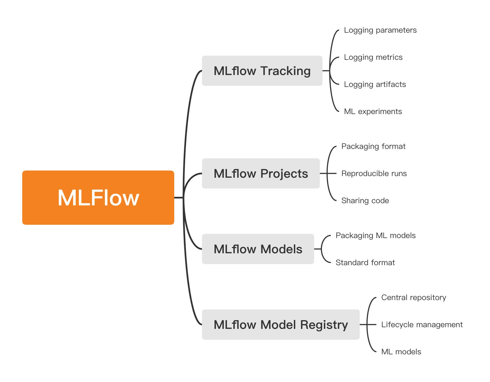
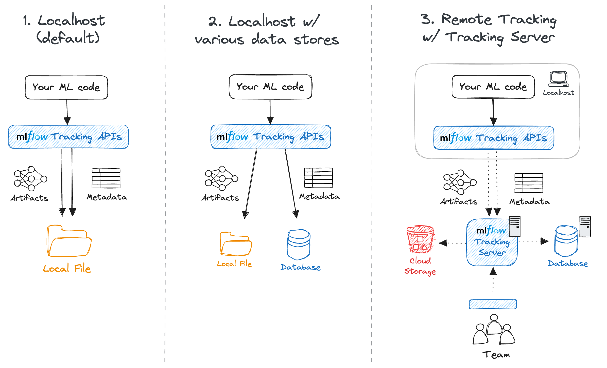
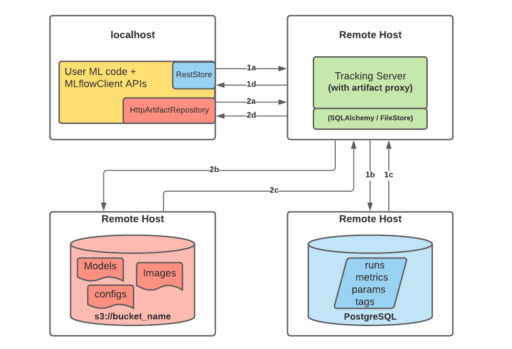
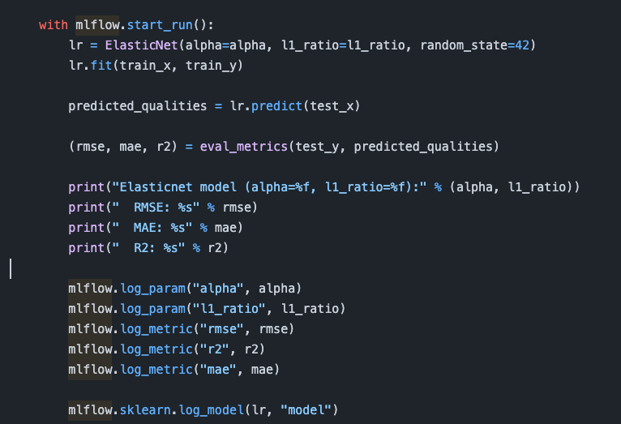
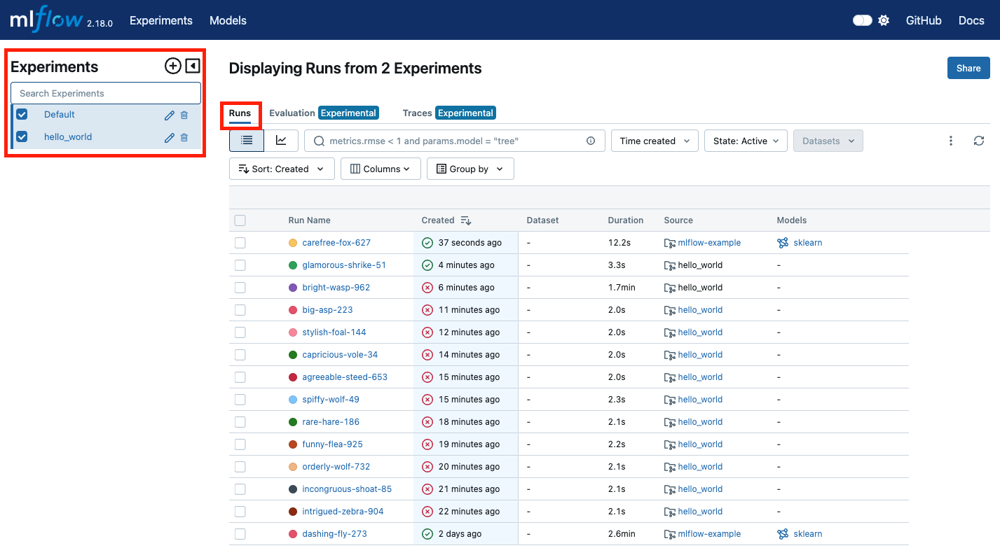
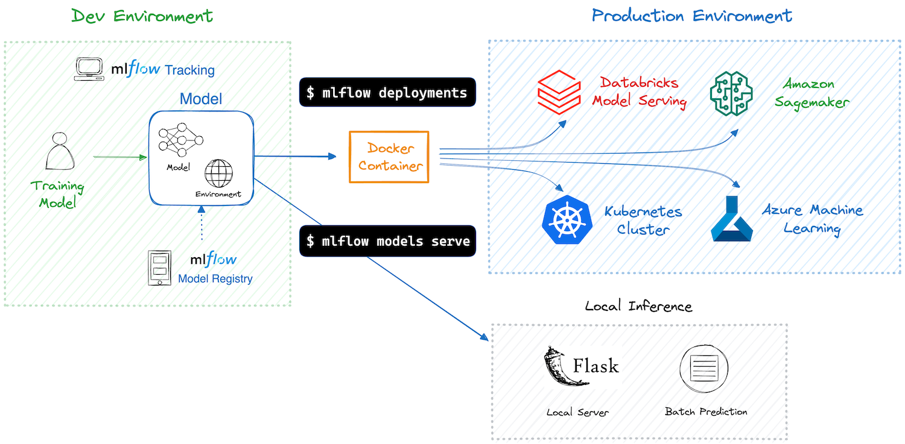
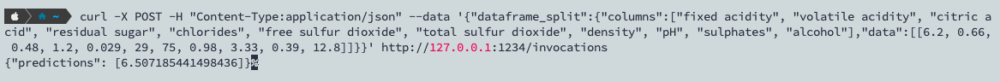
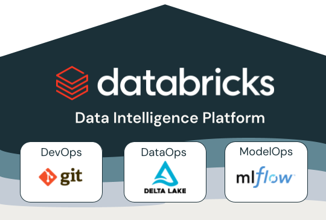
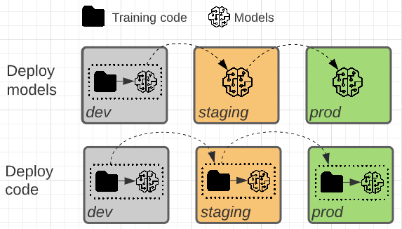
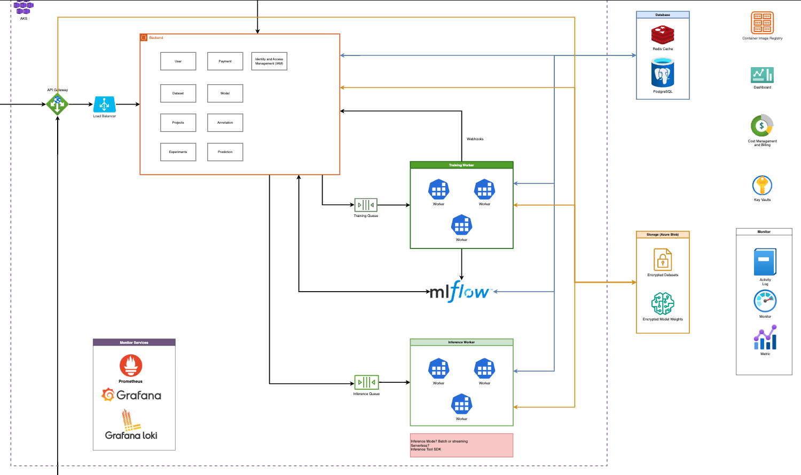

## TL; DR

MLflow 是一個用於管理機器學習實驗的生命週期的開源工具，開源自深耕資料科學的公司 Databricks。

## 核心模組



- **MLflow Tracking**
  即利用 UI 以及 API 用於在運行機器學習程式碼時記錄參數、程式碼版本、指標和輸出文件，並用於 UI 呈現視覺化結果。
- **MLflow Projects**
  每個 AI 工程師使用的程式語言、環境、套件版本的不同，造成在不同環境底下重現其他人的實驗會遇上麻煩。MLflow Project 統一格式，利用 YAML 檔與 MLproject 去定義 conda 或者 docker 的環境，解決這項問題。
- **MLflow Models**
  將模型封裝，讓 mlflow 使用統一格式存取 model，透過 serve 提供 rest API，並可以輕鬆部署訓練好的模型到 Docker、Apache Spark、Databricks、Azure ML 和 AWS SageMaker 等平臺進行批次或即時推論。
- **MLflow Model Registry**
  用於管理 ML 模型生命週期的中央儲存庫。

然而隨著大語言模型（LLMs）的快速發展，新版又針對 LLM 管理多了幾個核心功能：

- MLflow Deployments for LLMs(大語言模型部署)：提供標準化 API 以訪問 SaaS 和開源大型語言模型 (LLM) 的服務器。
- Evaluate(評估)：提供深入的模型分析工具，支援傳統 ML 演算法和現代 LLM 的客觀比較。
- Prompt Engineering UI (提示詞 UI)：為 LLM 的提示工程提供實驗、測試和部署環境的 UI。
  現在 LLM 的 DevOps 有自成一格的 LLMOps，LLMOps 是機器學習維運 MLOps 的分支，是一套專門針對大型語言模型開發、部署和維運的實踐方法。有別於 MLOps，LLMOps 有 5 大特點，其一是基礎模型選擇。因為，在 LLMOps 中，使用者通常選擇預訓練過的基礎模型，如開源的 Llama 2、Falcon，或透過 API 呼叫 GPT-4、Gemini Pro 等模型，作為 LLM 應用的基底，而非從頭打造。

## 實作

- MLflow Tracking environment
  官方文檔定義了三種部署模式，實驗採用第三種，在遠端電腦建立 mlflow tracking server，並使用本地電腦做訓練最後透過 mlflow API 推送實驗記錄到遠端 mlflow tracking server。
  
- 實驗環境
  使用 [Docker Compose](https://github.com/sachua/mlflow-docker-compose) 部署，包含以下 Services：
  - **MLflow Tracking Server**
  - **PostgreSQL** （本次實驗使用 MySQL）：作為 MLflow 的後端存儲 （backend store)
  - **MinIO**：作為 artifact 的儲存 (artifact store)
- 實驗流程
  
  - **Part 1a and 1b:**
    - MLflow 用戶端建立  `RestStore`  實例並傳送 REST API 請求以記錄 MLflow 實體
    - 追蹤伺服器建立  `SQLAlchemyStore` （也可以使用 FileStore 存在本地 local file）的實例並連接到遠端主機以在資料庫中插入追蹤資訊（即指標、參數、標籤等）
  - **Part 1c and 1d:**
    - 客戶端的檢索請求從配置的  `SQLAlchemyStore`  表傳回訊息
  - **Part 2a and 2b:**
    - 要記錄 artifact 的事件是由客戶端使用  `HttpArtifactRepository`  將檔案寫入 MLflow 追蹤伺服器
    - 然後，追蹤伺服器使用假定的角色身份驗證將這些檔案寫入配置的物件儲存位置
  - **Part 2c and 2d:**
    - 從配置的後端儲存中檢索使用者請求的 artifact 是使用伺服器啟動時配置的相同授權身份驗證完成的
    - Artifact 透過  `HttpArtifactRepository`  的介面透過追蹤伺服器傳遞給最終用戶
- 實驗步驟

  ### 整合現有 python 專案

  在原有的 python 專案中將建模過程整合進 MLflow，只需要在程式端操作 mlflow api 即可，以 MLflow 提供的 [mlflow-example](https://github.com/mlflow/mlflow-example) 專案為例：
  

  - 使用 `mlflow.start_run()` 開啟一次新的實驗運行（Run）。
  - 使用以下方法記錄參數、指標和模型：

    - `mlflow.log_param(key, value)`：記錄模型參數（如 `alpha` 和 `l1_ratio`）。
    - `mlflow.log_metric(key, value)`：記錄模型評估指標（如 RMSE、MAE 和 R2）。
    - `mlflow.sklearn.log_model(model, artifact_path)`：儲存訓練好的模型（以 `sklearn` 格式）。


其餘 mlflow project 範例可參考這個 [project](https://github.com/amesar/mlflow-examples/tree/master)


### MLproject

`mlflow run` 會根據 `MLproject` 文件中的設定，自動管理依賴環境（如 Conda 或 Docker），然後執行指定的入口點（如 `python train.py`）。

- 範例 `MLproject` 文件內容：
  ```yaml
  name: mlflow-example
  conda_env: conda.yaml
  entry_points:
    main:
      parameters:
        alpha: { type: float, default: 0.5 }
        l1_ratio: { type: float, default: 0.5 }
      command: >
        python train.py {alpha} {l1_ratio}
  ```

### mlflow run

在執行前先設定環境變數

```bash
export MLFLOW_TRACKING_URI=https://mlflow.sdsp-dev.com

export MLFLOW_S3_ENDPOINT_URL=http://172.21.18.48:9000

mkdir ~/.aws
touch ~/.aws/credentials
cat <<EOF > ~/.aws/credentials
[default]
aws_access_key_id=minio
aws_secret_access_key=minio123
EOF
```

mlrun 的專案位置，可接受不同的輸入來源：

- 本地目錄（包含 `MLproject` 文件）。
  ```bash
  mlflow run . --experiment-name=hello_world -P alpha=0.7 -P run_origin=LocalRun
  ```
- Git 存儲庫（如 `https://github.com/...`）。
  ```bash
  mlflow run https://github.com/sachua/mlflow-example.git -P alpha=0.5
  ```
- 壓縮檔案（如 `.tar.gz`）。
  實驗結果 on MLflow UI：
  

### 部署



- **Deploy MLflow Model as a Local Inference Server**
  - MLflow 提供一種方便的方法將模型部署為 Flask REST API Server，而不需要手動編寫服務代碼。
  - 使用 `mlflow models serve` 啟動一個本機伺服器，該伺服器偵聽指定連接埠並為您的模型提供服務。
  - 適用場景：輕量級應用程式或在將模型移至臨時或生產環境之前在本地測試模型。
    Run local inference server：
  ```bash
  export MODEL_ID=0ced24069348417fbbcb2cd41a7d2f07 #run ID
  mlflow models serve -m runs:/${MODEL_ID}/model -p 1234 --env-manager conda
  ```
  
  Inference：
  ```bash
  curl -X POST -H "Content-Type:application/json" --data '{"dataframe_split":{"columns":["fixed acidity", "volatile acidity", "citric acid", "residual sugar", "chlorides", "free sulfur dioxide", "total sulfur dioxide", "density", "pH", "sulphates", "alcohol"],"data":[[6.2, 0.66, 0.48, 1.2, 0.029, 29, 75, 0.98, 3.33, 0.39, 12.8]]}}' http://127.0.0.1:1234/invocations
  ```
  
- **Deploy MLflow Model to Production Environment (Kubernetes)**
  尚未研究！

## CI/CD Integration

### **MLOps in Databricks**



- code、dataset 和 model 等 ML 資產是分階段開發的。
- 從早期開發階段，經過中間測試階段，再到嚴格控制的最終生產階段，都會導入不同的管理工具管理這些資產。流程間需要 CICD 流程整合。

### Model Deployment Mode

ref. [https://docs.databricks.com/en/machine-learning/mlops/deployment-patterns.html](https://docs.databricks.com/en/machine-learning/mlops/deployment-patterns.html)



以以下的部署架構來說，模型是由平台統一提供，所以在部署模式會是上面 Deploy Models 的模式。



## 特色

- **開源且易於使用**  
  MLflow 是一個開源的機器學習平台，擁有活躍的社群和豐富的資源 (Github star 19.2k)。 MLflow 支援 Python, Java, R 和 REST API 與之集成，API 設計簡單直觀，易於上手。
- **模組化**  
  MLflow 由 Tracking、Projects、Models 和 Model Registry 四個元件組成，這些元件可以獨立使用，也可以組合使用，滿足不同的需求。這種模組化設計使得 MLflow 非常靈活，可以根據實際場景進行自訂。
- **支援多種機器學習框架**  
  MLflow 支援多種流行的機器學習框架，如 TensorFlow、PyTorch、Scikit-learn 等。
- **促進團隊協作與專案可維護性**  
  透過 MLflow Registry，團隊成員可以更方便地共享和協作模型。此外，MLflow 可以記錄實驗的詳細資訊（如參數、指標和工件），有助於提高專案的可重現性和可維護性。
- **易於部署和擴充**  
  MLflow Model 可以以多種格式進行保存，並支援將模型部署到不同的環境（如本機伺服器、雲端服務和容器平台等）。此外，MLflow 支援與各種雲端服務（如 AWS SageMaker、Azure ML 等）集成，方便在不同環境中進行擴充。

## 導入 MLflow 後能達到的成熟度分析

MLflow 的導入可以幫助企業達到 MLOps 成熟度等級 1 或 2，具體取決於它的使用方式和集成程度。

### MLOps 成熟度等級 1：ML 流水線

MLflow 提供了一些關鍵功能，使得部分自動化變得可能：

- **實驗跟蹤**：MLflow Tracking 可以記錄和查詢不同實驗的參數、指標和代碼版本，這有助於模型的版本控制和可追溯性。
- **模型管理**：MLflow Models 支持不同格式的模型存儲和部署，這使得模型管理變得更為簡單和一致。
- **模型註冊**：MLflow Model Registry 允許用戶註冊和管理模型版本，這有助於在生產環境中管理多個模型版本。

### MLOps 成熟度等級 2：自動化與 CI/CD

如果 MLflow 與其他工具和流程進行更深度的集成，則可以幫助企業達到這一等級：

- **持續集成和部署（CI/CD）**：通過集成 MLflow 與 CI/CD 工具（如 Jenkins、GitHub Actions），可以實現模型訓練、測試和部署的自動化，達到持續集成和部署的目標。
- **高級監控和告警**：MLflow 可以與監控工具（如 Prometheus、Grafana）集成，提供對模型性能的高級監控和即時告警。
- **全面自動化**：MLflow 可以與其他數據處理和工作流工具（如 Apache Airflow、Kubeflow）集成，實現數據處理、模型訓練和部署的全面自動化。
