## 為什麼需要

再優秀的模型，若無法成功部署於實際環境中，讓用戶在日常生活中使用，那終究只能停留在理論層面，無法發揮真正價值。因此，我們需要將模型部署到一個用戶友好的界面或平台上，使其易於訪問和使用。從建立 ML 模型到實際生產環境使用，有許多要注意點：

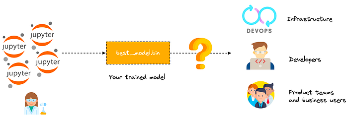

- 多個 ML 框架的使用與支持
- 如何建立 API 並高效提供服務
- 完善的 API 文件
- 再現性和依賴性管理
- 監控、日誌記錄、指標等

## 解決方案

### 純推論引擎（Model-Serving Runtime, 僅專注於執行推論任務）

- **Triton Inference Server：** 由 NVIDIA 釋出的開源模型推論解決方案，可透過 HTTP 或 GRPC 端點提供客戶端推理服務及服務管理。
- **MLServer (為 MLflow 官方文檔推薦生產環境使用)：** 由 Seldon 開源的 Python 推理伺服器，可與 Kubernetes 原生的機器學習框架（如 Seldon Core 和 KServe）無縫集成。多模型服務（Multi-Model Serving）是 MLServer 的一個關鍵特性，可以在單個伺服器中動態加載和卸載多個模型。
- **TensorFlow Serving：** 用於為使用 TensorFlow 開發的機器學習模型提供服務的函式庫。

### 模型服務平台類 （**Model-serving platforms,** 涵蓋機器學習模型從部署到運行監控的全流程功能）

- **BentoML：** 開源的模型服務框架，可簡化模型服務的建立與部署，提供內建的高性能推論服務，支持 REST 和 gRPC 接口。其商業化 PaaS BentoCloud 才可視為是一個完整的 MLOps 平台。
- **Seldon Core：** 用於部署機器學習模型的開源平台，專為在 Kubernetes 上大規模部署和管理機器學習模型而設計。
- **KServe：** 最初是作為 Kubeflow 的一部分，原名為 KFServing，主要負責模型的部署和推論服務。後來 KServe 獨立出來，成為一個通用的 Kubernetes 原生推論服務框架，不再依賴於 Kubeflow。雖然 KServe 起初的重點是模型推論，但其功能範圍已經超出了純推論引擎的定義，在設計上更像是部署與推論層工具。

---

## 部署分類

### 推論執行模式

- 動態推論 Dynamic inference（also called  線上推論 online inference or 即時推論 real-time inferenc）：是指模型只會在有需要時進行預測，例如當用戶端要求預測時。
- 靜態推論 Static inference（also called 離線推論  offline inference or 批量推論  batch inference）：模型針對一組數據（通常是預先準備的未標記樣本）一次性進行預測，並將預測結果存儲或快取下來，供後續使用。 ⇒ AISVIsion Current Scope

### 部署形式

- Model Serving (API Server)：模型被打包為獨立的 Web 服務，通過 HTTP/gRPC 接口接收請求並返回結果。
- Model Embedding (嵌入式)：模型直接嵌入到應用中作為一部分運行，不依賴獨立的服務進行請求。

### 部署環境

- 雲部署：適合需要快速擴展和處理大量數據的應用程式。
- 本地部署：當資料隱私至關重要或網路存取不可靠或無法存取時，本地部署是最佳選擇。
- 邊緣部署：適合需要即時回應和低延遲的應用，尤其是在網路連線有限或沒有網路連線的地方。

---

## BentoML

### 簡介

BentoML 是一個用於機器學習模型服務的開源框架，設計初衷是讓資料科學和 DevOps 之間的銜接更順暢。

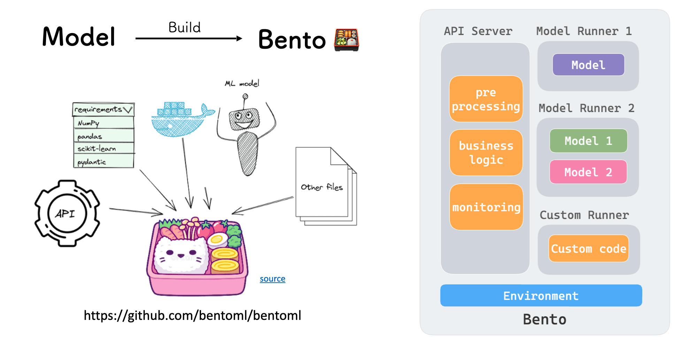

BentoML 將 ML 專案中所需的一切打包成一種稱為 bento（便當）的格式，bento 是一個文件壓縮檔（archieve)，其中包含模型訓練的所有原始程式碼、定義的 API 、保存的二進制模型、數據文件、Dockerfile、依賴項和其他配置 。

bento 有三個關鍵組成：

- API 伺服器：處理 IO 密集型任務，例如預處理、後處理、業務邏輯、指標公開和 API 定義。
- Model Runner：管理模型的加載，可以使用 PyTorch 或 TensorFlow 等不同框架建立模型，確保它們利用適當的資源。
- Environment 環境：包含配置和依賴項。

您可以將 bento 視為 Docker 映像，但用於 ML。

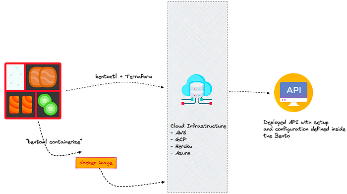

當 bento 建置完成後，可以將它變成一個可以部署在雲端上的 Docker 映像，或使用 bentoctl（依賴 Terraform） 將 bento 部署到任何雲端服務和基礎架構上（例如 AWS Lambda 或 EC2、GCP Cloud Run、Azure functions 等）。

### 特點

1. 模型打包：BentoML 可以將訓練好的模型及其相依性打包成一個獨立的可執行文件，方便在不同環境中進行部署。
2. API 服務：提供 RESTful API 接口，方便使用者透過 HTTP 請求與模型進行互動。
3. 多種部署選項：支援多種部署方式，包括 Docker、Kubernetes、AWS Lambda 等，靈活應對不同的生產環境需求。
4. 版本管理：支援模型的版本管理，方便對不同版本的模型進行切換與管理。
5. 監控與日誌：提供監控與日誌功能，幫助開發者即時了解模型的運作狀態與效能。

### 運作流程

- 定義模型：使用 BentoML 之前，需要先準備一個或多個機器學習模型。模型可以使用 TensorFlow 和 PyTorch 等機器學習庫進行訓練。
- 儲存模型：模型訓練後，將其儲存到 BentoML 的本地模型倉庫（Model Store）中，這樣便於管理所有本地的模型，之後可隨時存取並提供服務。
- 建立 BentoML 服務: 建立 service.py 檔案來包裝模型並定義服務邏輯。服務 中會為模型定義 Runner 以便於大規模的模型推斷，並揭露對外 API，定義輸入和輸出的處理邏輯
- 建置 Bento: 透過建立一個 YAML 設定檔（bentofile.yaml），將所有模型和服務打包成一個可部署的製品，即 Bento，其中包含所有程式碼和依賴檔案等。
- 部署 Bento：Bento 準備好後，可以將 Bento 容器化以建立 Docker 映像並在 K8s 上運行。或者，直接將 Bento 部署到 BentoCloud 或 Yatai，以便於在 K8s 上自動化部署流程，進行大規模運行。

### 實作

- 建立 BentoML 服務
  使用官方的 quickstart 練習：
  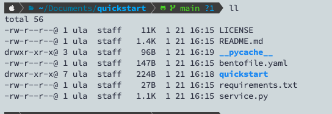
  - service.py # 定義核心的 BentoML Service 和 API 接口，用於加載模型和推論邏輯。
  - bento.yml # BentoML 打包配置檔案
    ```yaml
    service: "service:Summarization" # 服務入口
    labels:
      owner: bentoml-team
      project: gallery
    include: # 可選：指定需要打包的文件或目錄
      - "*.py"
    python: # Python 環境設置
      requirements_txt: requirements.txt
    ```
- `bentoml build`
  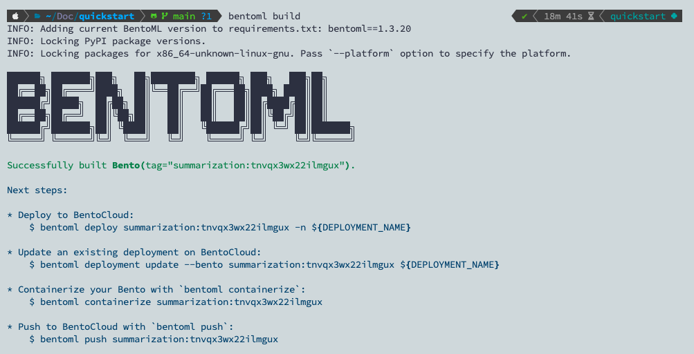
- `bentoml list`
  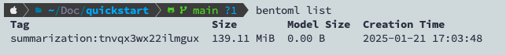
- `bentoml serve service:Summarization`
  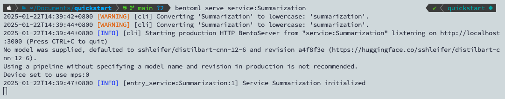
  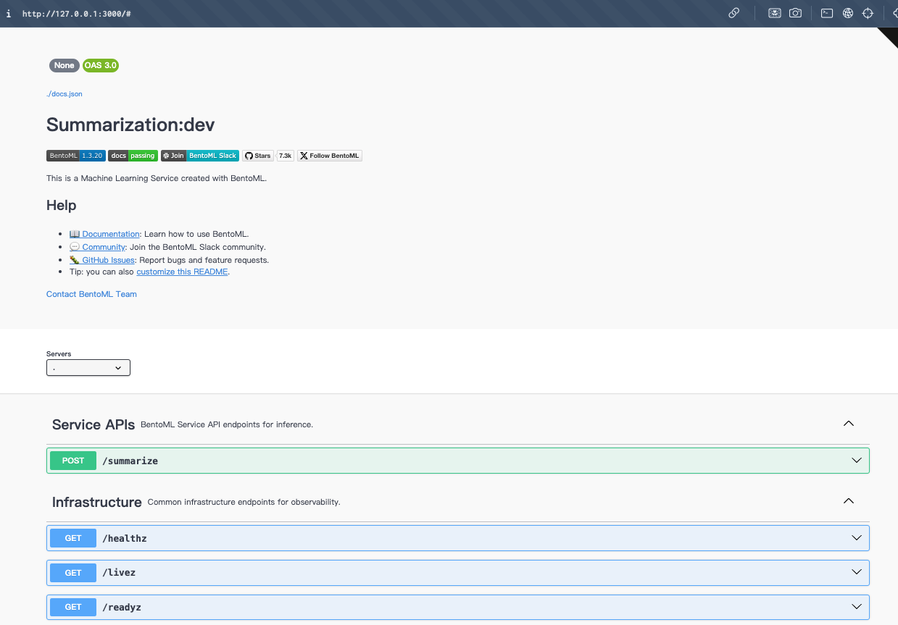
  此 Summarize 範例接受帶有提供的範例的字串輸入，透過管道對其進行處理，然後返回摘要文字。

\*\* 更完整的實驗步驟應該要參考[這篇文章](https://scclabs.paratera.com/k8s/basic/examples/inference/bentoml)，從下載訓練好的模型 ⇒ 到 bento model 的產生 ⇒ 再到 bento service 的定義 ⇒ 鏡像的製作 ⇒ 最後進行部署。不過在第一步驟下載模型太大了所以下載到一半 timeout ??? 尚未繼續進行。

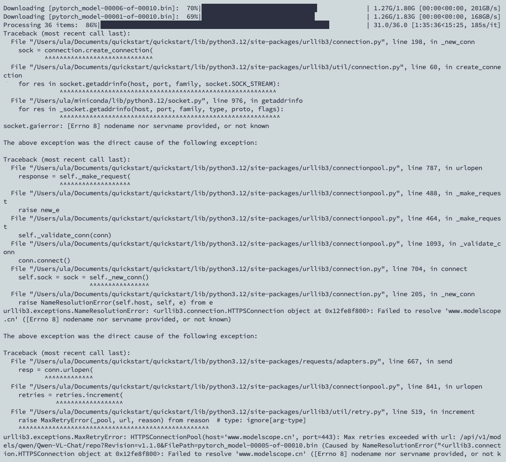

### 部署到 Kubernetes - Yatai (待實作）

Yatai（屋台、食品車）可讓您在 Kubernetes 上部署、操作和擴展機器學習服務。支援透過統一模型服務框架 BentoML 部署任何 ML 模型。

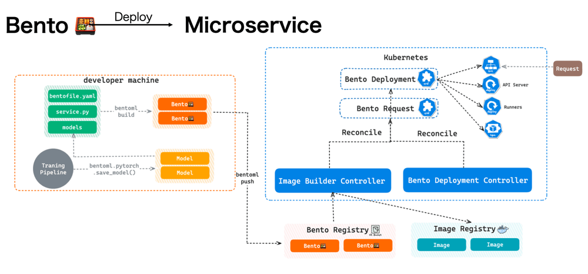

- **Image Builder Controller**：監控名為「BentoRequest」的自訂資源，並自動將 Bento 建置到映像中。請注意，預設會自動產生 Dockerfile，其中包含 Bento 中所需的所有依賴項。但是也可以在 Bento 設定檔 (bentofile.yaml) 中對其進行自訂。
- **Bento Deployment Controller**：使用剛剛建置的映像並建立名為「Bento Deployment」的資源。此控制器為 AI 應用程式建立所有資源，例如服務、HPA 以及 API Server 和 Runner Pod，這些資源都可以獨立擴展。

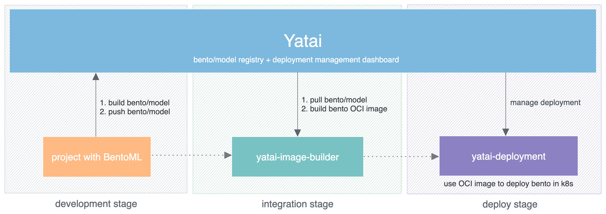

## Reference

- [https://neptune.ai/blog/ml-model-serving-best-tools](https://neptune.ai/blog/ml-model-serving-best-tools)

- https://developers.google.com/machine-learning/crash-course/production-ml-systems/static-vs-dynamic-inference](https://developers.google.com/machine-learning/crash-course/production-ml-systems/static-vs-dynamic-inference)

- [https://medium.com/@FrankAdams7/the-four-machine-learning-model-deployment-types-you-should-know-e7577251959](https://medium.com/@FrankAdams7/the-four-machine-learning-model-deployment-types-you-should-know-e7577251959)

- [https://medium.com/ai-blog-tw/部屬雲端 api 型態的 ml-service-使用 flask 與 aws-elastic-beanstalk 的實務教學-6a451b642ab0](https://medium.com/ai-blog-tw/%E9%83%A8%E5%B1%AC%E9%9B%B2%E7%AB%AFapi%E5%9E%8B%E6%85%8B%E7%9A%84ml-service-%E4%BD%BF%E7%94%A8flask%E8%88%87aws-elastic-beanstalk%E7%9A%84%E5%AF%A6%E5%8B%99%E6%95%99%E5%AD%B8-6a451b642ab0)
