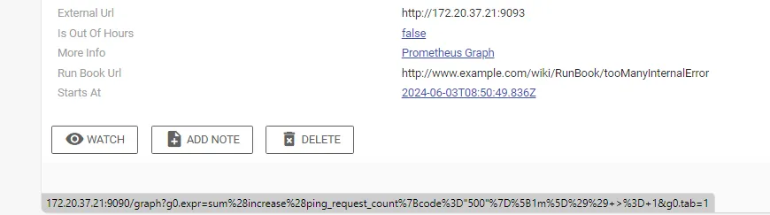
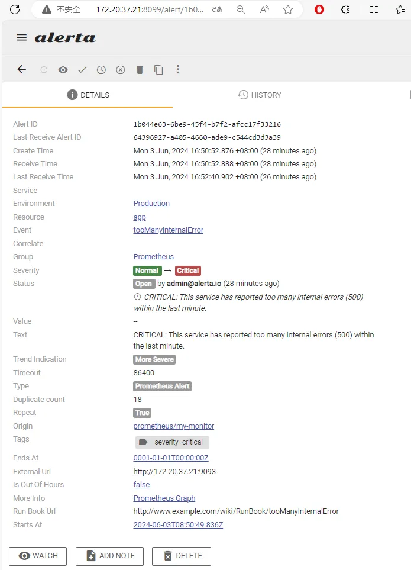
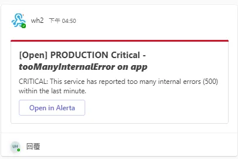

## TL; DR

集中式告警平台用來將來自不同監控系統的所有警報匯總到一個中心位置，提供單一窗口來檢視和管理警報。前一間公司使用 Atlassian Opsgenie，而目前公司部門因為是自管，所以在找開源方案時找到了 Alerta 這個酷東西。

## 為什麼需要

在沒有集中管理之前，我們是僅將告警送到 Microsoft Teams 通知維運人員，但發現訊息就只是訊息，當維運人員處理完後只能簡單的對告警訊息按 emoji reaction 或是回復訊息，當告警多的時候，重複的告警也會不停的往 channel 送，而且若維運人員將處理告警手法記錄在告警訊息中，也會導致歷史的告警被淹沒。

## 有了集中告警管理平台的好處

- 更好的可見度和優先排序：透過集中式平台，可以更容易地檢視所有活動警報的完整情況，並根據嚴重性、影響範圍等因素對它們進行優先排序和分類，以確保專注於最緊迫的問題。
- 改善警報管理生命週期：集中式平台通常提供了更全面的警報生命週期管理功能，如分派、註解、升級/降級、抑制和解決警報。這有助於更好地追蹤和記錄警報處理過程。
- 警報關聯和去重：這些平台可以識別並關聯相關的警報，避免被同一個根本原因引起的重複警報淹沒。這減少了噪音，並提高了事件管理的效率。

## Deploy

- Alerta DockerFile

  因為 msteams 是需要額外安裝的 plugin，所以需要另外包 image

  ```docker
  FROM alerta/alerta-web

  USER root
  RUN apt-get update && apt-get -y upgrade
  RUN apt-get autoclean && apt-get clean
  USER 1001

  RUN /venv/bin/pip install --upgrade pip && /venv/bin/pip install git+https://github.com/alerta/alerta-contrib.git#subdirectory=plugins/msteams
  ```

- alerta docker-compose.yaml 部署檔

  設定 `DASHBOARD_URL` 以利 Teams 顯示正確的 alerta 外部網址

  ```yaml
  version: "2.1"
  services:
    web:
      image: alerta-web-teams:9.0.3
      ports:
        - "8099:8080"
      depends_on:
        - db
      environment:
        - DEBUG=1 # remove this line to turn DEBUG off
        - DATABASE_URL=postgres://postgres:postgres@db:5432/monitoring
        - AUTH_REQUIRED=True
        - ADMIN_USERS=admin@alerta.io #default password: alerta
        - ADMIN_KEY=demo-key
        - PLUGINS=msteams,reject,blackout,normalise,enhance
        - MS_TEAMS_WEBHOOK_URL=https://asus.webhook.office.com/webhookb2/f1867c17-0269-42dc-b8c4-86dae337a240@301f59c4-c269-4a66-8a8c-f5daab211fa3/IncomingWebhook/f98d6190f6d24bccb871d87f07e35977/19628105-fb88-4a05-ad97-19ecb9e0b21f
        - DASHBOARD_URL=http://172.20.37.21:8099
      restart: always
    db:
      image: postgres
      volumes:
        - ./pg-data:/var/lib/postgresql/data
      environment:
        POSTGRES_DB: monitoring
        POSTGRES_USER: postgres
        POSTGRES_PASSWORD: postgres
      restart: always
  ```

- alertmanager.yml 設定檔

  定義送往 alerta 的 receiver。

  ```yaml
  global:
    resolve_timeout: 5m
  route:
    receiver: "alerta"
    group_by: ["alertname"]
    repeat_interval: 3s
    group_wait: 3s
    group_interval: 3s
  receivers:
    - name: "alerta"
      webhook_configs:
        - url: "http://172.20.37.21:8099/api/webhooks/prometheus?api-key=ek1emONw-2IS6yc31nziqiawcpCpmnAiLXuMqgbq"
          send_resolved: true

  templates:
    - "/etc/alertmanager/template/*.tmpl"
  ```

- prometheus.yml 設定檔

  ```yaml
  global:
    scrape_interval: 5s
    external_labels:
      monitor: "my-monitor"

  rule_files:
    - "/etc/prometheus/rules/*.rules"

  scrape_configs:
    - job_name: "prometheus"
      static_configs:
        - targets: ["localhost:9090"]

    - job_name: "simple_server"
      static_configs:
        - targets: ["go-api-prom:8090"]

  alerting:
    alertmanagers:
      - scheme: http
        static_configs:
          - targets: ["alertmanager:9093"]
  ```

- alert.rules 告警規則定義檔
  ```yaml
  groups:
    - name: go-api-prom-rules
      rules:
        - alert: tooManyInternalError
          expr: sum(increase(ping_request_count{code="500"}[1m])) >= 1
          for: 1m
          labels:
            severity: critical
          annotations:
            summary: "Too many internal errors (500) detected"
            description: "This service has reported too many internal errors (500) within the last minute."
  ```
- prometheus docker-compose.yaml 部署檔

  請注意這邊的 prometheus 跟 alertmanager 都指定了 `--web.external-url` 對外，以利在 alerta 中顯示告警細節。
  

  ```yaml
  version: "3"
  services:
    init:
      image: busybox:1.36
      entrypoint: ["/bin/sh", "-c"]
      command: |
        - "chown 472 /grafana_data; chown 65534 /prometheus_data;"
      volumes:
        - ./data/grafana_data:/grafana_data
        - ./data/prometheus_data:/prometheus_data
      restart: "no"

    prometheus:
      image: prom/prometheus:v2.45.2
      container_name: prometheus
      volumes:
        - ./prometheus:/etc/prometheus
        - ./data/prometheus_data:/prometheus
      command:
        - "--config.file=/etc/prometheus/prometheus.yml"
        - "--web.external-url=http://172.20.37.21:9090/"
      ports:
        - "9090:9090"
      depends_on:
        - init

    grafana:
      image: grafana/grafana:9.5.15
      container_name: grafana
      volumes:
        - ./data/grafana_data:/var/lib/grafana
      environment:
        GF_SECURITY_ADMIN_USER: root
        GF_SECURITY_ADMIN_PASSWORD: admin
      depends_on:
        - init
        - prometheus
      ports:
        - "3000:3000"

    alertmanager:
      image: prom/alertmanager:v0.26.0
      restart: unless-stopped
      ports:
        - "9093:9093"
      command:
        - "--config.file=/etc/alertmanager/alertmanager.yml"
        - "--web.external-url=http://172.20.37.21:9093"
      volumes:
        - ./alertmanager:/etc/alertmanager

    app:
      container_name: go-api-prom
      image: harbor.sdsp-dev.com/traceability/go-api-prom:0.6
      ports:
        - 8090:8090
  ```

- 測試用的 API server

  main.go

  ```go
  package main

  import (
  "fmt"
  "net/http"

  "github.com/prometheus/client_golang/prometheus"
  "github.com/prometheus/client_golang/prometheus/promhttp"
  )

  var pingCounter = prometheus.NewCounterVec(
  prometheus.CounterOpts{
      Name: "ping_request_count",
      Help: "Number of request handled by Ping handler",
  },
  []string{"code"},
  )

  func ping(w http.ResponseWriter, req *http.Request) {
  if req.URL.Query().Get("error") == "true" {
      pingCounter.With(prometheus.Labels{"code": "500"}).Inc()
      http.Error(w, "Internal Server Error", http.StatusInternalServerError)
      return
  }
  pingCounter.With(prometheus.Labels{"code": "200"}).Inc()
  fmt.Fprintf(w, "pong")
  }

  func main() {
  prometheus.MustRegister(pingCounter)

  http.HandleFunc("/ping", ping)
  http.Handle("/metrics", promhttp.Handler())
  http.ListenAndServe(":8090", nil)
  }
  ```

  Dockerfile，打包成 image

  ```docker
  FROM golang:alpine AS build
  ADD . /src
  RUN cd /src && CGO_ENABLED=0 go build -o app

  FROM alpine
  WORKDIR /app
  COPY --from=build /src/app /app/
  ENTRYPOINT ["./app"]
  ```

## 結果

當告警被觸發時，可以看到 alerta 有正確的收到告警，並且發送到 Microsoft Teams channel。




