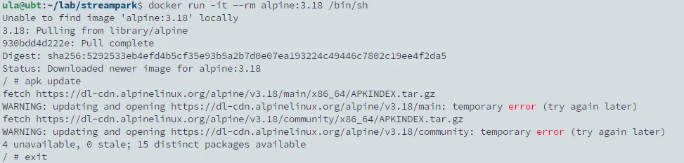

## TL; DR

在封閉的公司內網環境使用 docker 跑一個 alpine container 測試環境時，發現在做任何 apk 動作時都會顯示 `temporary error (try again later)` 的錯誤。



## Reason

原因是內網環境使用內部自建的 DNS，且網段環境預設 block 掉所有 53 port。故發生該問題的根本原因是 docker 解析不了網址。

## Solution

為 docker engine 指定對的 DNS server，編輯 `sudo vi /etc/docker/daemon.json`

```bash
{
  "dns": ["172.23.44.53"]
}
```

重啟 docker

```bash
sudo systemctl restart docker
```

就能正常解析網址了。
