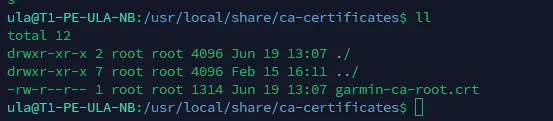

## TL; DR

紀錄公司環境的 WSL 沒有匯入憑證導致存取不到各種 tls 服務的問題。

## Solution

這邊整理了四種方法

### I - 使用腳本匯入所有憑證

參考了這個 [bayaro/windows-certs-2-wsl](https://github.com/bayaro/windows-certs-2-wsl) repo，使用 Powershell 腳本將 windows 系統中的所有憑證匯出，在複製到 WSL 中，再使用 `update-ca-certificates` 一次性的更新所有憑證。

### II - 使用 OpenSSL 導出憑證

使用 openssl 指令連線到帶有 https 的網站，如 google，並印出連線使用的憑證，找到公司使用的 CA 憑證，並複製出來到 `/usr/local/share/ca-certificates` 下，

```bash
openssl s_client -connect [google.com:443](http://google.com:443/) -showcerts
```

複製第三張憑證 `Garmin Root CA - 2018` ：



接著一樣更新憑證，

```bash
sudo update-ca-certificates
```

### III - Docker Pull 公司私有倉庫時遇到 x509

#### 問題描述

即使已經匯入企業根憑證到系統憑證庫，Docker pull 仍然遇到 `x509: certificate signed by unknown authority` 錯誤。

#### 根本原因

**憑證鏈缺失關鍵憑證**。雖然 wsl 已透過前面的手法匯入企業根憑證，但缺少 Harbor 伺服器實際使用的完整憑證鏈中的某個關鍵憑證（可能是中間憑證或更新版本的根憑證）。

#### 解決方法

1. **從 Harbor 伺服器取得完整憑證鏈：**

   根據您的實際解決經驗，以下是更新後的筆記：

   ```bash
   openssl s_client -connect harbor.company.com:443 -showcerts
   ```

2. **識別並複製缺失的憑證：**
   - 從 `showcerts` 輸出中找到最後一個憑證區塊（通常是根憑證）
   - 複製完整的憑證內容，包括 `----BEGIN CERTIFICATE-----` 和 `----END CERTIFICATE-----`
3. **將憑證附加到系統憑證庫：**

   ```bash
   sudo vi /etc/ssl/certs/ca-certificates.crt
   # 將複製的憑證內容 append 到檔案末尾
   ```

4. **重啟 Docker 服務：**

   ```bash
   sudo systemctl restart docker
   ```

5. **驗證修復：**

   ```bash
   docker pull harbor.company.com/project/image:tag
   ```

### IV - 忽略 SSL 憑證驗證（不推薦，僅用於測試）

1. **Docker 忽略 SSL 驗證：**

   ```bash
   # 修改 Docker daemon 設定
   sudo vi /etc/docker/daemon.json
   ```

   ```json
   {
     "insecure-registries": ["harbor.company.com"]
   }
   ```

   ```bash
   sudo systemctl restart docker
   ```

2. **curl 忽略 SSL 驗證：**

   ```bash
   curl -k <https://www.google.com/>
   # 或
   curl --insecure <https://www.google.com>

   ```

3. **apt 忽略 SSL 驗證：**

   ```bash
   # 單次使用
   apt-get -o Acquire::https::Verify-Peer=false -o Acquire::https::Verify-Host=false update
   ```

4. **wget 忽略 SSL 驗證：**

   ```bash
   wget --no-check-certificate <https://harbor.company.com/file>
   # 或
   wget --no-check-certificate --no-check-certificate <https://harbor.company.com/file>
   ```

5. **Git 忽略 SSL 驗證：**

   ```bash
   # 全域設定
   git config --global http.sslVerify false

   # 單次使用
   git -c http.sslVerify=false clone <https://harbor.company.com/repo.git>
   ```

## Reference

- [bayaro/windows-certs-2-wsl](https://github.com/bayaro/windows-certs-2-wsl)
- [Docker pull 時遇到 x509 certificate signed by unknown authority 的解決方法 - HackMD](https://hackmd.io/@camiol/SkMPqYZYi)
