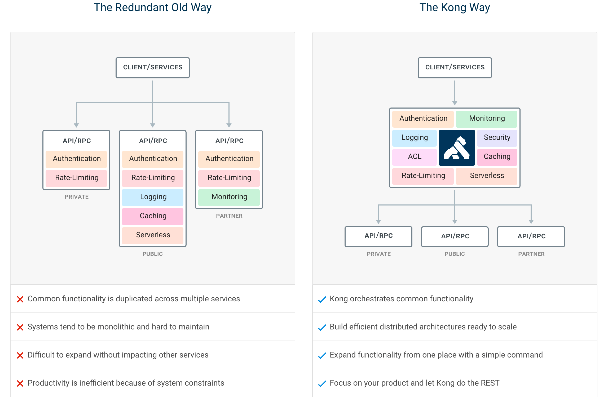
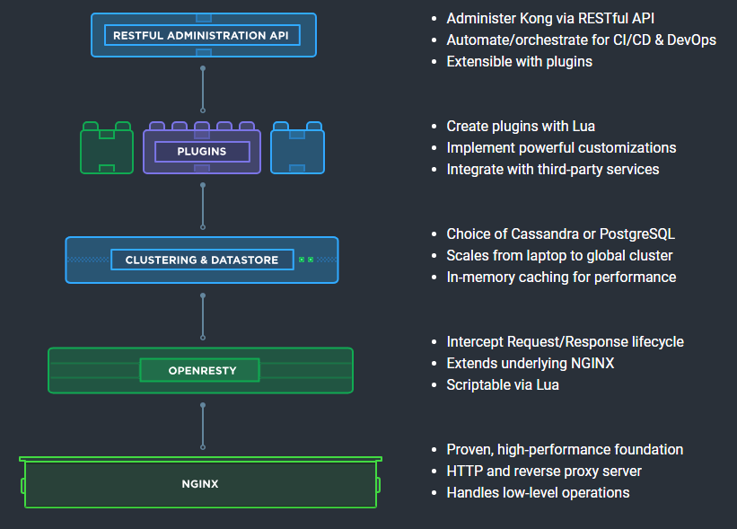
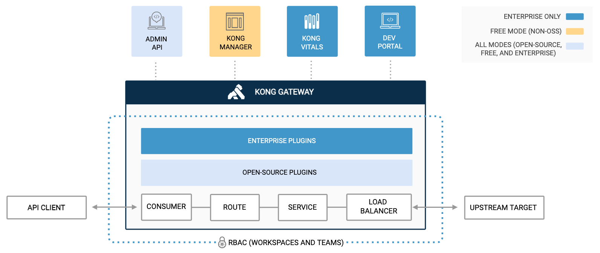
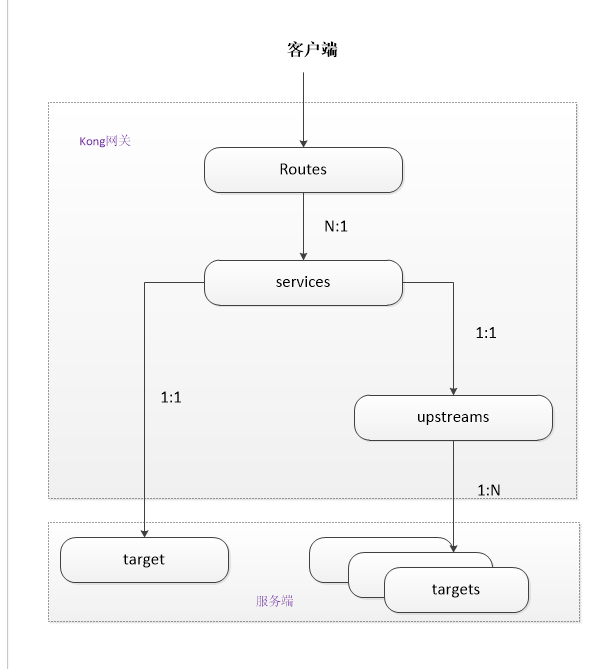
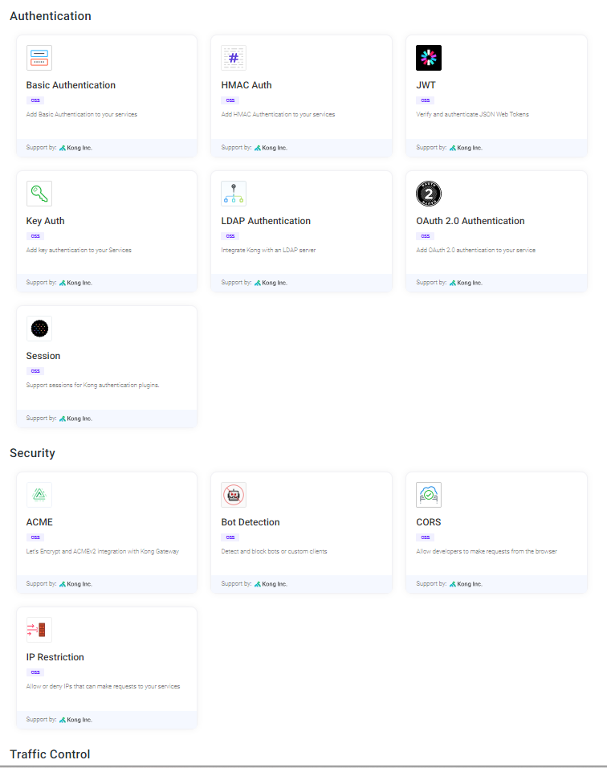
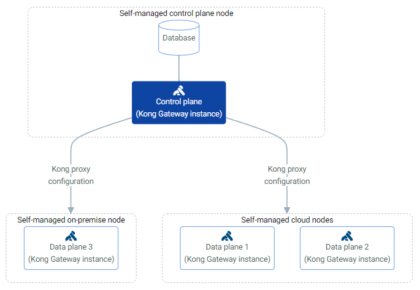
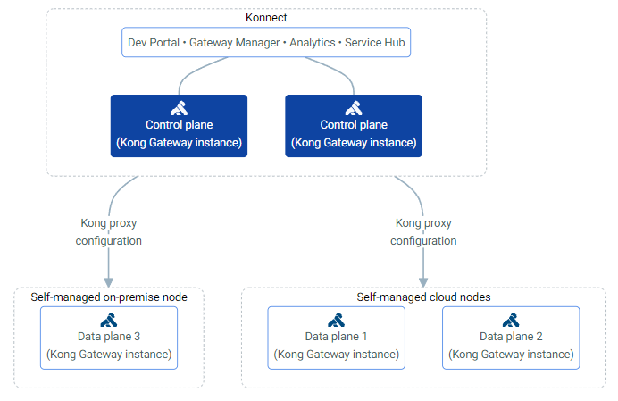

## TL; DR

本篇是在研究 Kong 時所記錄的筆記。

<!--more-->

## 基本概念

### Why we need API Gateway

在舊的服務治理體系之下，權限管理、限流、日誌、監控等通用功能需要在每個服務中單獨實現，這使得系統維護者無法統一管理這些功能，缺乏全局視圖。不同語言實現的方式可能各異，導致 code base 複雜，隨著服務數量增加，維運也變得更加複雜。然而，有了 API Gateway 後，後端就能專注於商業邏輯的開發。

### Kong Architecture

- kong 是一個基於 nginx + openresty 的 api 網關  
   Nginx 提供反向代理服務；OpenResty 在 nginx 的基礎上增加了 Lua 腳本的靈活性，允許開發者自定義高性能的 Web 服務；Kong 則是專注於 API 管理，提供了一個在 Nginx 和 OpenResty 基礎上更高層次的、易於使用的 API 管理工具。Kong 的運作依賴於 Nginx 和 OpenResty 的高性能和靈活性，進而提供 API 管理和微服務治理的解決方案。
- 背後需要 database (postgres/cassendra) 儲存 API 以及路由設定
- 可以透過 plugin 對每個路由單獨設定如 cache、logging 的功能
- 提供 admin api 可對內部所有元件進行管理 (透過 API 將 plugin 放到 service 上面)

### Kong 元件說明

- service
  代表外部下游 API 或微服務的 Kong 實體，可以用來指向特定實體服務（target），也可以指向 upstream 用來實現實體服務的負載效果。一個 service 對於 upstream、target 都是一對一的關係。
- route
  將上游請求對應到下游服務的方式的 Kong 實體，路由匹配客戶端的請求規則。匹配成功後分配到 service 層。一個路由指向一個 service，一個 service 可以被多個不通規則的路由 routes 指向
- upstream
  用於實作 kong 的負載功能，一個 service 匹配到一個 upstream 後，upstream 可以指向多個 target 服務以此來實現負載的效果。 target 服務端指的就是最後的實體服務，當然也可以是其他的虛擬服務。如果不考慮負載平衡，可以不設定 upstream，僅透過 routes 和 service 也可以代理服務。
- consumer
  Consumer 物件代表 API 的消費者或使用者，是一個抽象概念，並不單指一個特定的實體，例如可以建立一組 consumer 代表 api 版本號 v1、v2、v3， 也可以代表請求來源類型，來自客戶端請求可標記為 android/iOS，web 前端請求標記為 web frontend，IoT 裝置請求標記為 IoT device 。

### Plugin

Plugin Hub 功能分類:

- AI
- Authentication
- Security
- Traffic Control
- Serverless
- Analytics & Monitoring
- Transformations
- Logging

常用的 plugin

- Authentication Plugin：有提供基本的 basic authentication、key auth、JWT、OAuth
- Traffic Control Plugin : 如 ACL，可指定每個 service 的 allow group；Proxy Cache 可以指定 cache 讓已經存在 kong memory 的 service 直接提供服務；Rate Limiting 速率限制在給定的幾秒鐘、幾分鐘..等等指定時間內，可以發出多少個 HTTP 請求。
- Observability Plugin：如 Prometheus、Logging (提供如 http log, file log，需再透過 UI 工具撈取呈現如 Loki, ELK, EFK)

## 部署架構

### DB-less and Declarative

在無資料庫模式下，設定透過 YAML 檔案套用。 Kong Gateway 節點不會連接到資料庫，也不互相連接。

### Traditional (database)

在傳統部署中，所有 Kong Gateway 節點都連接到資料庫，但每個節點管理自己的配置。

### Hybrid (Control Plane + Data Plane)

在自管理混合模式中，控制平面和資料平面託管在不同的節點上。控制平面連接資料庫，資料平面從控制平面接收配置。

### Konnect

Konnect 可以自管或託管於公有雲上 (有提供 SaaS)。在 Konnect 模式中，會統一託管控制平面和所有相關應用程式：Dev Portal, Gateway Manager, Analytics, Service Hub 等。資料平面則會附加到 Konnect 來處理流量，該流量從控制平面取得所有配置。
