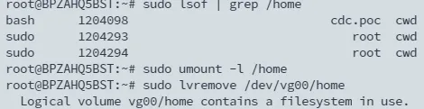

## TL; DR

在使用 lvremove 刪除指定的 lv 時發生 `Logical volume vg00/xxx contains a filesystem in use.` 的錯誤，而且即使使用 unmount -l 強制卸載原本的 mount point 後也會得到該錯誤。



## Solution

### 檢查是否有程序或服務使用

某些系統服務或背景程序可能仍在使用該檔案系統。執行：

```bash
sudo lsof /dev/vg00/home
sudo fuser -v /dev/vg00/home
```

會列出所有正在使用該設備的 process。如果有，可以 `systemctl stop` 停止或直接 `kill` 砍掉這些進程。

### 檢查是否有使用者占用

因當前操作的位置就剛好在要刪除設備上原本的 mount point 上，請隨便切換到其它掛載目錄下。

### 移除自動掛載

```bash
sudo vi /etc/fstab
```

刪除或註解掉該設備的自動掛載點，接著重啟 server

```bash
sudo reboot
```

## 完整 Script

```bash
#!/bin/bash

# Step 1: 備份數據
echo "Step 1: 備份數據"
sudo mkdir -p /backup
sudo tar -cvpzf /backup/tmp_backup.tar.gz /tmp
sudo tar -cvpzf /backup/opt_backup.tar.gz /opt
sudo tar -cvpzf /backup/home_backup.tar.gz /home

# Step 2: 卸載文件系統
echo "Step 2: 卸載文件系統"
sudo umount -l /tmp
sudo umount -l /opt
sudo umount -l /home

# Step 3: 修改 /etc/fstab，注釋掉 /tmp、/opt 和 /home 的條目
echo "Step 3: 修改 /etc/fstab"
sudo sed -i 's|\(.*[[:space:]]/tmp[[:space:]]ext4.*\)|#\1|' /etc/fstab
sudo sed -i 's|\(.*[[:space:]]/opt[[:space:]]ext4.*\)|#\1|' /etc/fstab
sudo sed -i 's|\(.*[[:space:]]/home[[:space:]]ext4.*\)|#\1|' /etc/fstab
```

```bash
# step 4 : reboot
sudo reboot
```

```bash
#!/bin/bash
# Step 5: 刪除邏輯卷
echo "Step 4: 刪除邏輯卷"
sudo lvremove -y /dev/vg00/tmp
sudo lvremove -y /dev/vg00/opt
sudo lvremove -y /dev/vg00/home

# Step 6: 還原備份數據
echo "Step 5: 還原備份數據"
sudo tar -xvpzf /backup/tmp_backup.tar.gz -C /
sudo tar -xvpzf /backup/opt_backup.tar.gz -C /
sudo tar -xvpzf /backup/home_backup.tar.gz -C /

# 擴展 /usr 和 /var 邏輯卷
echo "Step 7: 擴展 /usr 和 /var 邏輯卷"
sudo lvextend -L +10G /dev/vg00/usr
sudo lvextend -l +100%FREE /dev/vg00/var
sudo resize2fs /dev/vg00/usr
sudo resize2fs /dev/vg00/var

```

重新登入

```bash
su - ${USER}
```
