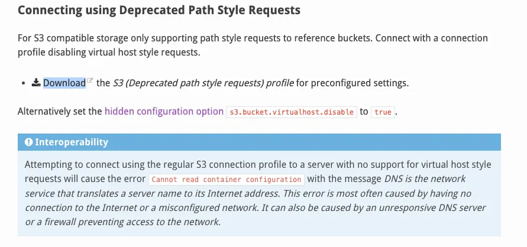
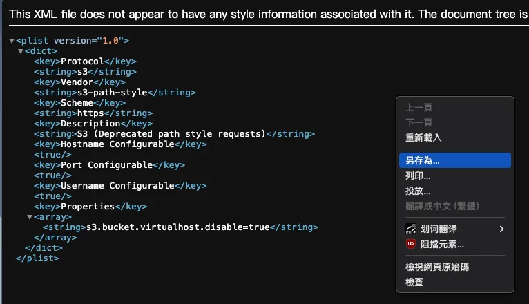
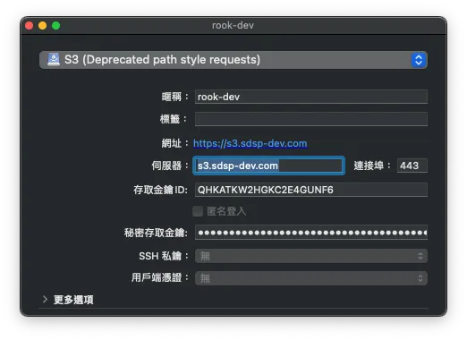
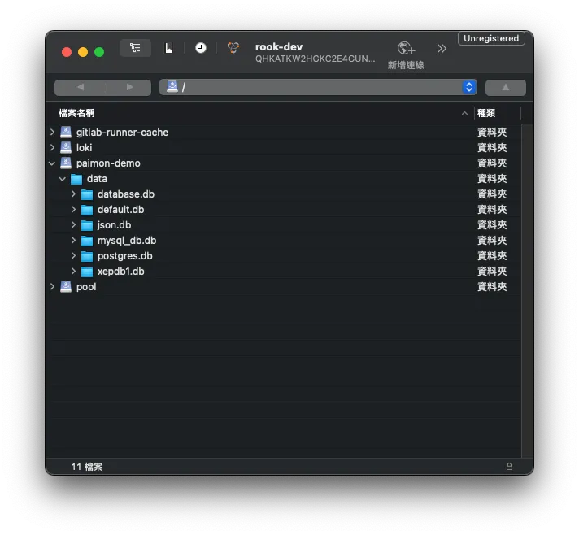

## TL; DR

After switching to a new computer, I found that [S3 Browser](https://s3browser.com/) does not support MacOS. This article documents how to install Cyberduck on Mac and connect to Ceph Object Storage Gateway using path-style connection.

## Step 1: Download Cyberduck

Go to the [official website](https://cyberduck.io/download/) and download the appropriate version of the application.

## Step 2: Download the legacy configuration file

1. Refer to the [Cyberduck official documentation](https://docs.cyberduck.io/protocols/s3/#connecting-using-deprecated-path-style-requests).

   

2. Since Ceph Object Storage still uses **path style** connection, you need to download the legacy configuration file for Cyberduck.
   - Click **Download**, and it will redirect you to an XML page.
     
   - Right-click the page and choose **Save As** to download the configuration file.
   - The downloaded file will automatically be saved with the `.cyberduckprofile` extension.

## Step 3: Configure Cyberduck

1. Open the downloaded `S3 (Deprecated path style requests).cyberduckprofile` configuration file.
2. In the configuration window, enter the server address and key information, then close the window.

   

## Step 4: Connect to Ceph Object Storage

1. Return to the Cyberduck bookmarks list and double-click the newly created bookmark to connect.

   

## Step 5: Access the Bucket

Once connected, you can access the **bucket** from within Cyberduck.

