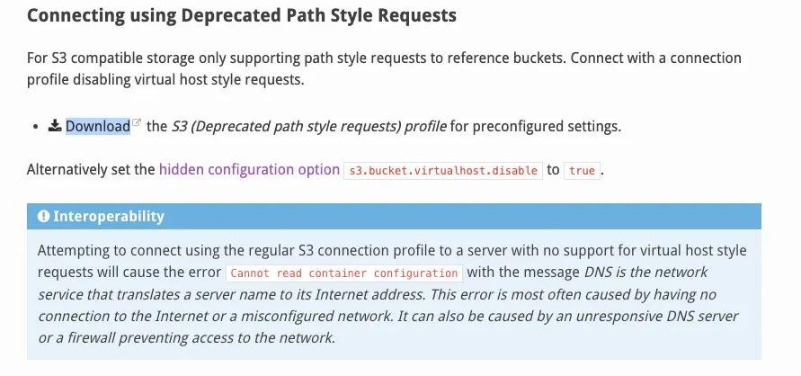
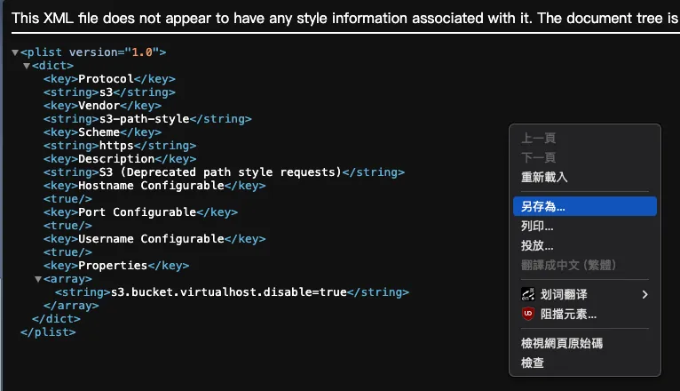
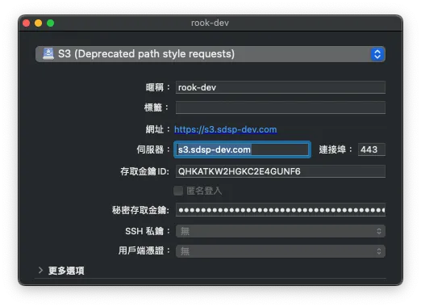
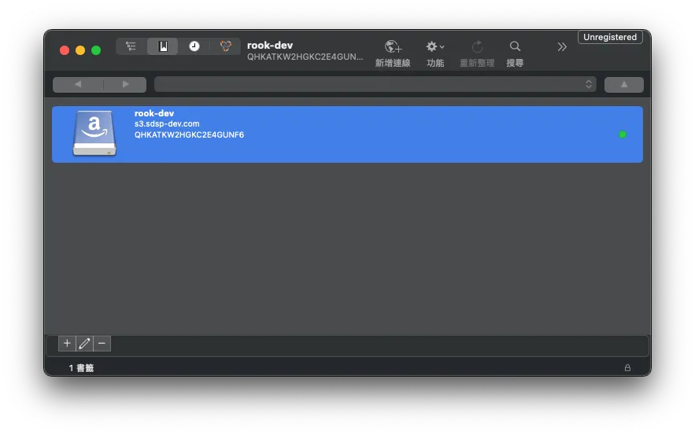
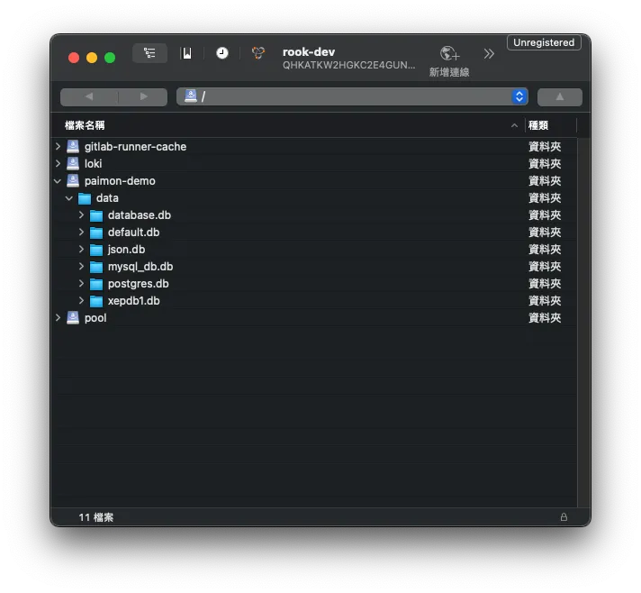

## TL; DR

換了電腦後發現 S3 Browser 沒有支持 MacOS，所以本篇紀錄如何在 Mac 安裝 Cyberduck 並連線到以 path-style 連線的 Ceph Object Storage Gateway。

## 步驟 1：下載 Cyberduck

前往[官網](https://cyberduck.io/download/)下載相應版本的應用程式。

## 步驟 2：下載舊版設定檔

1. 參考 [Cyberduck 官網的說明](https://docs.cyberduck.io/protocols/s3/#connecting-using-deprecated-path-style-requests)。

   

2. 由於目前 Ceph Object Storage 還是使用 **path style** 連線，因此需要下載舊版的設定檔來配置 Cyberduck。
   - 點選 **Download**，並會跳轉到 XML 格式的網頁。
     
   - 右鍵點擊該網頁，選擇 **下載**，將設定檔下載到本地。
   - 下載後，檔案會自動保存為 `.cyberduckprofile` 格式。

## 步驟 3：設定 Cyberduck

1. 開啟下載的 `S3 (Deprecated path style requests).cyberduckprofile` 設定檔。
2. 在設定視窗中，填入伺服器位址與金鑰資訊，完成設定後直接關閉視窗。

   

## 步驟 4：連接到 Ceph Object Storage

1. 返回 Cyberduck 的書籤列表，雙擊剛才設定好的書籤進行連線。

   

## 步驟 5：存取 Bucket

成功連線後，您就可以在 Cyberduck 中進行 **bucket** 的存取操作了。

