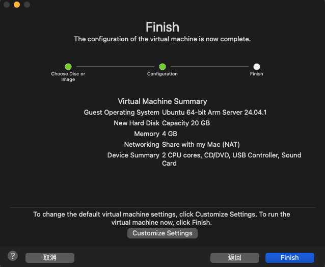

## 安裝 VMware Fusion Pro

登入 Broadcom 後，進入[下載頁面](https://support.broadcom.com/group/ecx/productdownloads?subfamily=VMware%20Fusion)，選擇欲下載的版本進行下載。

## 安裝 VM

在首次開啟 VMware Fusion 應用程式後，會直接進入第一台 VM 的安裝介面。
將下載好的 [ARM Ubuntu](https://ubuntu.com/download/server/arm) ISO 檔拖曳到 `install from disc or image` 欄位中，進到下一步



請注意不要下載到 ARM base 的 image!!!



接著在完成前的畫面，可以選擇 `Customize Settings` 修改 VM 存放位置以及檔名。

接著就會進到熟悉的 Ubuntu 安裝介面，進行 OS 的安裝。

## 設定 VM

完成安裝後，可以進到設定頁面進行系統層的設定，包含 CPU、記憶體大小以及網卡模式設定。

網路直接使用 `Bridged` 橋接模式，取得與實體主機相同網段的獨立 IP，所有網路功能和網路中的真實機器幾乎完全一樣。

## 建立第二台 VM

在開啟的 VMware Fusion 應用程式上按右鍵，選擇 `Virtual Machine Library` 就可以進入到主控頁面，進行多台 VM 的增刪改了。

## 下載 Ubuntu Desktop for ARM

可於[官網](https://cdimage.ubuntu.com/daily-live/20240421/)下載。
